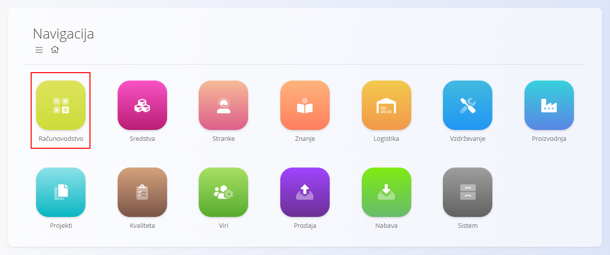
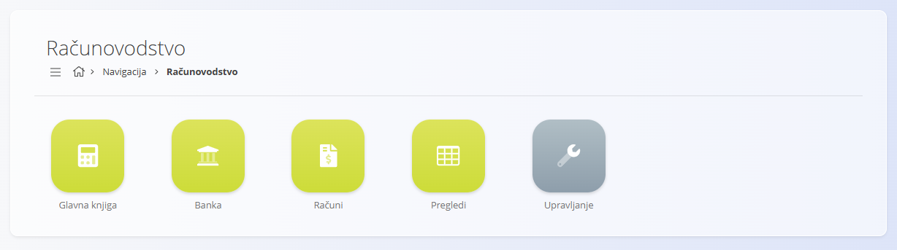
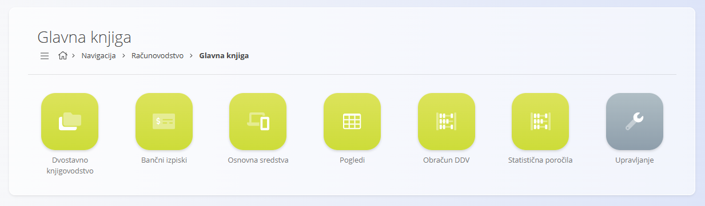
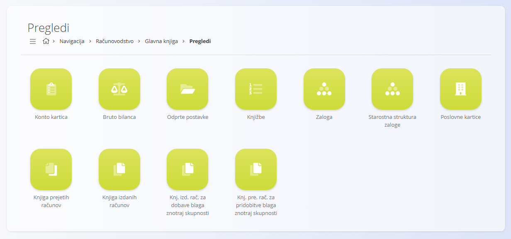
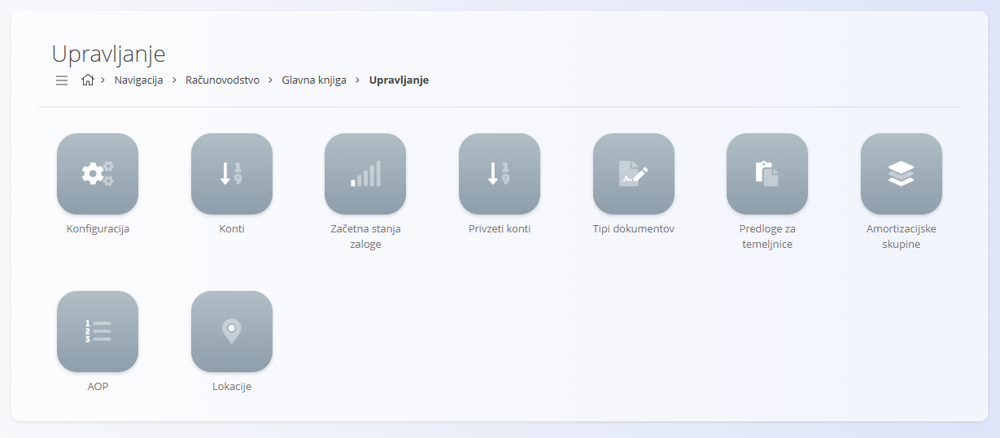
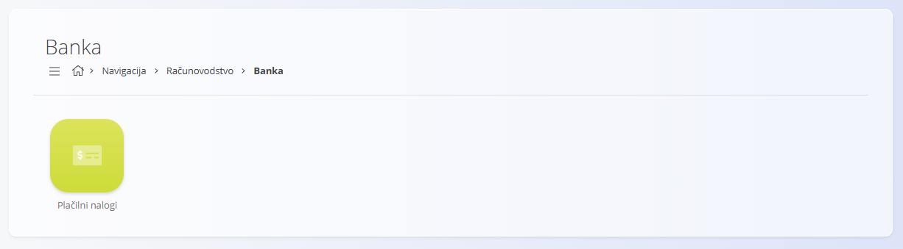
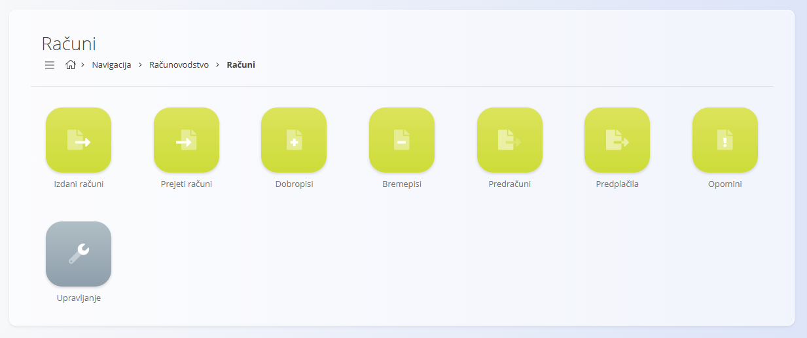
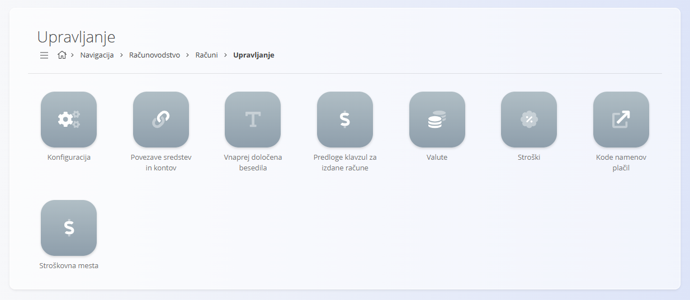
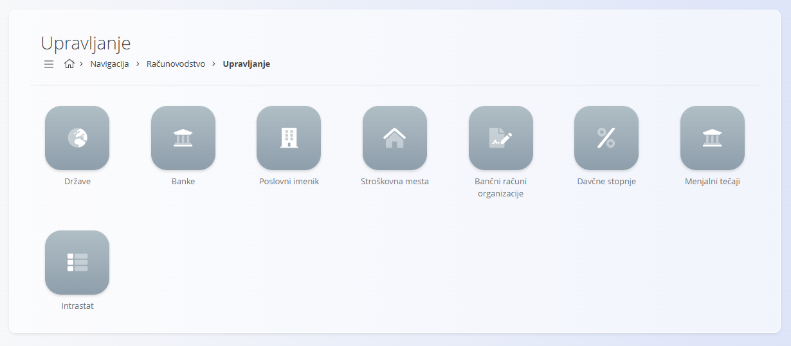

<!-- app_route: /sitemap/accounting -->
<!-- app_label: Domena Računovodstvo -->
<!-- canonical_source_url: https://tom-pit.github.io/Connected.Docs/sl/Domene/Racunovodstvo/ -->
<!-- canonical_source_title: Domena Računovodstvo -->

# Računovodstvo

Domena **Računovodstvo** vsebuje vse zapise, poročila in nastavitve, potrebne za **evidentiranje, nadzor in analizo finančnih transakcij**.

Operativne dokumente, ustvarjene v drugih domenah (npr. [**Prodaja**](../Prodaja/README.md), [**Nabava**](../Nabava/README.md) in [**Logistika**](../Logistika/README.md)), pretvarja v **uradne računovodske knjižbe**, s čimer zagotavlja skladnost, sledljivost in pravilno finančno poročanje.

Do domene dostopate preko **Računovodstvo** v [navigaciji](../../Skupno/UI/Navigacija.md).

> [!NOTE]  
> Razpoložljivi razdelki in funkcionalnosti so odvisni od konfiguracije podjetja, omogočenih računovodskih modulov in lokalne zakonodaje.

## Kaj vključuje domena Računovodstvo?

Domena Računovodstvo je **strukturno ena najobsežnejših domen**. Več njenih glavnih sklopov (zlasti **Glavna knjiga** in **Računi**) ima lastne razdelke **Dokumenti**, **Pregledi** in **Upravljanje**.

Domena je razdeljena na naslednja glavna področja:

- **[Glavna knjiga](#glavna-knjiga)** – osnovni računovodski zapisi, knjižbe in zakonska poročila  
- **[Banka](#banka)** – bančne računovodske operacije  
- **[Računi](#računi-v-računovodstvu)** – računski dokumenti z računovodskega vidika  
- **[Pregledi](#pregledi)** – analitični, samo-za-branje pregledi  
- **[Upravljanje](#upravljanje)** – globalne računovodske nastavitve in šifranti

## Glavna knjiga

**Glavna knjiga** je **jedro domene Računovodstvo**.  
Vsebuje vse temeljnice, knjižbe, salde in računovodska poročila, ki izhajajo iz finančnih dokumentov in operativnih transakcij.

Funkcionalnosti so znotraj Glavne knjige razdeljene na **Dokumente**, **Preglede** in **Upravljanje**.

### Glavna knjiga – Dokumenti

Dokumenti Glavne knjige predstavljajo **formalne računovodske zapise** in zakonsko obvezne evidence.

Na voljo so naslednji dokumenti:

- **[Dvostavno knjigovodstvo](Dokumenti/DvostavnoKnjigovodstvo.md)** – temeljnice, ustvarjene iz dokumentov ali ročno.
- **[Bančni izpiski](Dokumenti/BancniIzpiski.md)** – bančni prometi, ki ob objavi ustvarijo knjižbe.
- **[Osnovna sredstva](Dokumenti/OsnovnaSredstva.md)** – evidence sredstev za amortizacijo in dolgoročno vrednotenje.
- **[Obračun DDV](Dokumenti/ObracunDDV.md)** – periodični davčni pregledi za pripravo davčnih poročil.
- **Statistična poročila** – ustvarjena finančna poročila (npr. bilanca stanja, izkaz poslovnega izida).

Ti dokumenti **ustvarjajo ali povzemajo knjižbe** in so osnova za finančno poročanje.

### Glavna knjiga – Pregledi

Pregledi Glavne knjige omogočajo **analitične in nadzorne vpoglede** v računovodske podatke.  
So **samo za branje** in ne ustvarjajo transakcij.

Na voljo so naslednji pregledi:

- **[Konto kartica](Pregledi/KontoKartica.md)** – podrobni pregledi debetnih in kreditnih knjižb po kontu.
- **[Bruto bilanca](Pregledi/BrutoBilanca.md)** – začetno stanje, promet in končno stanje.
- **[Odprte postavke](Pregledi/OdprtePostavke.md)** – odprte terjatve in obveznosti po podjetjih.
- **[Knjižbe](Pregledi/Knjizbe.md)** – seznam vseh knjižb z možnostmi filtriranja.
- **[Zaloga glavne knjige](Pregledi/ZalogaGlavneKnjige.md)** – finančna vrednost zaloge na določen datum.
- **[Starostna struktura zaloge](Pregledi/StarostnaStrukturaZaloge.md)** – analiza staranja zaloge.
- **[Poslovne kartice](../Prodaja/Pregledi/PoslovneKartice.md)** – finančni pregled po poslovnih partnerjih.

Ti pregledi podpirajo **revizijo, usklajevanje in finančne analize**.

### Glavna knjiga – Upravljanje

Razdelek Upravljanje vsebuje **tehnične in računovodske nastavitve**, ki določajo način ustvarjanja knjižb.

Na voljo so naslednje nastavitve:

- **[Kontni načrt](Upravljanje/GlavnaKnjiga/Konti.md)** – definicija vseh kontov glavne knjige.
- **[Začetna stanja zaloge](Upravljanje/GlavnaKnjiga/ZacetnaStanjaZaloge.md)** – začetna vrednotenja zaloge.
- **[Privzeti konti](Upravljanje/GlavnaKnjiga/PrivzetiKonti.md)** – privzeti konti za knjiženje.
- **[Tipi dokumentov](Upravljanje/GlavnaKnjiga/TipiDokumentov.md)** – pravila za ustvarjanje temeljnic.
- **[Predloge za temeljnice](Upravljanje/GlavnaKnjiga/PredlogeZaTemeljnice.md)** – predloge knjiženj.
- **[Amortizacijske skupine](Upravljanje/GlavnaKnjiga/AmortizacijskeSkupine.md)** – pravila amortizacije sredstev.
- **[AOP](Upravljanje/GlavnaKnjiga/AOP.md)** – klasifikacijska struktura za poročila.
- **[Lokacije glavne knjige](Upravljanje/GlavnaKnjiga/LokacijeGlavneKnjige.md)** – lokacije, povezane s sredstvi in knjižbami.

Te nastavitve določajo **globalno računovodsko logiko sistema**.

## Banka

Razdelek **Banka** pokriva bančne računovodske operacije.

Na voljo so naslednji dokumenti:

- **[Plačilni nalogi](Dokumenti/PlacilniNalogi.md)** – navodila za odhodna in vhodna plačila.

Bančni dokumenti so pogosto povezani z **bančnimi izpiski** in **temeljnicami**, da je denarni tok pravilno zajet v glavni knjigi.

## Računi v računovodstvu

Razdelek **Računi** vsebuje **računske dokumente**, večinoma skupne z domeno Prodaja.

Na voljo so naslednji dokumenti:

- **[Prejeti računi](Dokumenti/PrejetiRacuni.md)**
- **[Izdani računi](../Prodaja/Dokumenti/IzdaniRacuni.md)**
- **[Dobropisi](../Prodaja/Dokumenti/Dobropisi.md)**
- **[Bremepisi](../Prodaja/Dokumenti/Bremepisi.md)**
- **[Predračuni](../Prodaja/Dokumenti/Predracuni.md)**
- **[Avansni računi](../Prodaja/Dokumenti/AvansniRacuni.md)**
- **[Opomini](../Prodaja/Dokumenti/Opomini.md)**

Struktura dokumentov je opisana v domeni Prodaja, medtem ko so tukaj dokumentirani **računovodski vidiki** (knjiženje, zapiranje, davki).

### Računi – Upravljanje

Nastavitve, povezane z računi, so združene v ločenem razdelku.

Na voljo so:

- **[Konfiguracija računov](Upravljanje/Racuni/KonfiguracijaRacunov.md)**
- **[Povezave sredstev in kontov](Upravljanje/Racuni/PovezaveSredstevInKontov.md)**
- **[Vnaprej določena besedila](../../Skupno/Upravljanje/VnaprejDolocenaBesedila.md)**
- **[Valute](../../Skupno/Upravljanje/Valute.md)**
- **[Stroški](../Nabava/Upravljanje/Stroski.md)**
- **[Kode namenov plačil](../Prodaja/Upravljanje/KodeNamenovPlacil.md)**
- **[Stroškovna mesta](../../Skupno/Upravljanje/StroskovnaMesta.md)**

Te nastavitve določajo, **kako se podatki iz računov vključujejo v računovodstvo**.

## Pregledi

Razdelek **Pregledi** omogoča **hiter dostop do analitičnih zaslonov**.

Vsi pregledi so **samo za branje** in namenjeni **finančnemu nadzoru**.

## Upravljanje

Razdelek **Upravljanje** vsebuje **globalne šifrante in nastavitve**, ki se uporabljajo v Glavni knjigi, Računih in Bančnih operacijah.

Vključuje:

- **[Države](../../Skupno/Upravljanje/Drzave.md)**
- **[Banke](../../Skupno/Upravljanje/Banke.md)**
- **[Poslovni imenik](../../Skupno/Upravljanje/PoslovniImenik.md)**
- **[Stroškovna mesta](../../Skupno/Upravljanje/StroskovnaMesta.md)**
- **[Bančne račune organizacije](../../Skupno/Upravljanje/Banke.md)**
- **[Davčne stopnje](../../Skupno/Upravljanje/DavcneStopnje.md)**
- **[Menjalni tečaji](../Prodaja/Upravljanje/MenjalniTecaji.md)**

Poseben sklop predstavljajo **Intrastat** šifranti:

- **[Vrsta posla](Upravljanje/Intrastat/VrstaPosla.md)**
- **[Pogoji dobave](../../Skupno/Upravljanje/PogojiDobave.md)**
- **[Vrsta transporta](../../Skupno/Upravljanje/VrstaTransporta.md)**
- **[Lega kraja](Upravljanje/Intrastat/LegaKraja.md)**
- **[Merske enote Intrastat](Upravljanje/Intrastat/IntrastatMerskeEnote.md)**
- **[Tarife](Upravljanje/Intrastat/Tarife.md)**

## Računovodstvo in druge domene

Računovodstvo je tesno povezano z drugimi domenami:

| Domena | Povezava |
|------|----------|
| **[Prodaja](../Prodaja/README.md)** | Izdani računi, prihodki, terjatve |
| **[Nabava](../Nabava/README.md)** | Prejeti računi, stroški, obveznosti |
| **[Logistika](../Logistika/README.md)** | Premiki in vrednotenje zaloge |
| **[Sredstva](../Sredstva/README.md)** | Osnovna sredstva in amortizacija |
