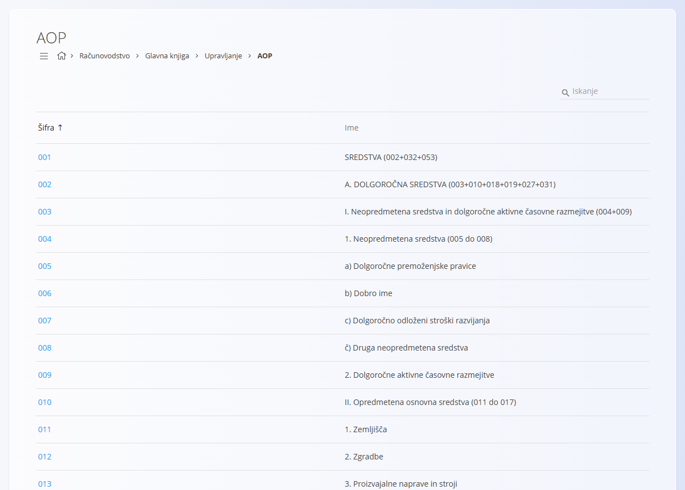

<!-- app_route: /management/ledger/aop -->
<!-- app_label: AOP -->
<!-- canonical_source_url: https://tom-pit.github.io/Connected.Docs/sl/Domene/Racunovodstvo/Upravljanje/GlavnaKnjiga/AOP/ -->
<!-- canonical_source_title: AOP -->

# AOP

Pogled **AOP** prikazuje vnaprej določen seznam zakonsko predpisanih poročevalskih postavk, ki se uporabljajo za pripravo računovodskih izkazov in zakonsko poročanje.

Za dostop do tega pogleda pojdite na **Računovodstvo / Glavna knjiga / Upravljanje / AOP** v [navigaciji](../../../../Skupno/UI/Navigacija.md).

> [!IMPORTANT]
> AOP postavke so zakonsko predpisani elementi poročanja. Na voljo so zgolj za vpogled in jih uporabniki ne morejo spreminjati.

## Namen

AOP postavke predstavljajo standardizirane poročevalske elemente, ki jih določajo nacionalni računovodski predpisi.  
Uporabljajo se kot referenčni podatki v računovodskih izkazih in drugih zakonsko predpisanih poročilih.

Prikazan primer je specifičen za **Slovenijo**, kjer so AOP (*Analitični obračun poslovanja*) postavke določene z zakonodajo in se uporabljajo v uradnem finančnem poročanju.

## Državno specifična struktura

AOP je **odvisen od države**:

- vsaka država določa lastno strukturo in kode,
- poimenovanje in hierarhija sta odvisna od lokalnih računovodskih standardov,
- seznam zagotavlja sistem in se centralno vzdržuje.

Za druge države se uporablja podoben seznam, prilagojen lokalnim zakonskim in poročevalskim zahtevam.

## Uporaba

AOP vnosi se uporabljajo kot **referenčne vrednosti** v računovodskih in poročevalskih pogledih.  
Uporabniki lahko seznam pregledujejo in iščejo po njem, ne morejo pa ga spreminjati.

## Urejanje in brisanje

Urejanje in brisanje **nista podprta**.
