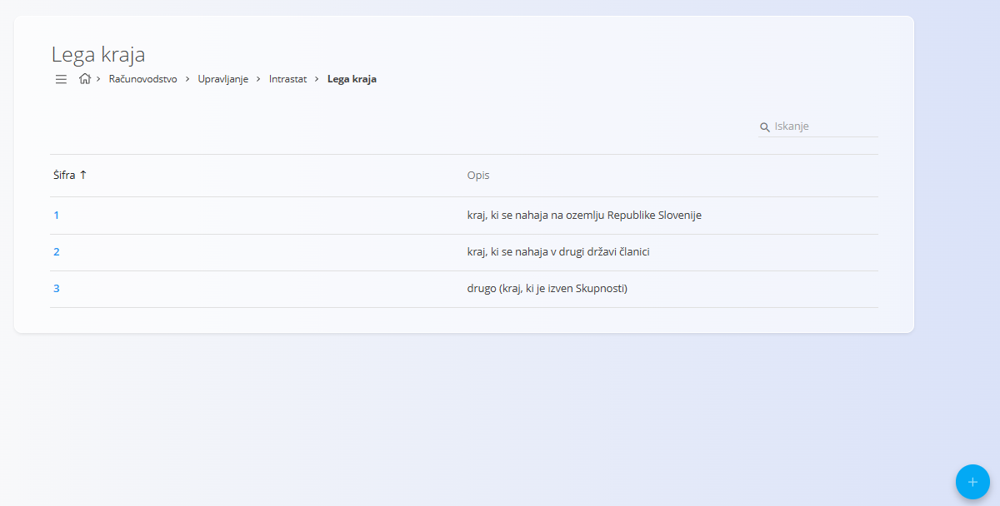
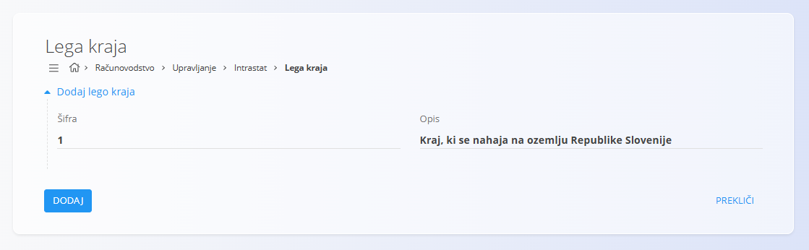

<!-- app_route: /management/intrastat/place-of-delivery -->
<!-- app_label: Lega kraja -->
<!-- canonical_source_url: https://github.com/Tom-PIT/Connected.Docs/blob/main/sl/Domene/Racunovodstvo/Upravljanje/Intrastat/LegaKraja.md -->
<!-- canonical_source_title: Lega kraja -->

# Lega kraja

Šifrant **Lega kraja** se uporablja za **Intrastat in računovodsko poročanje** ter določa, kje se nahaja kraj dobave blaga. Vsaka šifra predstavlja standardizirano kategorijo kraja dobave, ki je zahtevana za statistične in zakonske namene.

Do tega zaslona dostopate prek **Računovodstvo / Upravljanje / Intrastat / Lega kraja** v [navigaciji](../../../../Skupno/UI/Navigacija.md).

## Shema

| Polje  | Opis                                                       |
|-------|-------------------------------------------------------------|
| Šifra | Numerični identifikator lege kraja                          |
| Opis  | Opis kategorije kraja dobave                                |

## Seznam

Seznam prikazuje vse definirane šifre lege kraja.

Vsaka vrstica vsebuje:
- **Šifro**
- **Opis**

Seznam je mogoče filtrirati z iskalnim poljem v zgornjem desnem kotu.

Tipični primeri vrednosti:
- Kraj, ki se nahaja v vaši državi
- Kraj, ki se nahaja v drugi državi članici
- Kraj izven Evropske unije

## Dejanja

### Ustvariti lego kraja

Za dodajanje nove lege kraja:
1. Kliknite [akcijski gumb](../../../../Skupno/UI/AkcijskiGumb.md)
2. Vnesite:
   - **Šifra**
   - **Opis**
3. Kliknite **Dodaj** za shranjevanje vnosa

### Urediti lego kraja

Kliknite na šifro v seznamu, da jo odprete v urejevalnem načinu. Po potrebi posodobite **Šifro** ali **Opis**.

Kliknite **Shrani** za uveljavitev sprememb ali **Prekliči** za preklic.

### Izbrisati lego kraja

Odprite vnos iz seznama in kliknite **Izbriši**. Brisanje potrdite v pogovornem oknu.

> [!NOTE]
> Šifro lege kraja je mogoče izbrisati le, če ni uporabljena v odvisnih dokumentih ali Intrastat poročilih.
