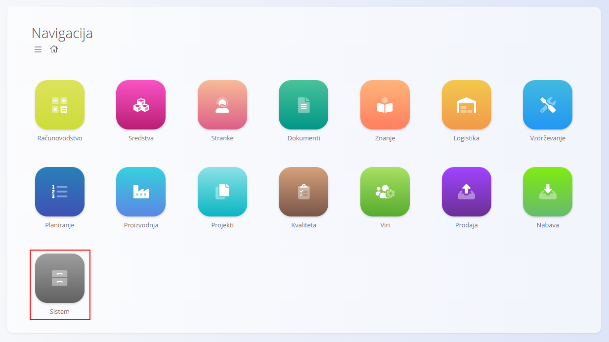
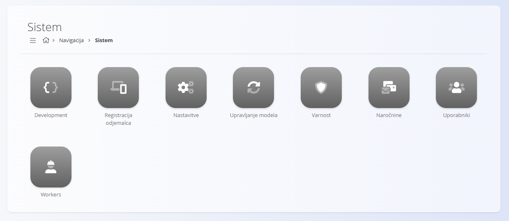

<!-- app_route: /sitemap/system -->
<!-- app_label: Domena Sistem -->
<!-- canonical_source_url: https://github.com/Tom-PIT/Connected.Docs/blob/main/sl/Domene/Sistem/README.md -->
<!-- canonical_source_title: Domena Sistem -->

# Sistem

Domena **Sistem** vsebuje administrativna orodja za konfiguracijo, zaščito in vzdrževanje platforme.

Za razliko od operativnih domen, kot so **Prodaja**, **Nabava** ali **Proizvodnja**, je domena Sistem namenjena predvsem skrbnikom in naprednim uporabnikom, ki upravljajo nastavitve sistema, uporabnike, integracije in globalno konfiguracijo.

Za dostop do te domene izberite **Sistem** na zemljevidu strani.

> [!NOTE]
> Razpoložljive možnosti so odvisne od omogočenih modulov, nameščenih razširitev in uporabniških pravic.

## Kaj vsebuje domena Sistem?

Domena Sistem je organizirana v več administrativnih področij:

* **[Nastavitve](#nastavitve)** – globalne sistemske in organizacijske nastavitve
* **[Uporabniki](#uporabniki)** – uporabniški računi in upravljanje dostopa
* **[Varnost](#varnost)** – preverjanje pristnosti in nadzor dostopa
* **[Naročnine](#narocnine)** – upravljanje licenc in naročnin
* **[Registracija odjemalca](#registracija-odjemalca)** – nastavitve registracije in identifikacije
* **[Development](#development)** – tehnična orodja za razvoj in prilagoditve
* **[Workers](#workers)** – ozadni procesi in sistemske storitve

## Nastavitve

Področje **Nastavitve** vsebuje konfiguracijo, ki vpliva na delovanje celotne platforme.

Primeri vključujejo:

* Podatke o organizaciji
* Privzeto državo in valuto
* Nastavitve skladišča
* Nastavitve fiskalizacije
* Nastavitve povezljivosti in integracij
* Lokalizacijske nastavitve

Razpoložljive nastavitve se lahko razlikujejo glede na nameščene module in zahteve posamezne države.

Glejte:

* [**Nastavitve**](Nastavitve/KonfiguracijaSistema.md)
* [**Nastavitve skladišča**](Nastavitve/KonfiguracijaSkladisca.md)
* [**Nastavitve maloprodaje SI**](Nastavitve/KonfiguracijaMaloprodajaSI.md)

## Uporabniki

Razdelek [**Uporabniki**](Upravljanje/Uporabniki.md) omogoča upravljanje dostopa do platforme.

Skrbniki lahko:

* Ustvarjajo uporabniške račune
* Dodeljujejo vloge in pravice
* Upravljajo stanje uporabnikov
* Nastavljajo jezikovne in lokalizacijske nastavitve

## Varnost

Razdelek **Varnost** vsebuje nastavitve preverjanja pristnosti in avtorizacije, ki ščitijo dostop do sistema in njegovih podatkov.

Razpoložljive možnosti so odvisne od načina namestitve in omogočenih varnostnih funkcionalnosti.

## Naročnine

Razdelek **Naročnine** vsebuje informacije o licencah in naročninah, ki določajo dostop do funkcionalnosti in storitev platforme.

## Registracija odjemalca

Razdelek **Registracija odjemalca** vsebuje nastavitve in informacije, povezane z registracijo in identifikacijo sistema.

Razpoložljive možnosti so odvisne od načina namestitve in licenčnih zahtev.

## Development

Razdelek **Development** vsebuje tehnična orodja, namenjena razvijalcem, svetovalcem in naprednim skrbnikom sistema.

Ta orodja se običajno uporabljajo pri implementaciji, prilagoditvah, odpravljanju težav in integracijah.

## Workers

Razdelek **Workers** vsebuje informacije o ozadnih storitvah in avtomatiziranih procesih, ki jih izvaja platforma.

Glede na konfiguracijo so te storitve lahko odgovorne za:

* Načrtovana opravila
* Obvestila
* Sinhronizacijo podatkov
* Izvajanje integracij
* Druge avtomatizirane procese

## Sistem in druge domene

Domena Sistem podpira vse druge domene platforme.

| Področje | Povezava |
|-----------|-----------|
| [**Prodaja**](../Prodaja/README.md) | Zagotavlja nastavitve fiskalizacije, organizacije in uporabnikov. |
| [**Nabava**](../Nabava/README.md) | Zagotavlja nastavitve skladišča in integracij. |
| [**Proizvodnja**](../Proizvodnja/README.md) | Uporablja uporabnike, lokalizacijo in sistemske nastavitve. |
| [**Vzdrževanje**](../Vzdrzevanje/README.md) | Uporablja nadzor dostopa in skupne sistemske nastavitve. |
| [**Viri**](../Viri/README.md) | Uporablja uporabnike, vloge in lokalizacijske nastavitve. |
Domena Sistem predstavlja administrativno osnovo platforme in podpira delovanje vseh poslovnih procesov.