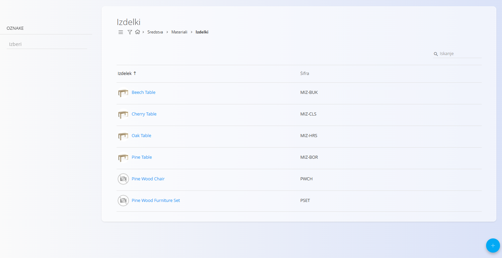
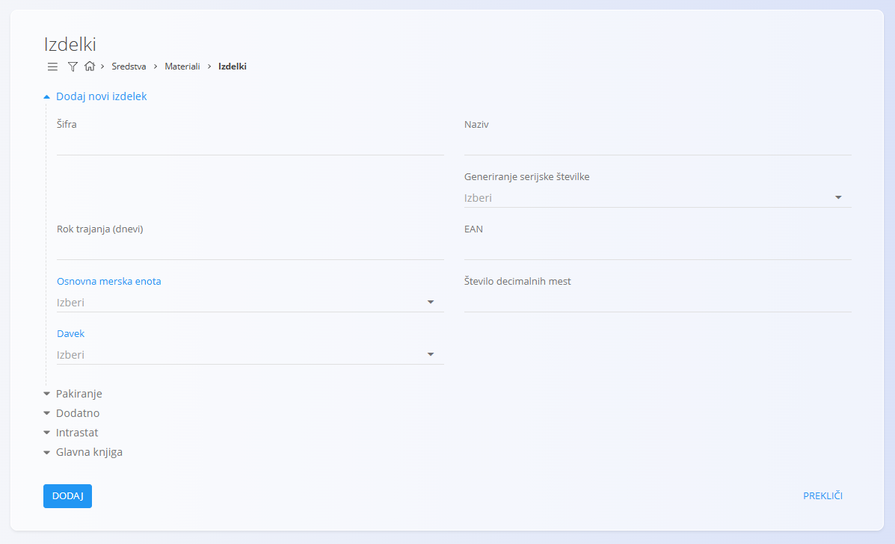
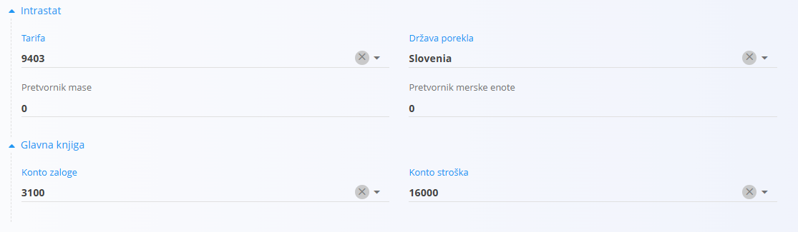
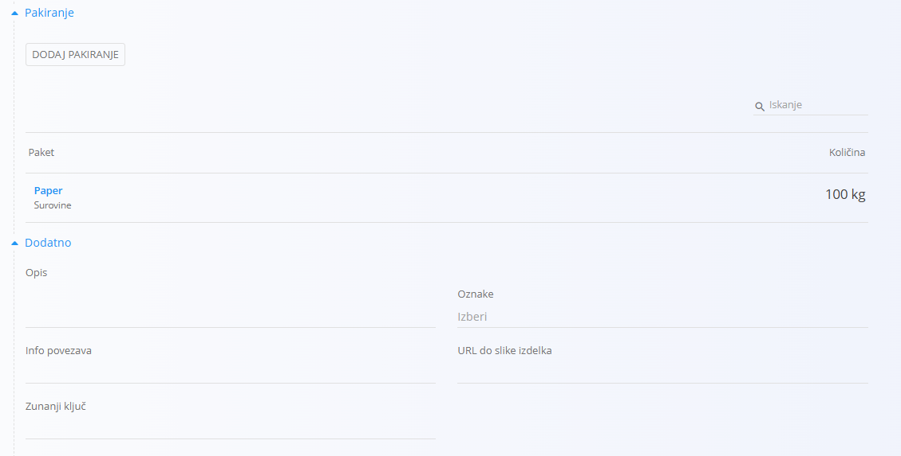
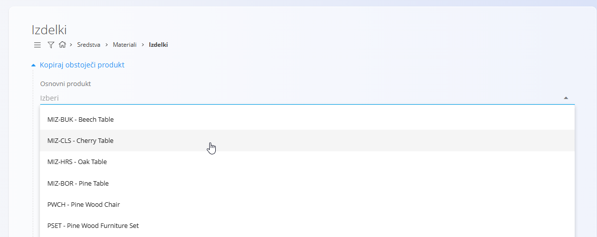
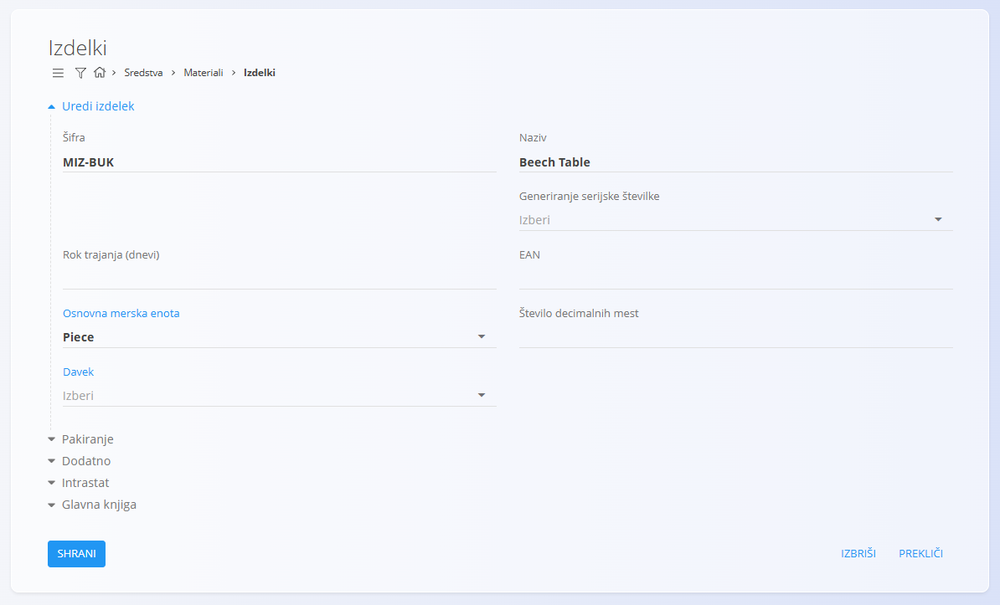

<!-- app_route: /management/materials/products -->
<!-- app_label: Izdelki -->
<!-- canonical_source_url: https://github.com/Tom-PIT/Connected.Docs/blob/main/sl/Domene/Sredstva/Materiali/Izdelki.md -->
<!-- canonical_source_title: Izdelki -->

# Izdelki

**Izdelki** so končni proizvodi, ki jih podjetje izdeluje ali kupuje. Te postavke se lahko prodajajo kupcem, skladiščijo v skladišču ali uporabljajo v internih procesih. Primeri izdelkov so hrastova miza, pisarniški stol, LED svetilka ali vrtna klop.

Vsak izdelek vsebuje pomembne podatke – kot so [merske enote](../../../Skupno/Upravljanje/MerskeEnote.md), [davčna stopnja](../../../Skupno/Upravljanje/DavcneStopnje.md), rok uporabe ali [pakiranje](Pakiranje.md) – ki zagotavljajo dosledno upravljanje v zalogi, prodaji in proizvodnih dokumentih. Ta šifrant predstavlja vse končne izdelke, ki so na voljo v vašem katalogu.

> [!TIP]
> Za celoten prikaz si oglejte video vodič  
> **[Materiali izdelkov](https://www.youtube.com/watch?v=FcrJ_IHQYeA)**.

> [!NOTE]  
> **Predpogoji**  
> Pred upravljanjem izdelkov preverite, ali so pravilno nastavljeni naslednji šifranti:  
> - [**Merske enote**](../../../Skupno/Upravljanje/MerskeEnote.md)  
> - [**Davčne stopnje**](../../../Skupno/Upravljanje/DavcneStopnje.md)

Za dostop do šifranta **Izdelki** pojdite na  
**Sredstva / Materiali / Izdelki** v [navigaciji](../../../Skupno/UI/Navigacija.md).

## Shema

<strong>Izdelek</strong>

| Polje | Opis |
|------|------|
| **Šifra** | Enolični identifikator izdelka znotraj seznama materialov. Na primer **2625001** ali **MIZ-ČLS**. Šifra mora biti enolična med vsemi materiali. (obvezno) |
| **Naziv** | Ime izdelka, prikazano v seznamih in dokumentih. Na primer **Miza – hrast**. (obvezno) |
| **Generiranje serijske številke** | Določa način upravljanja serijskih številk in zapisov materialov: • **Auto** – vsak kos prejme svojo naraščajočo serijsko številko. • **Same** – vsi kosi imajo enako serijsko številko, vendar ostanejo ločeni zapisi. • **Identical** – vsi kosi imajo enako serijsko številko in se obravnavajo kot en identičen zapis. |
| **Rok trajanja (dnevi)** | Število dni do poteka, uporabljeno za pokvarljivo blago. Na primer **30** ali **365**. |
| **EAN** | Vrednost črtne šifre, uporabljena za skeniranje. Na primer **3831234567890**. |
| **[Osnovna merska enota](../../../Skupno/Upravljanje/MerskeEnote.md)** | Merska enota za izražanje količin, kot sta **kos** ali **meter**. (obvezno) |
| **Število decimalnih mest** | Privzeto število decimalnih mest za prikaz vrednosti. Na primer **3** za **1,255** ali **1** za **2,5**. |
| **[Davek](../../../Skupno/Upravljanje/DavcneStopnje.md)** | Privzeta davčna stopnja, uporabljena v poslovnih dokumentih. Na primer **22** ali **9,5**. |

<strong>Pakiranje</strong>

**Definicija pakiranja** opisuje fizikalne lastnosti materiala in alternativne enote, ki se uporabljajo pri ravnanju z njim v skladišču. To je mogoče nastaviti tudi v razdelku [**Pakiranje**](Pakiranje.md).

| Polje | Opis |
|-------|------|
| **EAN** | Črtna koda pakiranja. |
| **Količina (kos)** | Količina, ki jo predstavlja pakirna enota (npr. 6 kosov na škatlo). |
| **Alternativna merska enota** | Alternativna enota za ravnanje ali poročanje (npr. paket). |
| **Teža** | Vnesite neto in bruto težo pakiranja. |
| **Dimenzije** | Vnesite širino, višino in globino pakirne enote. |

<strong>Dodatno</strong>

| Polje | Opis |
|------|------|
| **Opis** | Kratek interni opis, ki pojasnjuje uporabo ali specifikacije izdelka. Na primer **Masiven hrast, oljen**. |
| **Oznake** | Oznake za kategorizacijo in filtriranje. Na primer **pohištvo**, **premium**. |
| **Info povezava** | Povezava do zunanjih informacij ali dokumentacije o izdelku. |
| **URL do slike izdelka** | Javna povezava do slike izdelka. |
| **Zunanji ključ** | Identifikator zapisa v zunanjem sistemu, na primer **SAP-4711**. |

<strong>Glavna knjiga in Intrastat</strong>

| Polje | Opis |
|------|------|
| **[Konto zaloge](../../Racunovodstvo/Upravljanje/GlavnaKnjiga/Konti.md)** | Bilančni konto za vrednost zaloge tega izdelka. Nastavi se na ravni materiala in lahko preglasi privzeti konto zaloge. |
| **[Konto stroška](../../Racunovodstvo/Upravljanje/GlavnaKnjiga/Konti.md)** | Konto poslovnega izida (npr. strošek prodanega blaga), ki se uporabi ob porabi, izdaji iz zaloge ali prodaji izdelka. Lahko preglasi privzeti konto stroška. |
| **[Tarifa](../../Racunovodstvo/Upravljanje/Intrastat/Tarife.md)** | Carinska tarifa za statistično in carinsko poročanje. |
| **[Država porekla](../../../Skupno/Upravljanje/Drzave.md)** | Država porekla za trgovinske in carinske dokumente. |
| **Pretvornik mase** | Faktor za pretvorbo osnovne merske enote v maso (npr. kg). Uporablja se v Intrastatu ali analitiki, ko je potreben podatek o teži. |

## Upravljanje

### Seznam izdelkov

Uporabniški vmesnik vsebuje seznam izdelkov. Če zapisi še ne obstajajo, je seznam prazen.

Seznam prikazuje ime izdelka, šifro in način generiranja serijske številke.

Na levi strani zaslona je na voljo filter po **Oznakah**, v zgornjem desnem kotu pa **iskalno polje** za hitro iskanje določenih izdelkov.

## Dejanja

Kliknite [akcijski gumb](../../../Skupno/UI/AkcijskiGumb.md), da se prikažejo naslednja dejanja:

- [**Uvoz**](#uvoziti-izdelke)
- [**Kopiraj obstoječe**](#kopirati-obstoječi-izdelek)
- **Nov**

### Ustvariti nov izdelek

Kliknite [akcijski gumb](../../../Skupno/UI/AkcijskiGumb.md) in izbirate **Nov**, da odprete obrazec za dodajanje novega izdelka. Obrazec vključuje polja, kot so **Koda**, **Ime**, **Generiranje serijske številke**, **Osnovna merska enota**, **Davčna stopnja** in druga, odvisno od konfiguracije sistema.

Na voljo so dodatni zložljivi razdelki:

#### Pakiranje

Ta razdelek omogoča pregled ali dodajanje enega ali več zapisov [pakiranja](Pakiranje.md), specifičnih za material. Vsak zapis predstavlja eno pakirno enoto z lastno količino in identifikacijo.

Zapisi pakiranja se kasneje uporabljajo v skladiščnih procesih, kot so:
- [**Prevzemi**](../../Logistika/Dokumenti/Prevzemi.md)
- [**Izdajnice**](../../Logistika/Dokumenti/Izdajnice.md)
- [**Medskladiščni promet**](../../Logistika/Dokumenti/MedSkladiscniPromet.md)

#### Intrastat in Glavna knjiga

Vnesite podrobnosti za Intrastat in druge računovodske podatke, uporabljene pri poročanju.

> [!WARNING]
> V razdelku **Glavna knjiga** vnesite pravilne konte (npr. konto zaloge in stroška). Napačne ali manjkajoče vrednosti lahko povzročijo napake pri knjiženju.

#### Dodatno

Ta razdelek vsebuje neobvezna opisna polja, kot so opis materiala, oznake, slike, povezave ali zunanji identifikatorji. Ta polja zagotavljajo dodatni kontekst, vendar ne vplivajo na izračune zaloge.

Po vnosu zahtevanih podatkov kliknite **Dodaj**, da shranite izdelek, ali **Prekliči**, da se vrnete na seznam.

### Uvoziti izdelke

Kliknite [akcijski gumb](../../../Skupno/UI/AkcijskiGumb.md) in izbirate **Uvoz**. Ta akcija omogoča hkratni uvoz več materialov izdelkov z uporabo ustrezno pripravljene preglednice.

Za podrobnosti glejte dokumentacijo  
[**Uvoz materialov**](UvozMaterialov.md).

### Kopirati obstoječi izdelek

Kliknite [akcijski gumb](../../../Skupno/UI/AkcijskiGumb.md) in izbirate **Kopiraj obstoječi izdelek**, da ustvarite nov izdelek na podlagi že obstoječega. Prikaže se izbirni seznam razpoložljivih osnovnih izdelkov.

Po izbiri osnovnega izdelka so vsa polja predizpolnjena in jih je mogoče urediti pred shranjevanjem.

## Urediti izdelek

Za urejanje obstoječega izdelka kliknite **Ime** izdelka v seznamu. Vmesnik se preklopi v način urejanja, kjer so prikazana vsa polja. Kliknite **Shrani** za potrditev sprememb ali **Prekliči** za zavrnitev.

## Izbrisati izdelek

Kliknite **Izbriši** na zaslonu za urejanje, da odprete potrditveno pogovorno okno:

**Ali ste prepričani, da želite izbrisati ta zapis?**

Če potrdite, se izdelek trajno odstrani; v nasprotnem primeru sistem ohrani zapis nespremenjen.

> [!NOTE]
> Izdelek je mogoče izbrisati le, če ni referenciran v odvisnih zapisih, kot so premiki zaloge, dokumenti ali strukture materialov.
