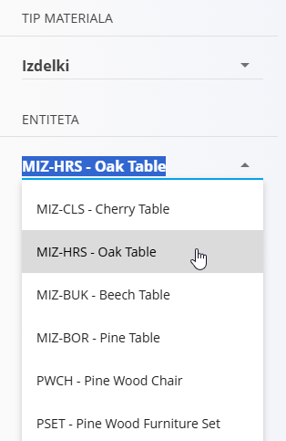
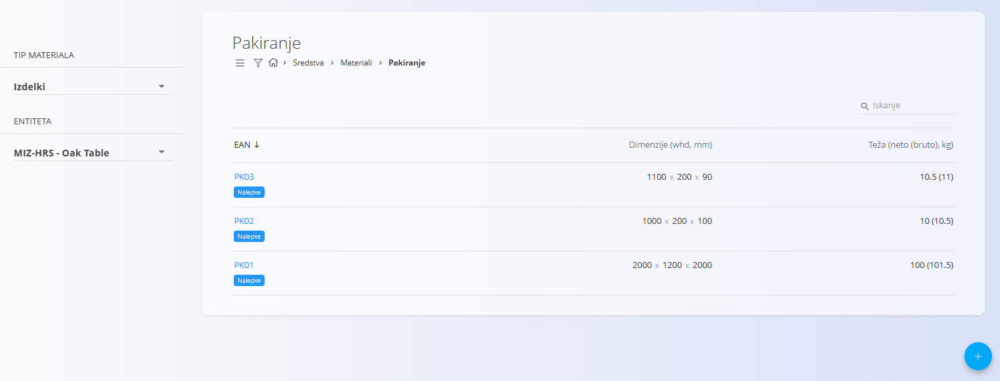
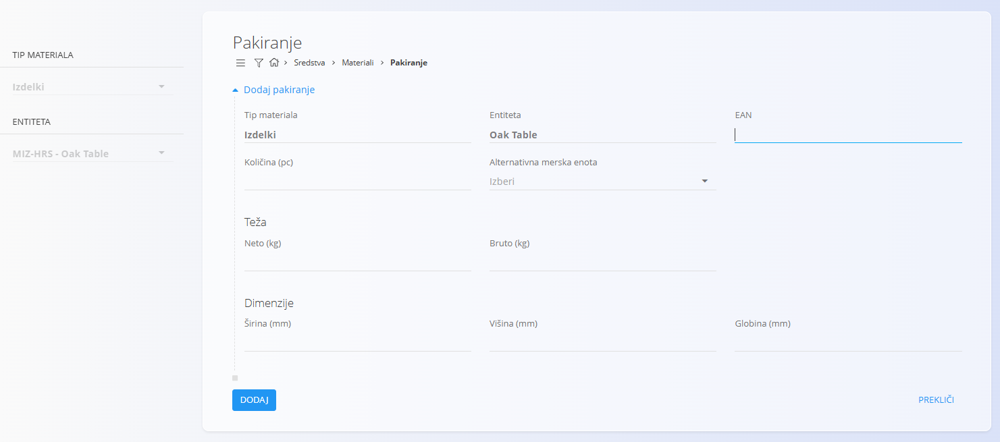
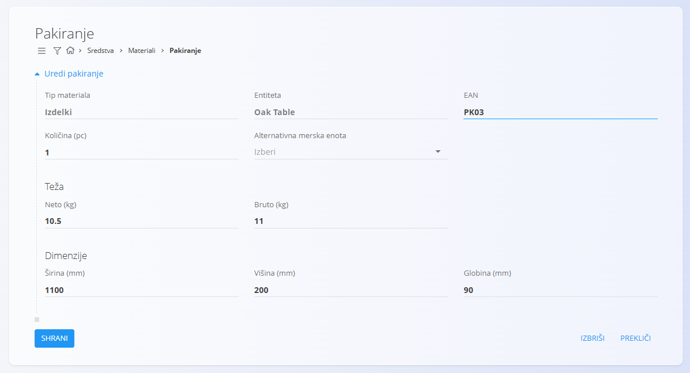
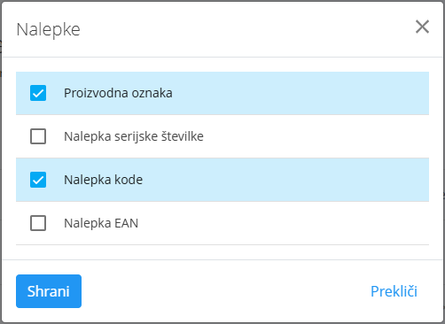

<!-- app_route: /management/materials/packaging -->
<!-- app_label: Pakiranje -->
<!-- canonical_source_url: https://github.com/Tom-PIT/Connected.Docs/blob/main/sl/Domene/Sredstva/Materiali/Pakiranje.md -->
<!-- canonical_source_title: Pakiranje -->

# Pakiranje

**Pakiranje** določa, kako je material zapakiran, vključno s količino, težo, dimenzijami in neobveznimi alternativnimi merskimi enotami. Podatki o pakiranju so ključni za logistiko, pošiljanje in upravljanje zalog. Uporablja se za:

- **[Izdelki](Izdelki.md)**  
- **[Polizdelki](Polizdelki.md)**  
- **[Repro materiali](ReproMateriali.md)**  
- **[Surovine](Surovine.md)**  

> [!NOTE]
> Podrobnosti pakiranja za posamezno vrsto materiala je mogoče določiti tudi v razdelkih materiala.

> [!TIP]
> Za celovit prikaz si oglejte video vodič **[Pakiranje](https://www.youtube.com/watch?v=-0T_l14bg5s)**.

Za dostop do nastavitev pakiranja pojdite na **Sredstva / Materiali / Pakiranje** v [navigaciji](../../../Skupno/UI/Navigacija.md).

## Shema

| Polje | Opis |
|-------|------|
| **Tip materiala** | Kategorija materiala, ki mu je dodeljeno pakiranje (npr. Izdelki, Polizdelki, Repro materiali, Surovine). |
| **Entiteta** | Konkretni materialni zapis znotraj izbrane vrste materiala. |
| **EAN** | Enolični identifikator pakiranja. Uporablja se tudi za označevanje. |
| **Količina** | Število kosov, vključenih v eno pakiranje. |
| **Alternativna merska enota** | (Neobvezno) Alternativna merska enota za vsebino pakiranja. |
| **Neto teža** | Teža brez embalaže. |
| **Bruto teža** | Teža skupaj z embalažo. |
| **Dimenzije** | Širina, višina in globina. |

## Upravljanje

Za dodelitev pakiranja materialu morate najprej izbrati **Vrsto materiala** (npr. Izdelki, Polizdelki) in nato konkretno **Entiteto** na levi strani zaslona.

### Pregled seznama

Vmesnik prikazuje seznam zapisov pakiranja za izbrano **Vrsto materiala** in **Entiteto**.

Seznam prikazuje:

- **EAN**
- **Dimenzije** (širina × višina × globina)
- **Težo** (neto in bruto)
- oznako **Nalepke**

V zgornjem desnem kotu je na voljo **iskalno polje**.

## Dejanja

### Ustvarjati novo pakiranje

Kliknite **[akcijski gumb](../../../Skupno/UI/AkcijskiGumb.md)** v zaslonu **Pakiranje** za dodajanje novega pakiranja.

Obrazec vključuje naslednja polja:

- **EAN**
- **Količina (kos)**
- **Alternativna merska enota**
- **Teža** (neto in bruto)
- **Dimenzije** (širina, višina, globina)

Po vnosu zahtevanih podatkov kliknite **Dodaj** za shranjevanje ali **Prekliči** za vrnitev brez sprememb.

## Urediti obstoječe pakiranje

Za urejanje obstoječega zapisa pakiranja kliknite vrednost **EAN** na seznamu.

Zaslon za urejanje omogoča spreminjanje vseh polj.  
Po končanem urejanju kliknite **Shrani** ali **Prekliči**.

### Nalepke

Vsak zapis pakiranja vsebuje oznako **Nalepke**, ki določa, katere vrste nalepk je mogoče ustvariti za to pakiranje.

V seznamskem pogledu kliknite gumb **Nalepke** pod izbranim pakiranjem:

Odpre se pogovorno okno za izbor nalepk:

Razpoložljive vrste nalepk:

- **Nalepka serijske številke**
- **Proizvodna nalepka**
- **EAN nalepka**
- **Kodni nalepka**

Izberite želene vrste nalepk in kliknite **Shrani**.

## Izbrisati pakiranje
  
Kliknite **Izbriši** na zaslonu za urejanje, da odprete potrditveno pogovorno okno:

**Ali ste prepričani, da želite izbrisati ta zapis?**

Če potrdite, se pakiranje trajno odstrani; v nasprotnem primeru sistem ohrani obstoječe stanje.

> [!NOTE]
> Zapis pakiranja je mogoče izbrisati le, če ni referenciran v drugih sistemskih entitetah.
