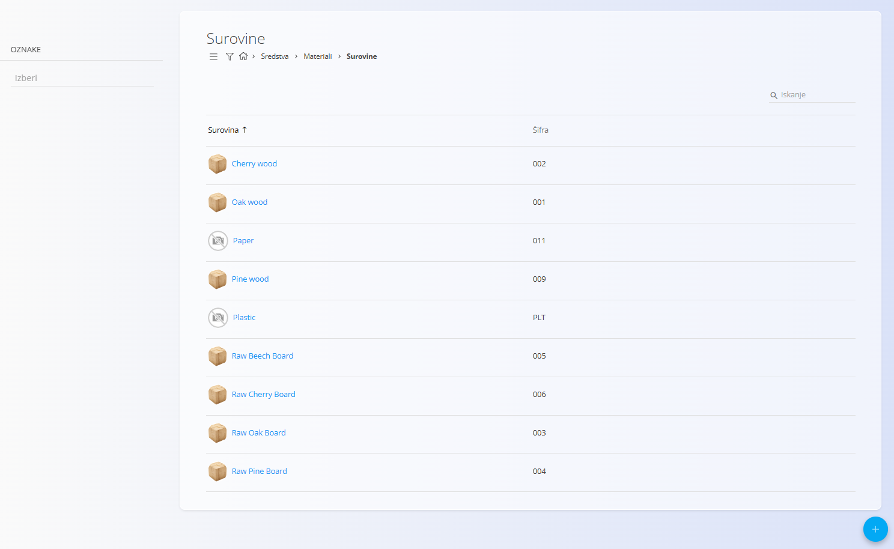
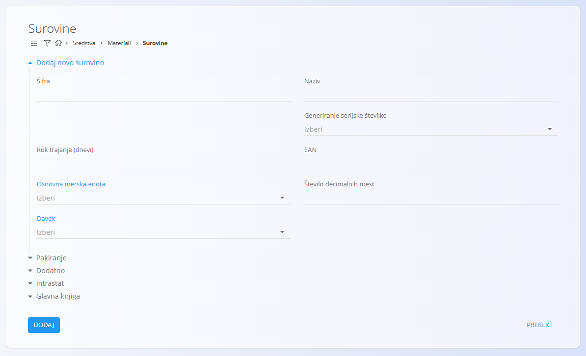
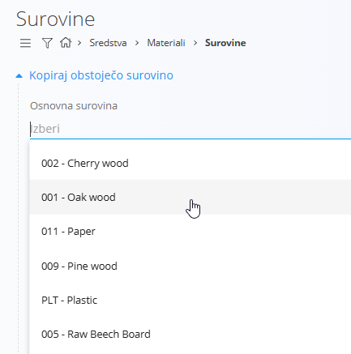
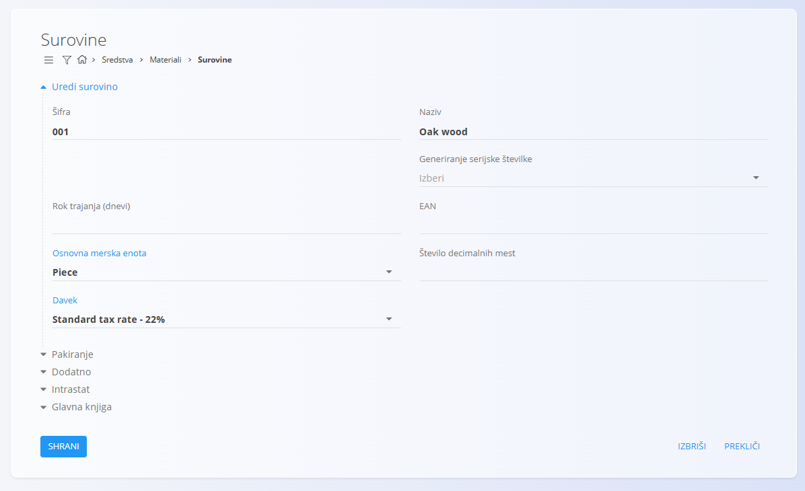

<!-- app_route: /management/materials/raw-materials -->
<!-- app_label: Surovine -->
<!-- canonical_source_url: https://github.com/Tom-PIT/Connected.Docs/blob/main/sl/Domene/Sredstva/Materiali/Surovine.md -->
<!-- canonical_source_title: Surovine -->

# Surovine

**Surovine** so osnovni materiali, ki se uporabljajo v proizvodnih procesih ali se kupujejo za interno uporabo. Mednje sodijo les, kovinske plošče, tkanine, kemikalije ali kateri koli drug vhodni material, potreben za izdelavo končnih izdelkov. Vsaka surovina vsebuje ključne podatke – kot so [merske enote](../../../Skupno/Upravljanje/MerskeEnote.md), [davčna stopnja](../../../Skupno/Upravljanje/DavcneStopnje.md), rok uporabe ali [pakiranje](Pakiranje.md) – kar omogoča dosledno upravljanje v celotnem sistemu.

Ta šifrant predstavlja register vseh surovin znotraj strukture materialov.

> [!TIP]
> Za celovit prikaz si oglejte video vodič **[Surovine](https://www.youtube.com/watch?v=kb6I-eJ0tBU)**.

> [!NOTE]  
> **Predpogoji**  
> Pred upravljanjem surovin zagotovite, da so naslednji šifranti pravilno nastavljeni:  
> - [**Merske enote**](../../../Skupno/Upravljanje/MerskeEnote.md)  
> - [**Davčne stopnje**](../../../Skupno/Upravljanje/DavcneStopnje.md)

Za dostop do šifranta **Surovine** pojdite na  
**Sredstva / Materiali / Surovine** v [navigaciji](../../../Skupno/UI/Navigacija.md).

## Shema

<strong>Surovina</strong>

| Polje | Opis |
|------|------|
| **Šifra** | Enolični identifikator surovine znotraj seznama materialov. Šifra mora biti enolična med vsemi materiali. (obvezno) |
| **Naziv** | Ime surovine, prikazano v seznamih in dokumentih. (obvezno) |
| **Generiranje serijske številke** | Določa način upravljanja serijskih številk in zapisov materialov: • **Auto** – vsak kos prejme svojo naraščajočo serijsko številko. • **Same** – vsi kosi imajo enako serijsko številko, vendar ostanejo ločeni zapisi. • **Identical** – vsi kosi imajo enako serijsko številko in se obravnavajo kot en identičen zapis. |
| **Rok trajanja (dnevi)** | Število dni do poteka, uporabljeno za pokvarljivo blago. Na primer **30** ali **365**. |
| **EAN** | Vrednost črtne šifre, uporabljena za skeniranje. Na primer **3831234567890**. |
| **[Osnovna merska enota](../../../Skupno/Upravljanje/MerskeEnote.md)** | Merska enota za izražanje količin, kot sta **kos** ali **meter**. (obvezno) |
| **Število decimalnih mest** | Privzeto število decimalnih mest za prikaz vrednosti. Na primer **3** za **1,255** ali **1** za **2,5**. |
| **[Davek](../../../Skupno/Upravljanje/DavcneStopnje.md)** | Privzeta davčna stopnja, uporabljena v poslovnih dokumentih. Na primer **22** ali **9,5**. |

<strong>Pakiranje</strong>

**Definicija pakiranja** opisuje fizikalne lastnosti materiala in alternativne enote, ki se uporabljajo pri ravnanju z njim v skladišču. To je mogoče nastaviti tudi v razdelku [**Pakiranje**](Pakiranje.md).

| Polje | Opis |
|-------|------|
| **EAN** | Črtna koda pakiranja. |
| **Količina (kos)** | Količina, ki jo predstavlja pakirna enota (npr. 6 kosov na škatlo). |
| **Alternativna merska enota** | Alternativna enota za ravnanje ali poročanje (npr. paket). |
| **Teža** | Vnesite neto in bruto težo pakiranja. |
| **Dimenzije** | Vnesite širino, višino in globino pakirne enote. |

<strong>Dodatno</strong>

| Polje | Opis |
|------|------|
| **Opis** | Kratek interni opis, ki pojasnjuje uporabo ali specifikacije izdelka. Na primer **Masiven hrast, oljen**. |
| **Oznake** | Oznake za kategorizacijo in filtriranje. Na primer **pohištvo**, **premium**. |
| **Info povezava** | Povezava do zunanjih informacij ali dokumentacije o izdelku. |
| **URL do slike izdelka** | Javna povezava do slike izdelka. |
| **Zunanji ključ** | Identifikator zapisa v zunanjem sistemu, na primer **SAP-4711**. |

<strong>Glavna knjiga in Intrastat</strong>

| Polje | Opis |
|------|------|
| **[Konto zaloge](../../Racunovodstvo/Upravljanje/GlavnaKnjiga/Konti.md)** | Bilančni konto za vrednost zaloge surovine. Nastavi se na ravni materiala in lahko preglasi privzeti konto zaloge za surovine. |
| **[Konto stroška](../../Racunovodstvo/Upravljanje/GlavnaKnjiga/Konti.md)** | Konto poslovnega izida, ki se uporabi ob porabi surovine v proizvodnji ali drugi uporabi (npr. strošek porabljenih surovin). Lahko preglasi privzeti konto stroška. |
| **[Tarifa](../../Racunovodstvo/Upravljanje/Intrastat/Tarife.md)** | Carinska tarifa za statistično in carinsko poročanje. |
| **[Država porekla](../../../Skupno/Upravljanje/Drzave.md)** | Država porekla za trgovinske in carinske dokumente. |
| **Pretvornik mase** | Faktor za pretvorbo osnovne merske enote v maso (npr. kg). Uporablja se v Intrastatu ali analitiki, ko je potreben podatek o teži. |

## Upravljanje

### Seznam surovin

Uporabniški vmesnik vsebuje seznam surovin.

Na levi strani je na voljo filter po **Oznakah**, v zgornjem desnem kotu pa **iskalno polje** za hitro iskanje.

## Dejanja

Kliknite [akcijski gumb](../../../Skupno/UI/AkcijskiGumb.md), da se prikažejo naslednja dejanja:

- [**Uvoz**](#uvoziti-surovine)
- [**Kopiraj obstoječi**](#kopirati-obstoječo-surovino)
- **Nov**

### Ustvariti novo surovino

Kliknite [akcijski gumb](../../../Skupno/UI/AkcijskiGumb.md) in izberite **Novo**, da odprete obrazec za dodajanje nove surovine.  

Obrazec vključuje polja, kot so **Koda**, **Ime**, **Generiranje serijske številke**, **Osnovna merska enota**, **Davčna stopnja** in druga, odvisno od konfiguracije sistema.

Na voljo so dodatni zložljivi razdelki:

#### Pakiranje

Ta razdelek omogoča pregled ali dodajanje enega ali več zapisov [pakiranja](Pakiranje.md), specifičnih za material. Vsak zapis predstavlja eno pakirno enoto z lastno količino in identifikacijo.

Zapisi pakiranja se kasneje uporabljajo v skladiščnih procesih, kot so:
- [**Prevzemi**](../../Logistika/Dokumenti/Prevzemi.md)
- [**Izdajnice**](../../Logistika/Dokumenti/Izdajnice.md)
- [**Medskladiščni promet**](../../Logistika/Dokumenti/MedskladiscniPromet.md)

#### Intrastat in Glavna knjiga

Vnesite podrobnosti za Intrastat in druge računovodske podatke, uporabljene pri poročanju.

> [!WARNING]
> V razdelku **Glavna knjiga** vnesite pravilne konte (npr. konto zaloge in stroška). Napačne ali manjkajoče vrednosti lahko povzročijo napake pri knjiženju.

### Uvoziti surovine

Kliknite [akcijski gumb](../../../Skupno/UI/AkcijskiGumb.md) in izberite **Uvoz** za hkratni uvoziti več surovin.

Za podrobnosti glejte dokumentacijo  
[**Uvoz materialov**](UvozMaterialov.md).

### Kopirati obstoječo surovino

Kliknite [akcijski gumb](../../../Skupno/UI/AkcijskiGumb.md) in izberite **Kopiraj obstoječo**, da omogočite ustvarjanje nove surovine na podlagi že obstoječe.

#### Dodatno

Ta razdelek vsebuje neobvezna opisna polja, kot so opis materiala, oznake, slike, povezave ali zunanji identifikatorji. Ta polja zagotavljajo dodaten kontekst, vendar ne vplivajo na izračune zaloge.

Po vnosu zahtevanih podatkov kliknite **Dodaj**, da shranite surovino, ali **Prekliči**, da se vrnete na seznam.

## Urediti surovino

Kliknite ime surovine v seznamu, da odprete zaslon za urejanje.

## Izbrisati surovino

Kliknite **Izbriši** na zaslonu za urejanje, da odprete potrditveno pogovorno okno:

**Ali ste prepričani, da želite izbrisati ta zapis?**

Če potrdite, se surovina trajno odstrani; v nasprotnem primeru sistem ohrani zapis nespremenjen.

> [!NOTE]
> Surovino je mogoče izbrisati le, če ni referencirana v drugih zapisih.
