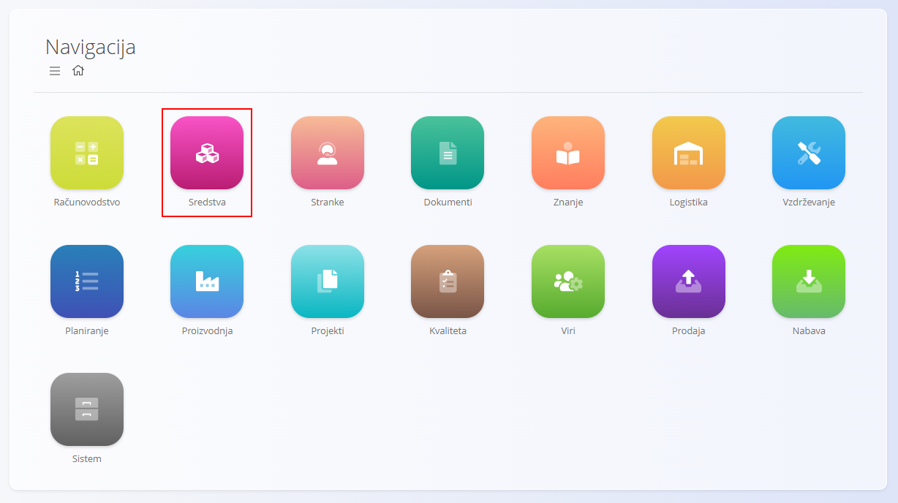
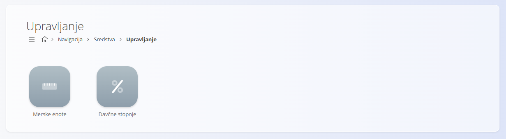

<!-- app_route: /sitemap/assets -->
<!-- app_label: Domena Sredstva -->
<!-- canonical_source_url: https://tom-pit.github.io/Connected.Docs/sl/Domene/Sredstva/ -->
<!-- canonical_source_title: Domena Sredstva -->

# Sredstva

Domena **Sredstva** vsebuje vse zapise, povezane z izdelki in storitvami, ki jih podjetje ponuja, ter z operativnimi postavkami, ki se uporabljajo za njihovo izdelavo, dobavo ali podporo. Vključuje tako **Sredstva** (komercialne postavke za prodajo) kot **Materiale** (operativne postavke, uporabljene interno v proizvodnji in logistiki).

- **Sredstva** so komercialne postavke, vidne kupcem (npr. končni izdelki, storitve, kataloški izdelki). Določajo, kako so ponudbe cenjene, obdavčene in prikazane v prodajnih dokumentih.
- **Materiali** so operativne postavke, uporabljene interno (npr. surovine, komponente, polizdelki, pakiranje, repro materiali). Določajo zalogo in tok blaga skozi logistiko in proizvodnjo.

Na primer: **sredstvo** je lahko *Komplet prenosnega računalnika*, prodan kot paket, ki vključuje prenosnik, torbo in miško. Posamezni deli tega kompleta — kot so **miška**, **prenosnik** ali celo notranji **čipi** — pa so obravnavani kot **materiali**, saj so komponente, uporabljene za sestavo ali podporo končnega komercialnega izdelka. Za več informacij glejte primerjavo [Sredstva vs. Materiali](#sredstva-vs-materiali).

Ta domena združuje vse elemente, potrebne za definiranje, cenitev, organizacijo in operativno upravljanje kataloga v prodaji in logistiki.

Za dostop do domene Sredstva pojdite na **Sredstva** v [navigaciji](../../Skupno/UI/Navigacija.md).

> [!NOTE]  
> Razpoložljive domene so odvisne od konfiguracije sistema in poslovnega modela podjetja.

## Kaj vključuje domena Sredstva?

Domena je razdeljena na več funkcionalnih področij:

- **[Sredstva](Sredstva/Sredstva.md)** – definirajo izdelke in storitve, ponujene kupcem. Vsako sredstvo vključuje cene, davčne nastavitve, opisna polja in po potrebi strukturo komponent.

- **[Ceniki sredstev](Sredstva/CenikiSredstev.md)** – uporabljajo se za pripravo prodajnih cen za izbrana sredstva. Ceniki podpirajo časovno veljavnost, cenitev po podjetjih in količinske popuste.

- **[Materiali](Materiali/README.md)** – materiali se uporabljajo za *izdelavo* sredstev ali kot postavke v logističnih procesih (zaloga, prevzemi, izdaje ipd.). Za razliko od sredstev so materiali izključno interni.

    - **[Izdelki](Materiali/Izdelki.md)**
    - **[Surovine](Materiali/Surovine.md)**
    - **[Repro materiali](Materiali/ReproMateriali.md)**
    - **[Polizdelki](Materiali/Polizdelki.md)**

- **Upravljanje – vsebuje dodatne konfiguracijske elemente, kot so:
  - **[Davčne stopnje](../../Skupno/Upravljanje/DavcneStopnje.md)**
  - **[Merske enote](../../Skupno/Upravljanje/MerskeEnote.md)**
Te nastavitve določajo strukturo in vedenje sredstev ter način njihove cenitve.

## Sredstva vs. Materiali

Razumevanje razlike med tema dvema pojmoma je ključno. Čeprav oba predstavljata postavke, ki jih sistem upravlja, imata povsem različen namen.

- **[Sredstva](Sredstva/Sredstva.md)** določajo, kaj podjetje *prodaja* kupcem.
- **[Materiali](Materiali/README.md)** določajo, kaj podjetje *uporablja interno* v proizvodnji in logistiki.

Spodnja tabela povzema ključne razlike:

| Vidik | **Sredstva** | **Materiali** |
|------|--------------|---------------|
| **Namen** | Komercialne postavke za prodajo kupcem. | Operativne postavke za interno uporabo. |
| **Vloga v sistemu** | Pojavljajo se v cenikih, ponudbah, računih ipd. | Pojavljajo se v zalogi, prevzemih, izdajah, proizvodnji. |
| **Primeri** | Končni izdelki, storitve, kataloški izdelki. | Surovine, komponente, polizdelki, pakiranje. |
| **Uporaba v procesih** | Prodajni procesi (ponudbe, računi, pogodbe). | Logistični in proizvodni procesi. |
| **Cenitev** | Uporablja cenike sredstev. | Uporablja nabavne cenike in lastno vrednost. |
| **Sestava** | Lahko vsebuje materiale kot komponente. | Lahko je del kosovnic ali struktur sredstev. |
| **Vidnost za kupce** | Vidno kupcem. | Interno, kupci materialov ne vidijo. |
| **Življenjski cikel** | Tržno usmerjen. | Operativno usmerjen. |
