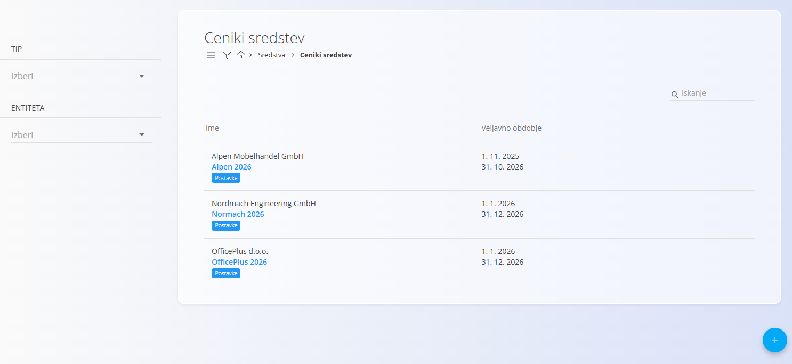
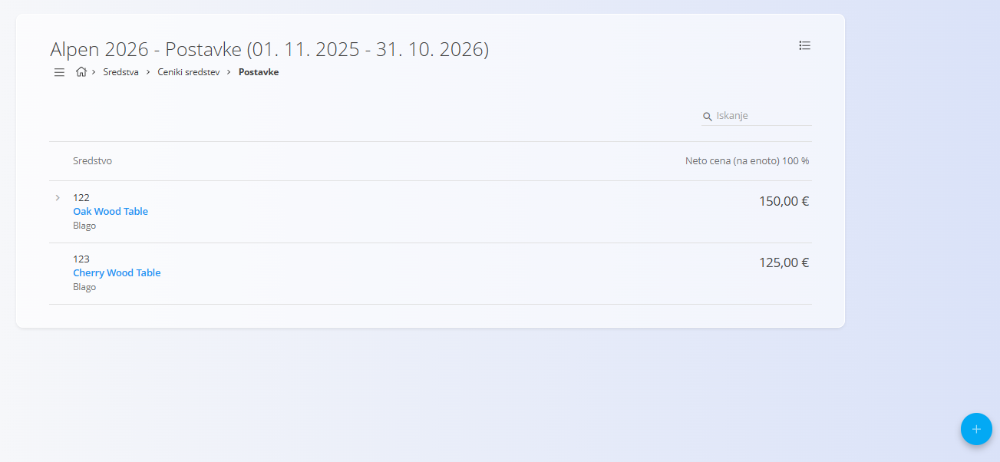
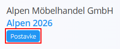
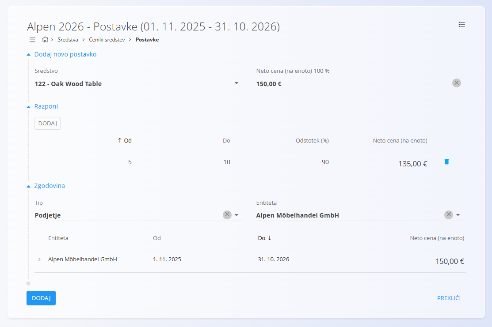
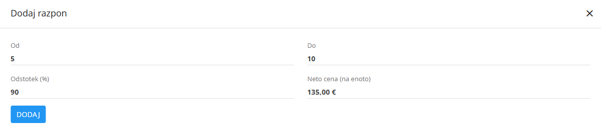
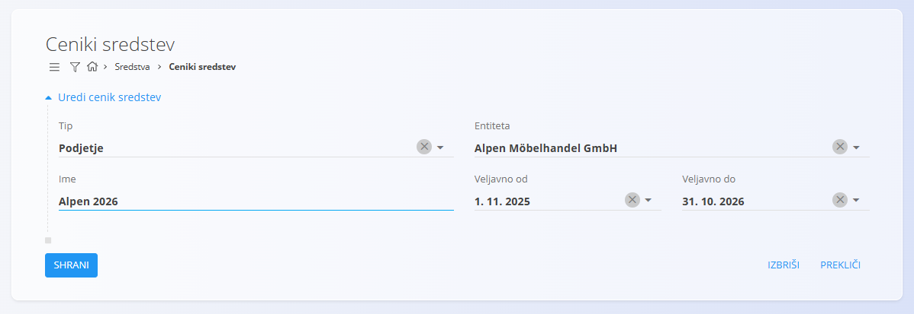
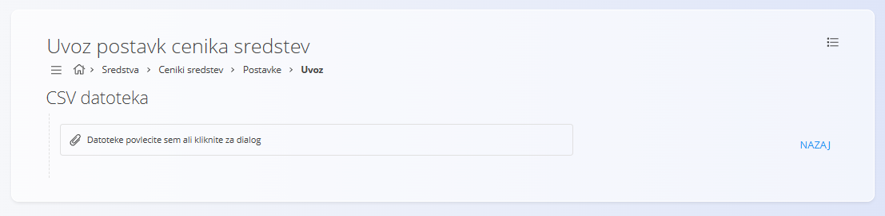

<!-- app_route: /assets/management/asset-price-lists -->
<!-- app_label: Ceniki sredstev -->
<!-- canonical_source_url: https://github.com/Tom-PIT/Connected.Docs/blob/main/sl/Domene/Sredstva/Sredstva/CenikiSredstev.md -->
<!-- canonical_source_title: Ceniki sredstev -->

# Ceniki sredstev

**Ceniki sredstev** določajo, koliko določen kupec (ali druga poslovna entiteta) plača za vaša [sredstva](Sredstva.md).  
Omogočajo nastavitev **cen po posameznem kupcu**, veljavnih za določeno časovno obdobje, ter po potrebi vključujejo **količinske popuste** (cenovne razrede).

Za dostop do tega zaslona pojdite na **Sredstva / Ceniki sredstev** v [navigaciji](../../../Skupno/UI/Navigacija.md).

## Shema

| Polje | Opis |
|------|------|
| **Tip** | Razvrstitev cenika (npr. *Podjetje*). |
| [**Entiteta**](../../../Skupno/Upravljanje/PoslovniImenik.md) | Kupec ali drug poslovni partner, za katerega velja cenik. |
| **Ime** | Prikazno ime cenika (obvezno). |
| **Veljavno od** | Datum začetka veljavnosti cenika. |
| **Veljavno do** | Datum konca veljavnosti cenika. |
| [**Sredstvo**](Sredstva.md) | Izbrano sredstvo, za katerega je v ceniku določena cena. |
| **Neto cena (na enoto) 100 %** | Osnovna neto cena sredstva pred popusti. |
| **Razponi** | Neobvezna pravila za količinske popuste, ki prilagodijo neto ceno glede na kupljeno količino. Vključujejo **Od**, **Do**, **Odstotek (%)** in **Neto cena postavke**. |

## Upravljanje

### Zaslon seznama

Za dostop do seznama cenikov pojdite na **Sredstva / Ceniki sredstev**.

Seznam prikazuje:
- vse obstoječe cenike  
- njihova obdobja veljavnosti  
- gumb **Podrobnosti** za ogled vsebine cenika  

Seznam je mogoče filtrirati po:
- **Tipu** (npr. Podjetje)
- **Entiteti** (npr. Kupec)

Klik na gumb **Postavke** odpre stran, kjer se upravljajo sredstva in količinski razponi.

## Dejanja

Glede na to, na katerem zaslonu se nahajate, [akcijski gumb](../../../Skupno/UI/AkcijskiGumb.md) ponuja različna dejanja:

Na strani **Ceniki sredstev**:
- **Nov**
- [**Kopiraj**](#kopirati-cenik)

Na strani **Podrobnosti**:
- [**Uvoz**](#uvoziti-cenik)
- **Nov**

### Ustvariti nov cenik sredstev

Za ustvarjanje delujočega cenika sledite tem korakom:

1. Kliknite [akcijski gumb](../../../Skupno/UI/AkcijskiGumb.md) in izberite **Nov**.
2. Izpolnite zahtevana polja: **Tip**, **Entiteta**, **Ime**, **Veljavno od**, **Veljavno do**.
3. Kliknite **Dodaj**, da shranite glavo cenika.
4. Kliknite gumb **Postavke**, da odprete stran s cenami.
   
   

5. Kliknite akcijski gumb in izberite **Novo**.

   

6. Izberite sredstvo, polje **Neto ceno (na enoto) 100 %** se samodejno izpolni.

7. (Neobvezno) Dodajte **Razpone**, da določite količinske popuste. V spodnjem primeru velja, da se pri nakupu med 5 in 100 sredstvi uporabi 90 % cene (10 % popust).

   

8. Shranite podrobnosti. Ponovite od koraka 5, da dodate več sredstev v cenik. 
 
Cenik je zdaj aktiven za izbranega kupca v določenem obdobju.

### Urediti cenik sredstev

Kliknite **ime cenika**, da odprete zaslon za urejanje. Tukaj lahko spremenite informacije o glavi cenika, vendar ne sredstev ali razponov. Za urejanje sredstev in razponov kliknite gumb **Podrobnosti**, kot je opisano v prejšnjem razdelku.

### Kopirati cenik sredstev

Ustvari kopijo obstoječega cenika, vključno z obdobjem veljavnosti in vsebino.

### Uvoziti cenik sredstev

Zaslon **Uvoz** omogoča uvoz CSV datoteke s seznamom postavk cenika.

## Izbrisati cenik sredstev

Cenike sredstev je mogoče izbrisati na zaslonu za urejanje, vendar **samo če ne vsebujejo nobenih sredstev**.

Če osnutek še vedno vsebuje sredstva v razdelku **Podrobnosti**:

1. Kliknite **Podrobnosti**, da odprete razdelek.
2. Kliknite sredstvo, da odprete njegov zaslon s podrobnostmi.  
3. Kliknite **Izbriši** v zaslonu podrobnosti sredstva.  
4. Postopek ponovite za vsa preostala sredstva.

Ko dokument ne vsebuje več nobenih sredstev, lahko kliknete **Izbriši**, da odstranite cenik.

## Meni

Meni omogoča dodatna dejanja, ki so na voljo na tej strani.

Na voljo je naslednje dejanje:

- **Izvoz v CSV**

Za podrobnosti o dejanjih menija glejte [**Dejanja menija**](../../../Skupno/Koncepti/MeniDejanja.md).
