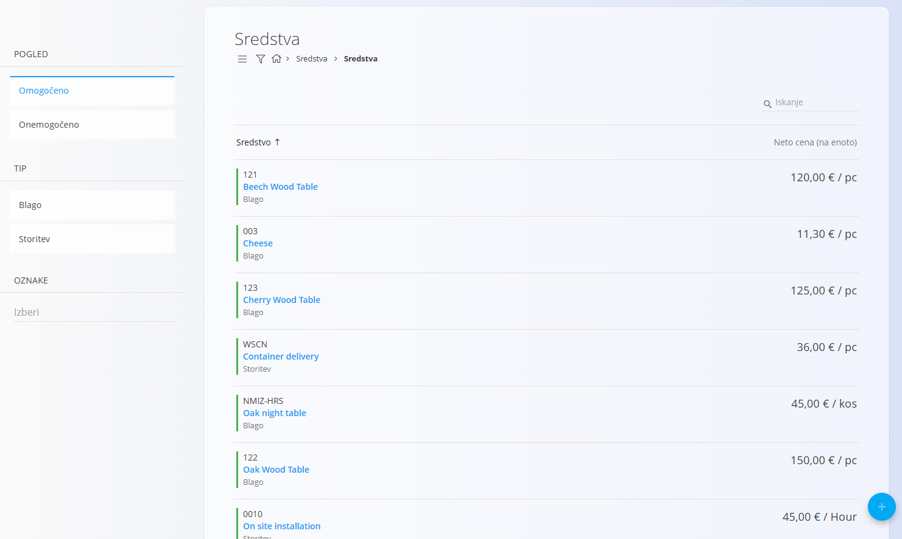
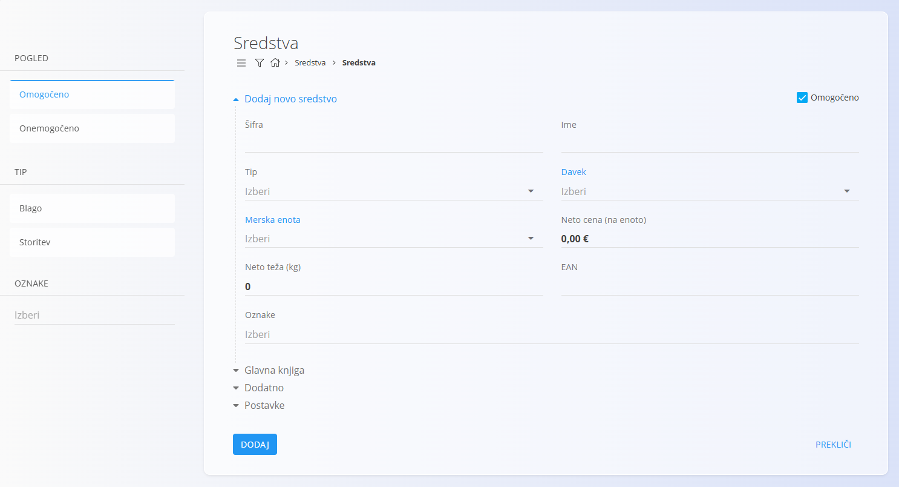
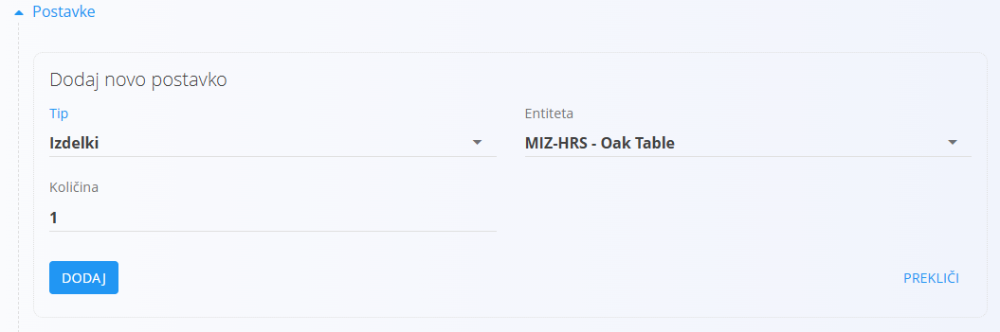
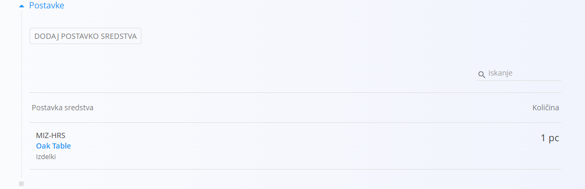
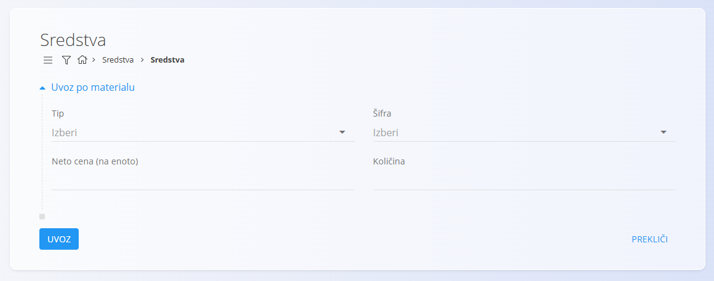

<!-- app_route: /assets/management/assets -->
<!-- app_label: Sredstva -->
<!-- canonical_source_url: https://tom-pit.github.io/Connected.Docs/sl/Domene/Sredstva/Sredstva/Sredstva/ -->
<!-- canonical_source_title: Sredstva -->

# Sredstva

**Sredstvo** predstavlja izdelek ali storitev, ki se lahko *proda* ali *zaračuna* v sistemu. Za razliko od **materialov** — ki se uporabljajo za sledenje zalogam, logistiko ali proizvodnjo — so **sredstva komercialne postavke**, namenjene cenitvi, ponujanju in obračunu.

Sredstva lahko predstavljajo:

- **Blago** (npr. končni izdelek, ponujen kupcem)
- **Storitve** (npr. montaža, prevoz, svetovanje)

Sredstva **ne sodelujejo v premikih zalog**. Namesto tega določajo prodajne postavke z lastno ceno, davčno stopnjo in lastnostmi. Sredstvo lahko po želji referencira materiale, kadar je prodani izdelek hkrati tudi predmet zalogovnega spremljanja.

Za dostop do tega zaslona pojdite na **Sredstva / Sredstva** v [navigaciji](../../../Skupno/UI/Navigacija.md).

## Shema

<strong>Sredstvo</strong>

| Polje | Opis |
|------|------|
| **Šifra** | Enolični identifikator sredstva (obvezno). |
| **Ime** | Prikazno ime sredstva (obvezno). |
| **Tip** | Določa, ali je sredstvo **Blago** ali **Storitev** (obvezno). |
| [**Davek**](../../../Skupno/Upravljanje/DavcneStopnje.md) | Uporabljena davčna stopnja (neobvezno). |
| [**Merska enota**](../../../Skupno/Upravljanje/MerskeEnote.md) | Enota za prikaz in cenitev sredstva (obvezno). |
| **Neto cena (na enoto)** | Neto cena na enoto sredstva. |
| **Neto teža (kg)** | Teža sredstva, če je relevantna (privzeto = 0). |
| **EAN** | Črtna koda (neobvezno). |
| **Oznake** | Neobvezne oznake za razvrščanje. |

<strong>Intrastat in Glavna knjiga</strong>

| Polje | Opis |
|------|------|
| **[Tarifa](../../Racunovodstvo/Upravljanje/Intrastat/Tarife.md)** | Carinska tarifa za statistično in carinsko poročanje. |
| **[Država porekla](../../../Skupno/Upravljanje/Drzave.md)** | Država porekla za trgovinske in carinske dokumente. |
| **Pretvornik mase** | Faktor za pretvorbo osnovne merske enote v maso (npr. kg). Uporablja se v Intrastatu ali analitiki, ko je potrebna teža. |
| **Konto prihodkov na domačen trgu** | Prihodkovni konto, uporabljen za prodaje na domačem trgu. |
| **Konto prihodka na trgih EU** | Prihodkovni konto, uporabljen za prodaje na trgih EU. |
| **Konto prihodka na trgih izven EU** | Prihodkovni konto, uporabljen za prodaje na trgih izven EU. |
| **[Konto zaloge](../../Racunovodstvo/Upravljanje/GlavnaKnjiga/Konti.md)** | Bilančni konto za vrednost zaloge, kadar je sredstvo povezano z zalogovno spremljanimi materiali. |

<strong>Dodatno in Podrobnosti</strong>

|  Polje | Opis |
|-------|------|
| **Opis** | Dodatno besedilo z razlago sredstva. |
| **Podrobnosti** | Seznam komponent sredstva (npr. povezani materiali ali količine). |
| **Dodaj novo podrobnost sredstva** | Dejanje za dodajanje nove podrobnosti sredstva. |
| **Tip** | Tip podrobnosti (npr. Izdelki). |
| **Entiteta** | Izbran [material](../Materiali/README.md) ali postavka, ki se poveže kot del sredstva. |
| **Količina** | Količina povezane entitete. |

## Upravljanje

### Seznam sredstev

Seznam **Sredstva** prikazuje vsa obstoječa sredstva, skupaj z njihovo vrsto (storitev ali blago), neto ceno in mersko enoto.

Seznam sredstev lahko filtrirate z uporabo:

- **Pogled**: Omogočeno / Onemogočeno
- **Tip**: Blago / Storitev
- **Oznake**

Ti filtri pomagajo pri iskanju določenih sredstev in poenostavijo upravljanje obsežnih katalogov.

## Dejanja

### Ustvariti novo sredstvo

Kliknite **[akcijski gumb](../../../Skupno/UI/AkcijskiGumb.md)** in izberite **Nov** za ustvarjanje novega sredstva. Pred shranjevanjem morate vnesti naslednja polja:

- **Šifra**
- **Ime**
- **Tip**
- **Merska enota**

Neobvezna polja, kot so **Davek**, **Neto cena (na enoto)**, **EAN**, **Oznake** in **Dodatni podatki**, lahko izpolnite po potrebi.

#### Razdelek Podrobnosti

Po shranjevanju sredstva lahko dodate **podrobnosti sredstva**.  
Te omogočajo povezavo sredstva z drugimi entitetami, kot so materiali (na primer, kadar prodani izdelek ustreza zalogovno spremljanemu materialu).

Kliknite **Dodaj postavko sredstva**, da odprete obrazec za dodajanje nove podrobnosti sredstva. Vsaka podrobnost vključuje:

- **Tip** (npr. Izdelki)
- **Entiteta** (izbran material ali postavka)
- **Količina**

  

Kliknite **Dodaj**, da dodate podrobnost sredstva, ali **Prekliči**, da zaprete obrazec brez sprememb.

#### Intrastat in Glavna knjiga

Vnesite podrobnosti za Intrastat in druge računovodske podatke, uporabljene pri poročanju.

> [!WARNING]
> V razdelku **Glavna knjiga** vnesite pravilne konte (npr. konto zaloge in stroška). Napačne ali manjkajoče vrednosti lahko povzročijo napake pri knjiženju.

### Uvoziti sredstvo 

Kliknite akcijski gumb in izberite **Uvoz** za odpiranje obrazca **Uvoz po materialu**, ki omogoča hitro ustvarjanje sredstev na podlagi obstoječih materialov.

Uporabniki lahko izberejo:

- **Tip**
- **Kodo materiala**
- **Neto ceno postavke**
- **Količino**

Kliknite **Uvoz**, da ustvarite zapiske sredstev, ali **Prekliči**, da zaprete obrazec brez sprememb.

## Izbrisati sredstvo

Kliknite sredstvo v seznamu, da odprete zaslon za urejanje, nato kliknite **Izbriši**, da odstranite izbrano sredstvo. Če potrdite, se sredstvo trajno odstrani.

> [!NOTE]
> Če je sredstvo referencirano v drugih dokumentih ali zapisih, je lahko brisanje onemogočeno, dokler se odvisnosti ne razrešijo.