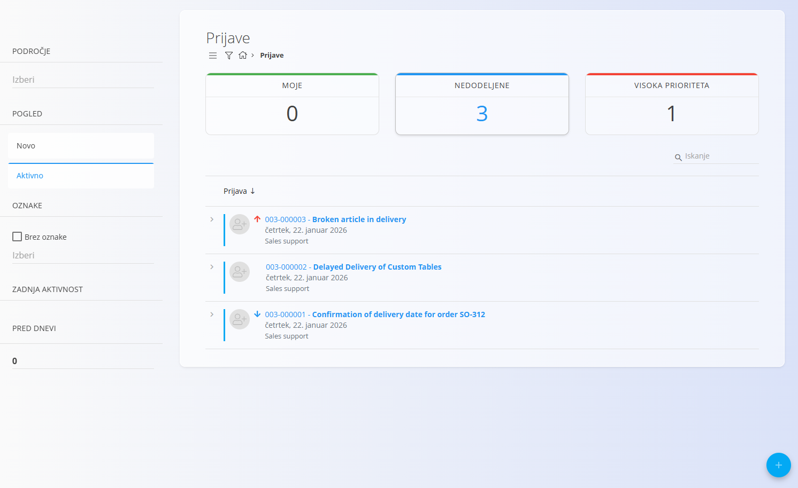
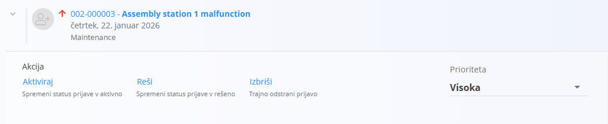
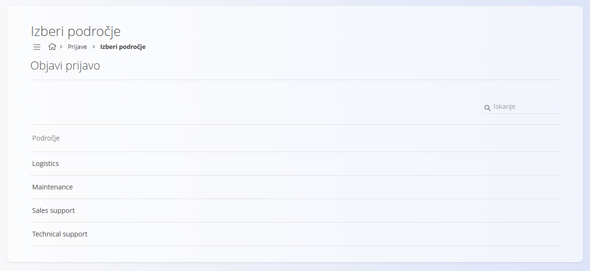
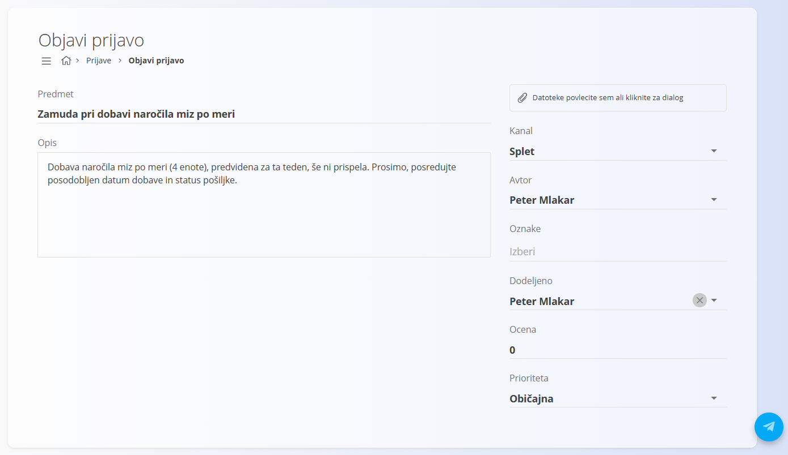
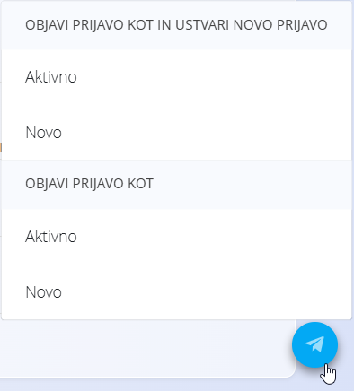
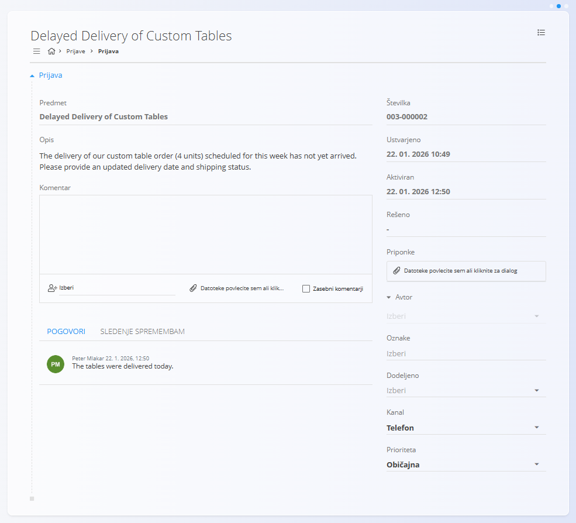
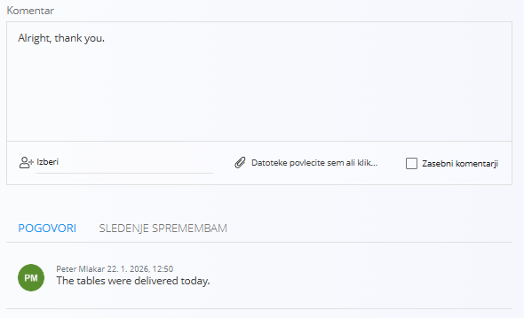
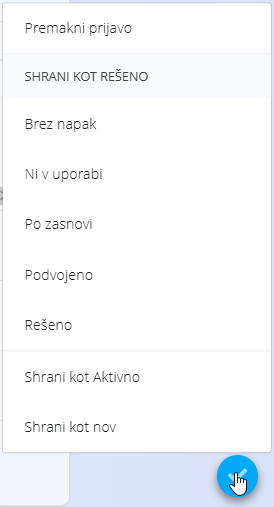

<!-- app_route: /customer-support -->
<!-- app_label: Prijave -->
<!-- canonical_source_url: https://github.com/Tom-PIT/Connected.Docs/blob/main/sl/Domene/Stranke/Prijave/Prijave.md -->
<!-- canonical_source_title: Prijave -->

# Prijave

Zaslon **Prijave** je osrednji delovni prostor domene Stranke.  
Uporablja se za ustvarjanje, spremljanje, posodabljanje in reševanje podpornih prijav, ki jih oddajo stranke, partnerji ali interni uporabniki.

Prijave so organizirane po **Področjih** (na primer Vzdrževanje, Prodajna podpora, Tehnična podpora) in se skozi svoj življenjski cikel premikajo med različnimi stanji.

Za dostop do tega zaslona pojdite na **Stranke / Prijave** v [navigaciji](../../../Skupno/UI/Navigacija.md).

## Shema

| Polje | Opis |
|-----|------|
| **Zadeva** | Kratek naslov, ki opisuje težavo |
| **Opis** | Podroben opis prijave |
| **[Področje](../Upravljanje/Podrocja.md)** | Področje, kateremu prijava pripada |
| **Kanal** | Izvor prijave (**Splet**, **Telefon**, **E-pošta**) |
| **Avtor** | Uporabnik, ki je ustvaril prijavo |
| **Dodeljeno** | Uporabnik, odgovoren za reševanje prijave |
| **Oznake** | Klasifikacijske oznake |
| **Prioriteta** | Prioriteta prijave (**Nizka**, **Normalna**, **Visoka**) |
| **Ocena** | Ocenjen napor |
| **Ustvarjeno** | Čas ustvarjanja prijave |
| **Aktivirano** | Čas, ko prijava postane aktivna |
| **Rešeno** | Čas rešitve prijave |
| **Priponke** | Datoteke, priložene prijavi |

## Seznam prijav

Seznam prikazuje prijave v stanjih **Novo** in **Aktivno**. Na vrhu seznama so prikazane povzetne kartice:

- **Moje prijave**
- **Nedodeljene prijave**
- **Prijave z visoko prioriteto**

Vsaka prijava je prikazana kot vrstica, ki jo je mogoče razširiti za hitra dejanja. Na voljo so naslednja dejanja:

- **Aktiviraj**
- **Reši**
- **Izbriši**
- **Spremeni prioriteto**
- **Dodeli uporabnika**

### Filtri

Prijave je mogoče filtrirati z uporabo levega panela:

- **Področje**
- **Pogled**
  - Novo
  - Aktivno
- **Oznake**
  - Brez oznake
- **Zadnja aktivnost**
- **Pred dnevi**

## Stanja prijav

Prijave se premikajo skozi naslednja glavna stanja:

- **Novo** – prijava je ustvarjena, vendar še ni aktivirana
- **Aktivno** – prijava je v obravnavi
- **Rešeno** – prijava je zaključena in premaknjena v **[Rešene prijave](ResenePrijave.md)**

## Ustvariti nove prijave

Za ustvarjanje nove prijave kliknite [akcijski gumb](../../../Skupno/UI/AkcijskiGumb.md) v spodnjem desnem kotu.

### Korak 1: Izbira področja

Prvi korak je izbira **Področja**, kateremu bo prijava pripadala. Za potrditev kliknite akcijski gumb.

### Korak 2: Podrobnosti prijave

V drugem koraku se vnesejo ali uredijo podrobnosti prijave.

Klik na [akcijski gumb](../../../Skupno/UI/AkcijskiGumb.md) omogoča:

- objavo kot **Novo**
- objavo kot **Aktivno**
- objavo kot **Novo** ali **Aktivno** in hkratno **ustvarjanje nove prijave**

## Delo s prijavami

### Odpirati prijave

Klik na naslov prijave odpre celoten pogled prijave.

Pogled prijave prikazuje:

- podatke o prijavi,
- Časovne oznake stanj,
- priloge,
- avtorja, oznake, dodelitev in prioriteto.

### Komentarji in pogovor

Prijave podpirajo sprotno komunikacijo prek komentarjev.

Pri dodajanju komentarja:

- je mogoče komentar usmeriti k določenemu uporabniku,
- komentar je lahko označen kot **Zasebno**,
- mogoče je priložiti datoteke.

Za shranjevanje komentarja je potrebno prijavo posodobiti tako, da se:

- shrani kot **Novo** ali **Aktivno**, ali
- spremeni njeno stanje (na primer v **Rešeno**).

### Revizijska sled

Revizijska sled beleži vse spremembe, opravljene na prijavi, v obliki časovnice. Do nje dostopate prek zavihka **Revizijska sled** v pogledu prijave, pod razdelkom **Komentar**.

### Dejanja v meniju

Dodatna dejanja so na voljo v meniju prijave, ki se nahaja v zgornjem desnem delu pogleda prijave.

Razpoložljive možnosti vključujejo:

- **Odjavi s prijave**
- **Naročniki**
- **Deli**
- **Delo**

> [!NOTE]
Nastavitve obvestil na ravni področja upravljate v [**Nastavitve obvestil**](../Upravljanje/NastavitveObvestil.md).

## Reševati prijave

Kliknite [akcijski gumb](../../../Skupno/UI/AkcijskiGumb.md), da odprete meni in izberete možnost rešitve:

- **Brez napak** – težave ni
- **Ni v uporabi** – prijava ni več relevantna
- **Podvojeno** – prijava je kopija druge prijave
- **Po zasnovi** – težava je namerna in pričakovana
- **Rešeno** – težava je odpravljena

Ko je prijava rešena:

- se njeno stanje nastavi na **Rešeno**,
- odstrani se iz aktivnega seznama,
- prikaže se v zaslonu **[Rešene prijave](ResenePrijave.md)**.

## Meni

Meni omogoča dodatna dejanja, ki so na voljo na tej strani.

Na voljo so naslednja dejanja:

- **Odjavi s prijave**
- **Naročniki**
- **Deli**
- **Delo**

> [!NOTE]
> Nastavitve obvestil za posamezno področje lahko upravljate v [**Nastavitve obvestil**](../Upravljanje/NastavitveObvestil.md).

Za podrobnosti o dejanjih menija glejte [**Dejanja menija**](../../../Skupno/Koncepti/MeniDejanja.md).