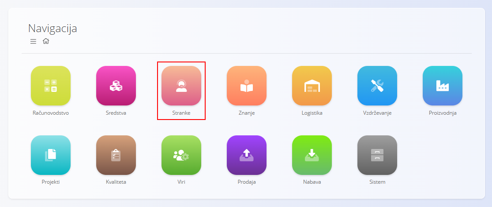
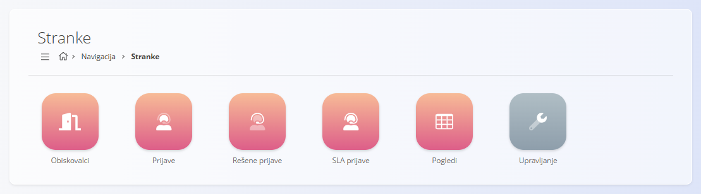
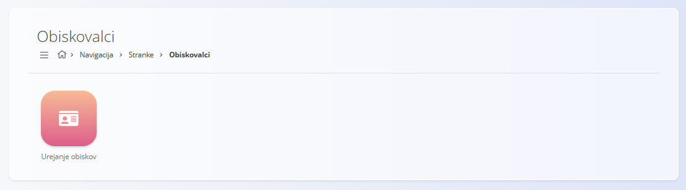
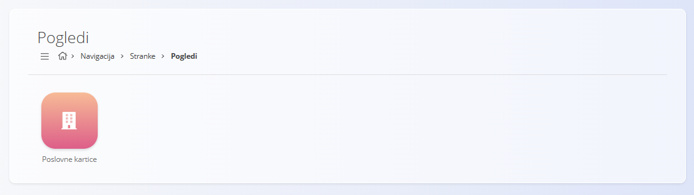
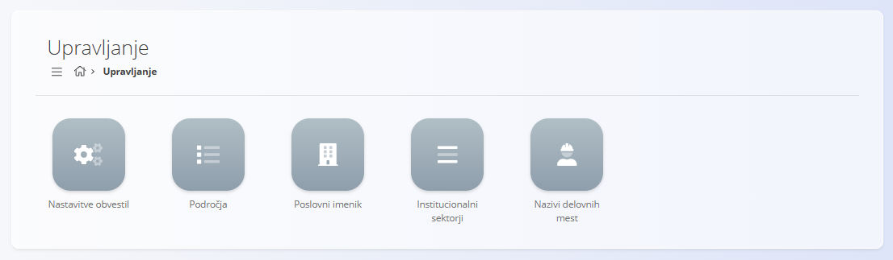

<!-- app_route: /sitemap/customers -->
<!-- app_label: Domena Stranke -->
<!-- canonical_source_url: https://github.com/Tom-PIT/Connected.Docs/blob/main/sl/Domene/Stranke/README.md -->
<!-- canonical_source_title: Stranke -->

# Stranke

Domena **Stranke** zagotavlja orodja za upravljanje interakcij s strankami, podpornih zahtevkov in komunikacije, povezane s storitvami. Organizacijam omogoča spremljanje prejetih prijav, reševanje težav, nadzor ravni storitev ter vzdrževanje strukturiranih podatkov o strankah.

Medtem ko se domena **[Prodaja](../Prodaja/README.md)** osredotoča na komercialne transakcije, se domena Stranke osredotoča na **poprodajno komunikacijo, reševanje težav in podporo strankam**.

Za dostop do domene pojdite na **Stranke** v glavnem zemljevidu aplikacije.

> [!NOTE]
> Razpoložljive domene in funkcionalnosti so odvisne od konfiguracije podjetja in omogočenih modulov.

## Kaj vključuje domena Stranke?

Domena je organizirana v naslednje funkcionalne sklope:

- **[Obiskovalci](#obiskovalci)** – upravljanje zunanjih obiskovalcev in kontaktov  
- **[Prijave](#prijave)** – obravnava podpornih prijav in zahtevkov  
- **[Pogledi](#pogledi)** – pregledni in analitični pogledi nad podatki strank  
- **[Upravljanje](#upravljanje)** – konfiguracija in osnovni podatki za podporne procese  

## Obiskovalci

Razdelek **Obiskovalci** je namenjen evidentiranju fizičnih obiskov strank, partnerjev ali drugih zunanjih oseb na lokacijah podjetja.

Zaslon **[Urejanje obiskov](Obiskovalci/UrejanjeObiskov.md)** omogoča beleženje:

- podatkov o obiskovalcu,
- datuma in časa obiska,
- stanja obiska (*Najavljen*, *Na lokaciji*, *Zaključen*, *Odpovedan*),
- ciljne lokacije ali oddelka.

Ta razdelek se uporablja predvsem za recepcijo, varnost in sledljivost obiskov.

## Prijave

Razdelek **Prijave** vsebuje vse zapise, povezane s podporo strankam in reševanjem težav.

Vključuje naslednje zaslone:

- **[Prijave](Prijave/Prijave.md)** – aktivne in odprte podporne prijave  
- **[Rešene prijave](Prijave/ResenePrijave.md)** – zaključeni in rešeni primeri  
- **[SLA prijave](Prijave/SLAPrijave.md)** – prijave, spremljane glede na dogovorjene ravni storitev (SLA)  

Ti zasloni predstavljajo **operativno jedro domene Stranke**. Podpornim ekipam omogočajo spremljanje prijav od prejema do zaključka ter nadzor odzivnih in reševalnih časov.

## Pogledi

Razdelek **Pogledi** ponuja zaslone samo za branje, ki združujejo in strukturirano prikazujejo podatke o strankah.

Razpoložljivi pogledi vključujejo:

- **[Poslovne kartice](../Prodaja/Pregledi/PoslovneKartice.md)** – celovit pregled podjetij in njihove aktivnosti v sistemu, vključno s podatki o prijavah in podpori

Pogledi ne omogočajo vnosa ali spreminjanja podatkov. Namenjeni so analizi, navigaciji in podpori odločanju.

## Upravljanje

Razdelek **Upravljanje** vsebuje konfiguracijske zaslone in šifrante, potrebne za pravilno delovanje procesov podpore strankam.

Razpoložljive nastavitve vključujejo:

- **[Nastavitve obvestil](Upravljanje/NastavitveObvestil.md)** – prilagoditev obvestil, povezanih s prijavami, po posameznih mizah  
- **[Področja](Upravljanje/Podrocja.md)** – definicija podpornih področij in kanalov  
- **[Poslovni imenik](../../Skupno/Upravljanje/PoslovniImenik.md)** – skupni imenik podjetij in kontaktov  
- **[Institucionalni sektorji](Upravljanje/InstitucionalniSektorji.md)** – razvrščanje strank po sektorjih  
- **[Nazivi delovnih mest](../../Skupno/Upravljanje/NaziviDelovnihMest.md)** – opredelitev vlog, povezanih s kontakti in uporabniki  

Ti elementi določajo strukturo podpore strankam ter način obveščanja in razvrščanja prijav.

> [!TIP]
> Oglejte si celoten seznam upravljanja: **[Kazalo upravljanja](../../KazaloUpravljanja.md)**.

## Stranke in druge domene

Domena Stranke je tesno povezana z drugimi področji sistema:

| Področje | Povezava |
|--------|----------|
| [**Prodaja**](../Prodaja/README.md) | Skupni podatki o strankah in podjetjih |
| [**Projekti**](../Projekti/README.md) | Prijave se lahko nanašajo na projekte strank |
| [**Vzdrževanje**](../Vzdrzevanje/README.md) | Prijave so lahko povezane z vzdrževalnimi nalogi |
| [**Viri**](../Viri/README.md) | Razporejanje in obremenitev podpornih ekip |
| [**Znanje**](../Znanje/README.md) | Dokumentacija in baza znanja za podporo reševanju težav |
