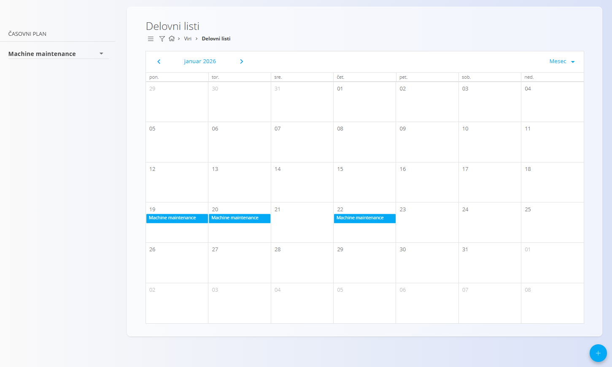
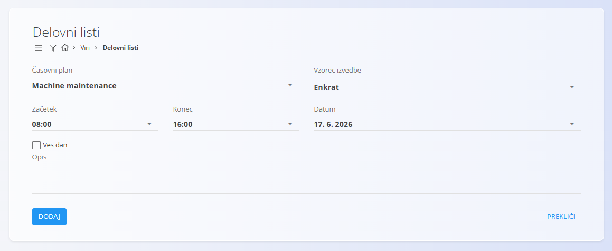
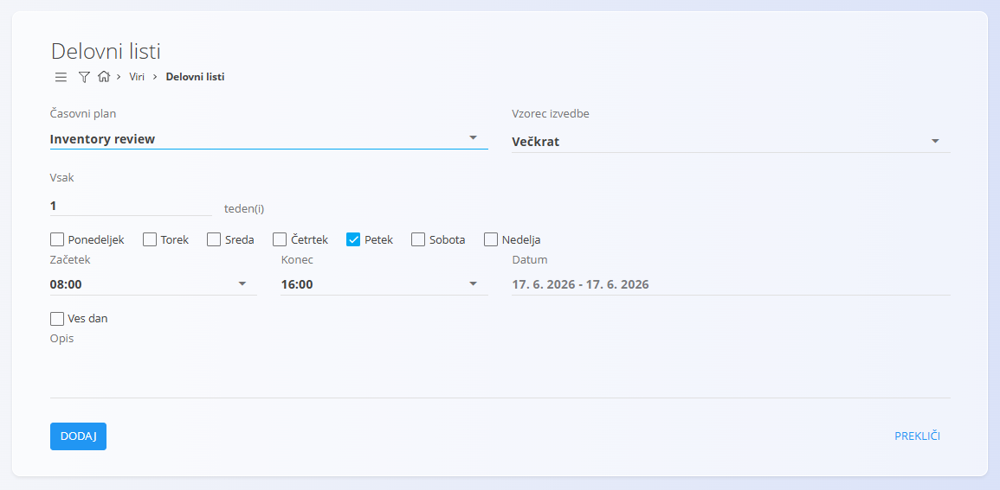

<!-- app_route: /management/resources/worksheets -->
<!-- app_label: Delovni listi -->
<!-- canonical_source_url: https://github.com/Tom-PIT/Connected.Docs/blob/main/sl/Domene/Viri/Pregledi/DelovniListi.md -->
<!-- canonical_source_title: Delovni listi -->

# Delovni listi

**Delovni listi** omogočajo koledarski pregled za načrtovanje dela na podlagi **časovnih planov**.  
Predstavljajo *planirano delo* in uporabnikom omogočajo razporejanje aktivnosti skozi čas.

Za dostop do **Delovnih listov** pojdite na **Viri / Delovni listi** v [navigaciji](../../../Skupno/UI/Navigacija.md).

## Shema

### Polja delovnega lista

| Polje | Opis |
|------|------|
| **[Časovni plan](../Upravljanje/CasovniPlani.md)** | Določa vrsto dela, ki se planira. |
| **Vzorec izvedbe** | Določa, ali se delovni list izvede **Enkrat** ali **Večkrat**. |
| **Začetek** | Začetni čas planiranega dela. |
| **Konec** | Končni čas planiranega dela. |
| **Datum** | Datum izvedbe. Če je izbrano **Večkrat**, to polje določa časovno obdobje ponavljanja. |
| **Cel dan** | Če je omogočeno, se delovni list razteza čez celoten dan. |
| **Opis** | Neobvezne dodatne informacije o planiranem delu. |

## Koledar delovnih listov

Koledar prikazuje vse delovne liste za izbrani **časovni plan**.  
Delovne liste je mogoče prikazati v **dnevnem**, **tedenskem** ali **mesečnem** pogledu.

Na levi strani je na voljo filter za izbiro, kateri **časovni plan** je prikazan v koledarju.  
Prikazani so samo delovni listi, ki pripadajo izbranemu časovnemu planu.

## Dejanja

### Ustvariti novi delovni list

Za ustvarjanje novega delovnega lista kliknite [akcijski gumb](../../../Common/UI/ActionButton.md) v spodnjem desnem kotu.

Glede na izbrani **vzorec izvajanja** so na voljo različne možnosti.

#### Enkrat

Možnost **Enkrat** se uporablja za planiranje enkratne izvedbe.

#### Večkrat

Možnost **Večkrat** se uporablja za planiranje ponavljajočega se delovnega lista v določenem časovnem obdobju.

Po shranjevanju se delovni list prikaže v koledarju na ustreznem datumu oziroma datumih.

### Urediti delovni list

Delovne liste je mogoče urejati neposredno iz koledarskega pogleda.

Za urejanje **dvokliknite dogodek v koledarju**. Odpre se pogovorno okno za urejanje, kjer lahko posodobite polja, kot so čas, vzorec izvajanja ali opis.

### Izbrisati delovni list

Delovne liste je mogoče izbrisati iz **pogovornega okna za urejanje**.

Postopek brisanja:
1. Dvokliknite dogodek delovnega lista v koledarju, da odprete zaslon za urejanje.
2. Kliknite **Izbriši**.
3. Potrdite brisanje.

Če delovni list uporablja vzorec **Večkrat**, je prikazano dodatno potrditveno vprašanje:
- **»Ali želite odstraniti vse prihodnje vnose?«**

Nato se prikaže še končno potrditveno pogovorno okno:
- **»Ali ste prepričani, da želite izbrisati delovni list?«**

Po potrditvi je delovni list trajno odstranjen iz sistema.
