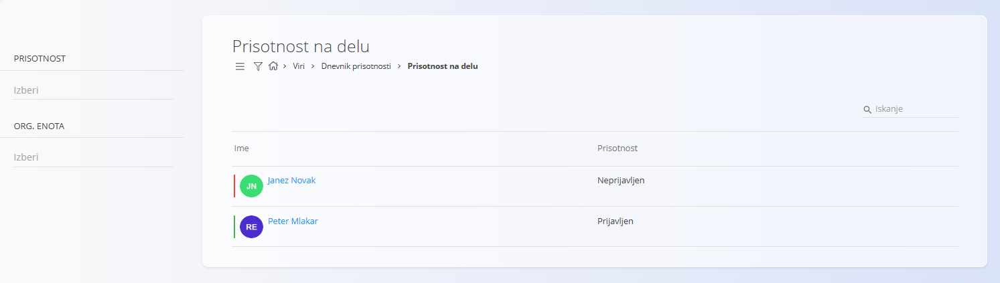
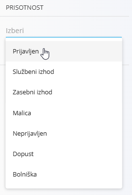

<!-- app_route: /time-logs/attendance -->
<!-- app_label: Dnevnik prisotnosti – Prisotnost na delu -->
<!-- canonical_source_url: https://github.com/Tom-PIT/Connected.Docs/blob/main/sl/Domene/Viri/Pregledi/DnevnikPrisotnostiPrisotnostNaDelu.md -->
<!-- canonical_source_title: Dnevnik prisotnosti – Prisotnost na delu -->

# Dnevnik prisotnosti – Prisotnost na delu

Pogled **Dnevnik prisotnosti – Prisotnost na delu** omogoča pregled **trenutnega stanja prisotnosti zaposlenih v realnem času**.  
Primarno je namenjen nadzornikom, vodjem ekip in vodstvu, ki morajo hitro preveriti, kdo je prisoten, odsoten ali v določenem stanju prisotnosti.

Za dostop do pogleda **Prisotnost na delu** pojdite na **Viri / Dnevnik prisotnosti / Prisotnost na delu** v [navigaciji](../../../Skupno/UI/Navigacija.md).

## Pregled

Glavni seznam prikazuje zaposlene in njihovo **trenutno stanje prisotnosti**.

Za vsakega zaposlenega so prikazane naslednje informacije:

- **Ime**
- **Trenutno stanje prisotnosti**

Stanje prisotnosti odraža zadnje zabeleženo dejanje v dnevniku prisotnosti (na primer prijava, malica, odsotnost ali odjava).

Ta pogled se samodejno posodablja na podlagi beleženja časa in evidenc odsotnosti.

## Stanja prisotnosti

Zaposleni so lahko prikazani v različnih stanjih prisotnosti, odvisno od njihove trenutne aktivnosti:

- **Prijavljen**
- **Službeni izhod**
- **Zasebni izhod**
- **Malica**
- **Neprijavljen**
- **Dopust**
- **Bolniška**

Ta stanja se pridobivajo iz dnevnika prisotnosti in zapisov odsotnosti ter jih v tem pogledu ni mogoče ročno spreminjati.

## Filtri

Filtri na levi strani omogočajo zoženje seznama:

- **Prisotnost** – filtriranje po posameznem stanju prisotnosti (Aktivno, Malica, Dopust itd.)
- **Organizacijska enota** – prikaz zaposlenih iz izbrane organizacijske enote

Filtre je mogoče kombinirati za hitro iskanje določenih skupin zaposlenih.

## Tipični primeri uporabe

Ta pogled se najpogosteje uporablja za:

- spremljanje, kdo je trenutno prisoten na lokaciji,
- preverjanje, ali je zaposleni na malici, dopustu ali bolniški odsotnosti,
- hiter pregled prisotnosti po ekipah ali organizacijskih enotah,
- podporo operativnim odločitvam in koordinaciji delovne sile.

## Povezava z drugimi pogledi dnevnika prisotnosti

- **Prisotnost na delu** se osredotoča izključno na *trenutno stanje*,  
- zgodovinski časovni vnosi in podrobno urejanje so na voljo v pogledu **[Dnevnik prisotnosti – Pregled](DnevnikPrisotnostiPregled.md)**,
- aktivno beleženje časa, prošnje za odsotnosti ter prijave in odjave se izvajajo v pogledu **[Dnevnik prisotnosti – Upravljaj](DnevnikPrisotnostiUpravljaj.md)**.
