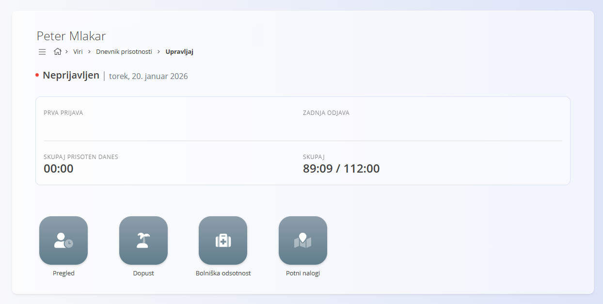
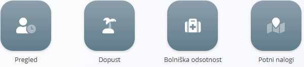
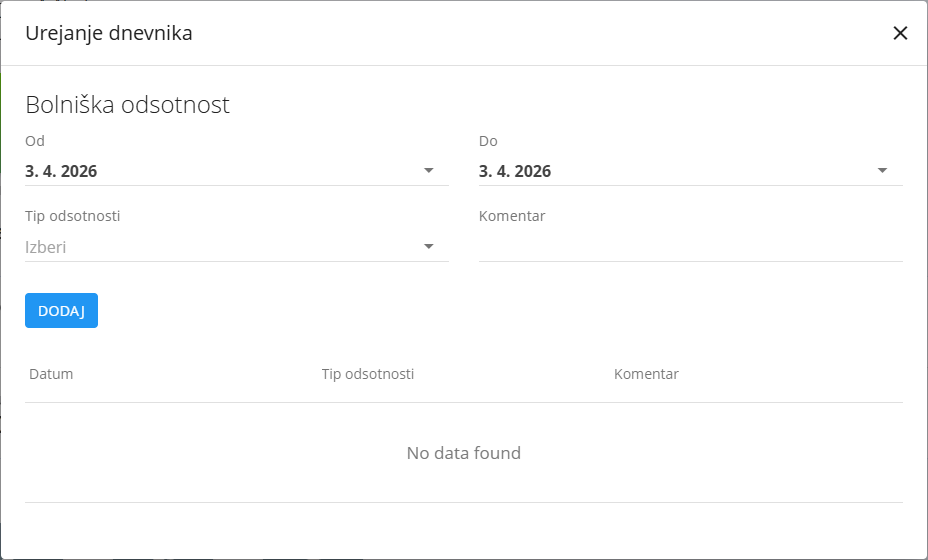

<!-- app_route: /time-logs/management -->
<!-- app_label: Dnevnik prisotnosti – Upravljaj -->
<!-- canonical_source_url: https://github.com/Tom-PIT/Connected.Docs/blob/main/sl/Domene/Viri/Pregledi/DnevnikPrisotnostiUpravljaj.md -->
<!-- canonical_source_title: Dnevnik prisotnosti – Upravljaj -->

# Dnevnik prisotnosti – Upravljaj

Pogled **Dnevnik prisotnosti – Upravljaj** je namenjen **sprotnemu beleženju prisotnosti in dnevnemu evidentiranju časa**. Zaposlenim omogoča beleženje začetka in konca dela, odmorov, službenih poti, zasebnega časa ter hiter dostop do odsotnosti in potnih nalogov.

Tipični primeri uporabe vključujejo:

- beleženje začetka in konca delovnega dne,
- evidentiranje odmora (npr. malica),
- beleženje službenih poti in zasebnega časa,
- hiter pregled današnje prisotnosti,
- hiter dostop do dejanj, povezanih z odsotnostmi ([dopust](#dopust), [bolniška odsotnost](#bolniška-odsotnost)) in [potnimi nalogi](#potni-nalogi).

Za dostop do pogleda **Dnevnik prisotnosti – Upravljaj** pojdite na **Viri / Dnevnik prisotnosti / Upravljaj** v [navigaciji](../../../Skupno/UI/Navigacija.md).

> [!NOTE]
> Dejanja beleženja časa morda niso na voljo vsem uporabnikom prek računalnika.  
> V mnogih okoljih se prisotnost primarno beleži prek **fizičnega čitalca kartic**.  
>  
> V nekaterih primerih (na primer delo na daljavo) so ista dejanja na voljo tudi neposredno v aplikaciji.

## Podatki v glavi zaslona

Na vrhu zaslona so prikazane naslednje informacije:

- **Ime zaposlenega**
- **Trenutno stanje** (na primer *Aktivno – Delo*)
- **Trenutni datum**
- **Čas prve prijave**
- **Čas zadnje odjave**
- **Današnji skupni čas**
- **Skupni čas za izbrano obdobje**

Ta razdelek omogoča hiter pregled prisotnosti in poteka delovnega dne.

## Akcije beleženja časa

Gumb **Prijava** se uporablja za začetek delovnega časa.

Po kliku se začne beleženje **delovnega časa**, hkrati pa postanejo na voljo dodatne akcije:

- **Odjava** – Zaključi trenutno delovno sejo
- **Malica** – Zabeleži čas za malico ali odmor
- **Službena pot** – Zabeleži čas službene poti
- **Privat** – Zabeleži zasebni čas med delovnim dnevom

Izbira akcije takoj posodobi status uporabnika in zabeleži ustrezen časovni vnos.

> [!NOTE]
> Gumb **Prijava** ni na voljo vsem uporabnikom. V nekaterih delovnih okoljih je **nadomeščen s prijavo preko kartice** z uporabo fizičnega čitalca kartic (na primer na vhodu).  
> V okoljih, kjer uporabniki beležijo čas neposredno na računalniku (na primer delo na daljavo ali pisarniško delo), je ta gumb lahko na voljo tudi v aplikaciji.

### Kako deluje

- S klikom na **Prijava** se začne beleženje **delovnega časa**
- Na voljo postanejo dodatni gumbi (npr. **Malica**, **Službena pot**, **Privat**)
- Izbira ene izmed teh akcij:
  - **Ustavi trenutno beleženje delovnega časa**
  - Začne beleženje izbrane aktivnosti (npr. **Malica**)
- Ponovni klik na **Prijava**:
  - Zaključi trenutno aktivnost (npr. malico)
  - Nadaljuje beleženje **delovnega časa**

> [!NOTE]
> Razpoložljive akcije se lahko razlikujejo glede na nastavitve in pravila organizacije.

#### Primer

1. Uporabnik klikne **Prijava** → začne se beleženje delovnega časa.  
2. Uporabnik klikne **Malica** → beleženje delovnega časa se ustavi in začne se beleženje malice.
3. Po malici uporabnik ponovno klikne **Prijava** → malica se zaključi in beleženje delovnega časa se nadaljuje.
4. Ko uporabnik zaključi dan, pritisne **Odjava**, kar ustavi delovni čas in zaključi dan.

## Dejanja za dopust in odsotnosti

Iz tega pogleda imajo uporabniki dostop do dejanj, povezanih z odsotnostmi in potovanji. Ta dejanja omogočajo upravljanje prisotnosti, odsotnosti in potovanj neposredno iz konteksta beleženja časa.

Na voljo so naslednja dejanja:
- **Pregled**
- **Dopust**
- **Bolniška odsotnost**
- **Potni nalogi**

### Pregled

Klik na **[Pregled](DnevnikPrisotnostiPregled.md)** odpre podroben pregled časovnih vnosov za izbrano obdobje.

### Dopust

Klik na **Dopust** odpre pogovorno okno za oddajo zahtevka za odsotnost.

#### Ustvariti novi zahtevek za dopust

Za oddajo zahtevka za dopust:

1. Kliknite **Dopust**
2. V dialogu:
	- izberite datuma **Od** in **Do**  
	- dodajte neobvezen **Komentar**  
3. Kliknite **Dodaj**, da oddate zahtevek

Zahtevek se nato obdela v skladu s postopkom odobritve v organizaciji (na primer zahteva odobritev nadrejenega).

> [!NOTE]
> Zgodovina zahtevkov in njihov status je običajno na voljo v istem pogovornem oknu.

### Bolniška odsotnost

Klik na **Bolniška odsotnost** odpre podobno pogovorno okno za vnos bolniške.

#### Ustvariti novi zahtevek za bolniško odsotnost

Za oddajo zahtevka za bolniško odsotnost:

1. Kliknite **Bolniška odsotnost**
2. V tem pogovornem oknu lahko uporabnik izvede podobna dejanja kot pri dopustu, z dodatno možnostjo izbire razloga za bolniško odsotnost (če je to omogočeno).
3. Kliknite **Dodaj**, da oddate zahtevek.

Zabeležene odsotnosti se prikažejo v dnevniku prisotnosti in povzetkih.

### Potni nalogi

Klik na **Potni nalogi** odpre zaslon **[Potni nalogi](../Dokumenti/PotniNalogi.md)**, kjer se upravljajo službene poti.

## Tipični poteki uporabe

Spodnji primeri prikazujejo, kako se beleženje časa običajno izvaja v različnih okoljih.

### Čitalec kartic

V številnih okoljih se ta pogled uporablja skupaj s **fizičnim čitalcem kartic** (na primer ob vhodu v objekt).

Tipičen potek je naslednji:

1. Zaposleni **prisloni kartico** ob prihodu na delo  
2. Sistem zabeleži **začetek delovnega dne**  
3. Ob ponovnem pristopu kartice se prikažejo **gumbi za beleženje časa**  
4. Zaposleni izbere dejanje (na primer **Malica**)  
5. Po koncu malice ponovno prisloni kartico, kar zaključi malico in nadaljuje **Delo**  
6. Ob koncu dneva zaposleni prisloni kartico in izbere **Odjava**, s čimer zaključi delovni dan  

V tem primeru zaposleni **ne uporablja neposredno uporabniškega vmesnika**, vendar so vsa dejanja vidna tudi v pogledu **Dnevnik prisotnosti – Upravljaj**.

### Računalniška ali oddaljena uporaba

V drugih okoljih (na primer **delo na daljavo** ali pisarniško delo) se ista dejanja izvajajo neposredno prek računalnika.

V tem primeru zaposleni:

- odpre pogled **Dnevnik prisotnosti – Upravljaj**
- uporabi razpoložljive gumbe za:
  - začetek dela
  - beleženje malice ali zasebnega časa
  - zaključek delovnega dne

S tem je zagotovljena enaka logika beleženja prisotnosti ne glede na lokacijo dela.