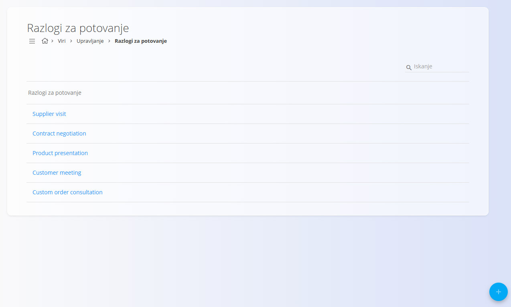

<!-- app_route: /management/resources/travel-order-reasons -->
<!-- app_label: Razlogi za potovanje -->
<!-- canonical_source_url: https://github.com/Tom-PIT/Connected.Docs/blob/main/sl/Domene/Viri/Upravljanje/RazlogiZaPotovanje.md -->
<!-- canonical_source_title: Razlogi za potovanje -->

# Razlogi za potovanje

Razlogi za potovanje določajo možne **namene službenih poti**. Uporabljajo se pri ustvarjanju [potnih nalogov](../Dokumenti/PotniNalogi.md) in omogočajo izbiro vnaprej definiranega razloga namesto prostega vnosa besedila.

Za dostop do **Razlogov za potovanje** pojdite na **Viri / Upravljanje / Razlogi za potovanje** v [navigaciji](../../../Skupno/UI/Navigacija.md).

## Shema

| Polje | Opis |
|------|------|
| **Ime** | Ime razloga za potovanje, ki je prikazano uporabnikom pri ustvarjanju potnega naloga (na primer: *Obisk dobavitelja*, *Sestanek s stranko*). |

## Upravljanje

## Seznam razlogov za potovanje

Seznam prikazuje vse konfigurirane razloge za potovanje.

- Vsaka vrstica predstavlja en razlog.
- Klik na razlog ga odpre za urejanje.
- Iskalno polje omogoča hitro iskanje posameznih razlogov.

## Dejanja

### Ustvariti razlog za potovanje

Za ustvarjanje novega razloga za potovanje:

1. Kliknite [akcijski gumb](../../../Skupno/UI/AkcijskiGumb.md), da ustvarite nov vnos.
2. Vnesite **Ime** razloga.
3. Kliknite **Dodaj** za shranjevanje.

### Urediti razlog za potovanje

Za urejanje obstoječega razloga:

1. Kliknite razlog na seznamu.
2. Po potrebi posodobite **Ime**.
3. Shranite spremembe.

## Izbrisati razlog za potovanje

Kliknite razlog na seznamu, da ga odprete za urejanje, nato kliknite **Izbriši** in potrdite brisanje.

Izbrisani razlogi niso več na voljo pri ustvarjanju novih potnih nalogov.
