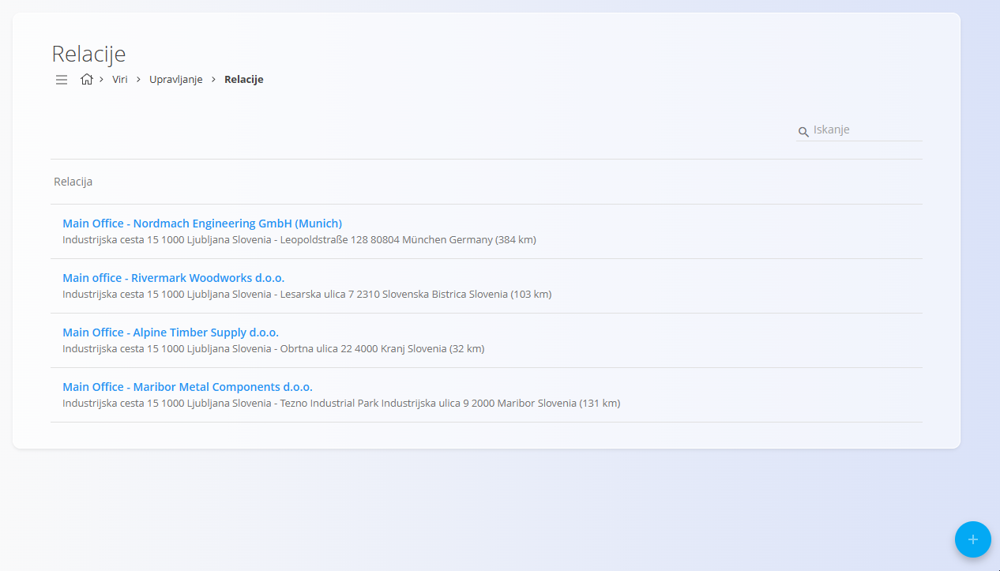
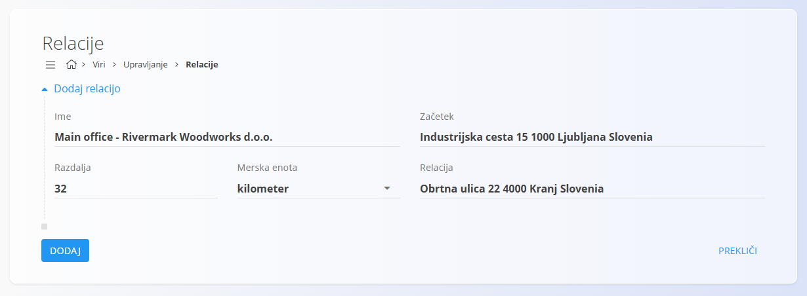

<!-- app_route: /management/resources/destinations -->
<!-- app_label: Relacije -->
<!-- canonical_source_url: https://github.com/Tom-PIT/Connected.Docs/blob/main/sl/Domene/Viri/Upravljanje/Relacije.md -->
<!-- canonical_source_title: Relacije -->

# Relacije

Relacije določajo **vnaprej definirane poti**, ki se uporabljajo pri ustvarjanju potnih nalogov.  
Shranjujejo začetni in ciljni naslov skupaj s podatki o razdalji, kar omogoča dosledno in ponovljivo ustvarjanje potnih nalogov.

Za dostop do **Relacij** pojdite na **Viri / Upravljanje / Relacije** v [navigaciji](../../../Skupno/UI/Navigacija.md).

## Shema

| Polje | Opis |
|------|------|
| **Ime** | Opisni naziv relacije (na primer: *Glavna pisarna – Alpine Timber Supply d.o.o.*). |
| **Začetek** | Začetni naslov poti, običajno glavna lokacija podjetja. |
| **Relacija** | Ciljni naslov poti. |
| **Razdalja** | Razdalja med začetkom in ciljem. |
| [**Merska enota**](../../../Skupno/Upravljanje/MerskeEnote.md) | Enota, uporabljena za razdaljo (na primer kilometri). |

## Upravljanje

### Seznam relacij

Seznamski pogled prikazuje vse konfigurirane relacije.

Vsaka vrstica prikazuje:
- naziv relacije,
- začetni in ciljni naslov,
- izračunano razdaljo z enoto.

Klik na relacijo jo odpre za urejanje.

## Dejanja

### Ustvariti novo relacijo

1. Kliknite [akcijski gumb](../../../Skupno/UI/AkcijskiGumb.md) za ustvarjanje nove relacije.
2. Izpolnite polja, opisana v razdelku [**Shema**](#shema).
3. Kliknite **Dodaj** za shranjevanje.

### Urediti relacijo

1. Kliknite relacijo na seznamu.
2. Spremenite zahtevana polja.
3. Kliknite **Shrani**.

> [!NOTE]
> - Relacije je mogoče ponovno uporabiti v več potnih nalogih.
> - Spremembe relacije vplivajo na prihodnje potne naloge, ne pa na že ustvarjene.

### Izbrisati destinacijo potovanja

1. Kliknite destinacijo na seznamu, da jo odprete za urejanje.
2. Kliknite **Izbriši** in potrdite dejanje.

Izbrisane destinacije potovanja niso več na voljo pri ustvarjanju novih potnih nalogov.