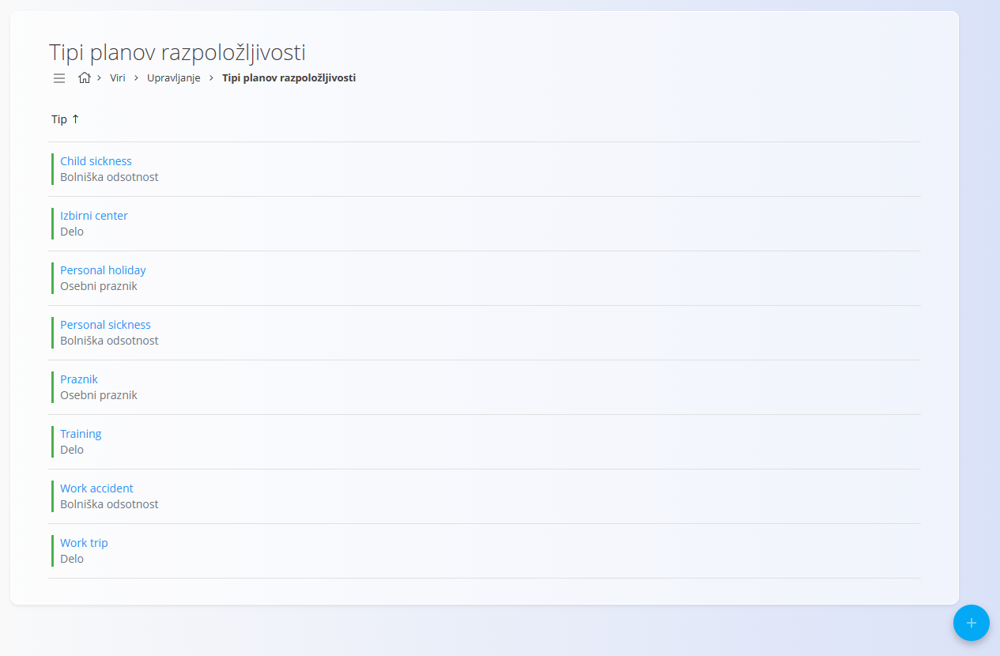
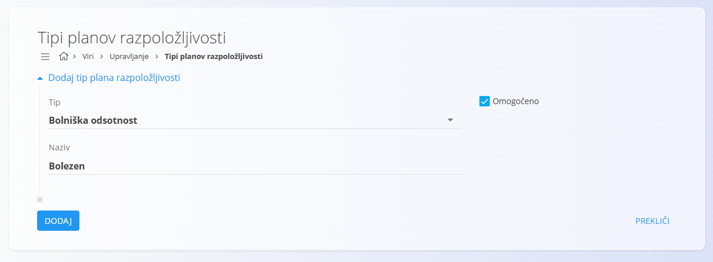

<!-- app_route: /management/resources/worksheet-types -->
<!-- app_label: Tipi planov razpoložljivosti -->
<!-- canonical_source_url: https://github.com/Tom-PIT/Connected.Docs/blob/main/sl/Domene/Viri/Upravljanje/TipiPlanovRazpolozljivosti.md -->
<!-- canonical_source_title: Tipi planov razpoložljivosti -->

# Tipi planov razpoložljivosti

Tipi planov razpoložljivosti določajo **kategorije razpoložljivosti in odsotnosti**, ki jih je mogoče dodeliti virom. Služijo kot osnova za [plane razpoložljivosti](../Pregledi/PlaniRazpolozljivosti.md).

Za dostop do **Tipov planov razpoložljivosti** pojdite na **Viri / Upravljanje / Tipi planov razpoložljivosti** v [navigaciji](../../../Skupno/UI/Navigacija.md).

## Shema

| Polje | Opis |
|------|------|
| **Tip** | Določa splošno kategorijo plana razpoložljivosti. Tipične vrednosti vključujejo **Delo**, **Odsotnost**, **Osebni dopust** in **Bolniška odsotnost**. |
| **Naziv** | Opisno ime, ki se prikazuje uporabnikom pri izbiri tipa razpoložljivosti (na primer: *Nega otroka*, *Poškodba pri delu*). |
| **Omogočeno** | Označuje, ali je tip plana razpoložljivosti aktiven in ga je mogoče izbrati v drugih delih sistema. |

## Seznamski pogled

Seznamski pogled prikazuje vse konfigurirane tipe planov razpoložljivosti.

Za vsak vnos so prikazane naslednje informacije:

- **Naziv**
- **Tip** 
- **Indikator stanja**

Klik na element v seznamu odpre njegov **zaslon za urejanje**.

## Dejanja

### Ustvariti nov tip plana razpoložljivosti

Kliknite [akcijski gumb](../../../Skupno/UI/AkcijskiGumb.md), da ustvarite nov vnos.

Spremembe se po shranjevanju uveljavijo takoj in vplivajo na vse zaslone, kjer je mogoče izbirati tipe razpoložljivosti.

### Urejati tipe planov razpoložljivosti

Kliknite element na seznamu, da odprete zaslon za urejanje tipa plana.

Na zaslonu za urejanje lahko spreminjate:

- **Naziv**
- **Tip**
- **Omogočeno**

Kliknite **Shrani**, da uveljavite spremembe, ali **Prekliči**, da jih zavržete.

## Izbrisati tip plana razpoložljivosti

Kliknite tip plana, da odprete zaslon za urejanje. Na zaslonu za urejanje lahko tip plana razpoložljivosti izbrišete.

Po potrditvi brisanja se tip plana razpoložljivosti odstrani iz sistema in ga ni več mogoče dodeliti planom razpoložljivosti.

Če je tip plana razpoložljivosti že uporabljen v planih razpoložljivosti ali časovnih evidencah, je lahko brisanje omejeno glede na konfiguracijo sistema.