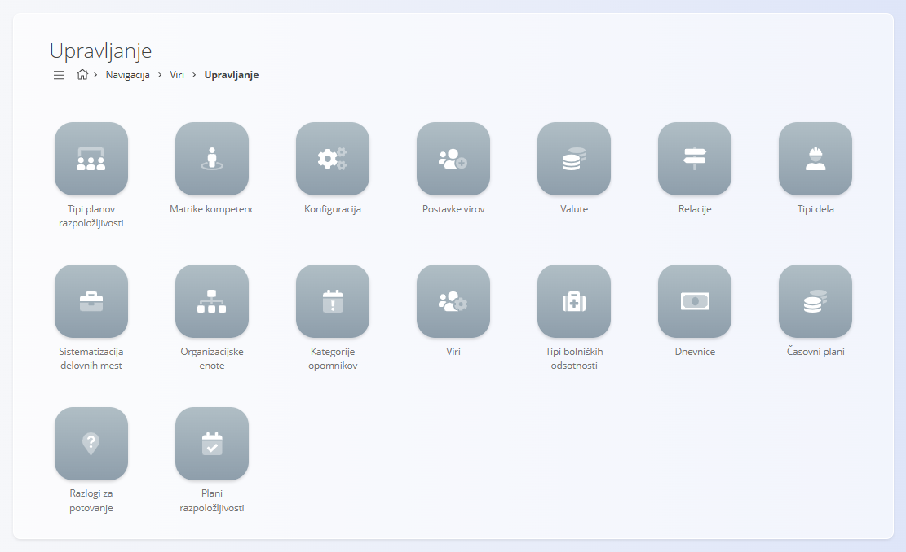

<!-- app_route: /sitemap/resources -->
<!-- app_label: Viri -->
<!-- canonical_source_url: https://github.com/Tom-PIT/Connected.Docs/blob/main/sl/Domene/Viri/Viri.md -->
<!-- canonical_source_title: Viri -->

# Viri

Domena **Viri** upravlja vse operativne podatke, povezane z ljudmi, znotraj organizacije. Zagotavlja orodja za načrtovanje razpoložljivosti, beleženje časa in napora, upravljanje osnovnih podatkov o virih ter analizo izkoriščenosti delovne sile.

Medtem ko druge domene (na primer **Proizvodnja**, **Vzdrževanje** ali **Projekti**) določajo, *katero delo je treba opraviti*, domena Viri določa, *kdo delo opravlja*, *kdaj* in *pod katerimi pogoji*.

Za dostop do domene **Viri** pojdite na **Navigacija / Viri** v [navigaciji](../../Skupno/UI/Navigacija.md).

> [!NOTE]
> Razpoložljive funkcionalnosti v domeni Viri so odvisne od konfiguracije podjetja, omogočenih modulov in notranjih pravilnikov.

## Kaj vključuje domena Viri?

Domena je organizirana v več funkcionalnih sklopov:

- [**Dokumenti**](#dokumenti) – operativni dokumenti, povezani z viri  
- [**Pogledi**](#pogledi) – vsakodnevni operativni in osebni pogledi  
- [**Upravljanje**](#upravljanje) – konfiguracija in osnovni podatki  
- [**Analiza**](#analiza) – poročanje in analiza delovne sile  

## Dokumenti

Razdelek **Dokumenti** vsebuje formalne dokumente, povezane z viri, ki se uporabljajo za administrativne, pravne ali skladnostne namene.

Razpoložljivi dokumenti vključujejo:

- **[Potni nalogi](Dokumenti/PotniNalogi.md)** – Evidentiranje, odobravanje in spremljanje službenih poti zaposlenih, vključeno z destinacijami, datumi in dnevnimi nadomestili.
Dokumenti praviloma predstavljajo *zapise* in ne izvajalnih delovnih tokov.

## Pogledi

Razdelek **Pogledi** vsebuje operativne zaslone, ki jih uporabljajo zaposleni, vodje ekip in vodstvo za spremljanje dela, časa, razpoložljivosti in opomnikov.

Ti zasloni so namenjeni **izvajanju, preglednosti in vsakodnevnemu spremljanju**, ne konfiguraciji.

Razpoložljivi pogledi vključujejo:
- **[Stroški opravil](Pregledi/StroskiOpravil.md)** – Pregled stroškovnih podatkov, povezanih z opravili in dodeljenimi viri.

- **[Opomniki](Pregledi/Opomniki.md)** – Osebni in operativni opomniki, povezani z nalogami, roki ali administrativnimi opravili.

- **[Pogled vira](Pregledi/PogledVira.md)** – Pregled virov, njihovih dodelitev in razpoložljivosti skozi čas.

- **[Dnevnik prisotnosti](Pregledi/DnevnikPrisotnosti.md)** – Pregled in upravljanje časovnih vnosov, ki jih beležijo viri.

- **[Delovni listi](Pregledi/DelovniListi.md)** – Strukturirano poročanje o času in aktivnostih, pogosto uporabljeno za odobritve ali obračun plač.
- **[Plani razpoložljivosti](Pregledi/PlaniRazpolozljivosti.md)** – Vizualni prikaz načrtovane razpoložljivosti, odsotnosti in delovnih urnikov.

## Upravljanje

Razdelek **Upravljanje** vsebuje konfiguracijske zaslone in osnovne podatke, ki so potrebni za vse procese, povezane z viri.

> [!TIP]
> Oglejte si celoten seznam upravljanja: **[Kazalo upravljanja](../../KazaloUpravljanja.md)**.

Razpoložljive nastavitve in osnovni podatki vključujejo:

- **[Tipi planov razpoložljivosti](Upravljanje/TipiPlanovRazpolozljivosti.md)**  
- **[Plani razpoložljivosti](Pregledi/PlaniRazpolozljivosti.md)**  
- **[Matrike kompetenc](Upravljanje/MatrikeKompetenc.md)**  
- **[Konfiguracija](Upravljanje/KonfiguracijaVirov.md)**  
- **[Postavke virov](Upravljanje/PostavkeVirov.md)**  
- **[Valute](../../Skupno/Upravljanje/Valute.md)**  
- **[Relacije](Upravljanje/Relacije.md)**  
- **[Razlogi za potovanje](Upravljanje/RazlogiZaPotovanje.md)**  
- **[Tipi dela](Upravljanje/TipiDela.md)**  
- **[Delovna mesta](../Proizvodnja/Upravljanje/SistematizacijaDelovnihMest.md)**  
- **[Organizacijske enote](../Proizvodnja/Upravljanje/OrganizacijskeEnote.md)**  
- **[Kategorije opomnikov](Upravljanje/KategorijeOpomnikov.md)**  
- **[Viri](../Viri/Upravljanje/Viri.md)**  
- **[Tipi bolniških odsotnosti](Upravljanje/TipiBolniskihOdsotnosti.md)**  
- **[Dnevnice](Upravljanje/Dnevnice.md)**  
- **[Časovni plani](Upravljanje/CasovniPlani.md)**  

Ti elementi določajo, kako so viri strukturirani, kategorizirani, stroškovno ovrednoteni in poročani v celotnem sistemu.

## Analiza

Razdelek **Analiza** omogoča vpogled v izkoriščenost delovne sile in operativno učinkovitost.

Razpoložljivi analitični pogledi vključujejo:

- **[Analiza opravil](Analiza/AnalizaOpravil.md)** – Analiza opravljenih ur, odsotnosti, vzorcev razpoložljivosti in trendov izkoriščenosti.
Analitični zasloni so **samo za branje** in podpirajo načrtovanje, optimizacijo ter odločanje.

## Viri in druge domene

Domena Viri je tesno povezana z drugimi operativnimi področji:
| Domena | Integracija |
|------|-------------|
| [**Projekti**](../Projekti/DomenaProjektov.md) | Opravila so dodeljena virom; napor in razpoložljivost se spremljata po projektih. |
| [**Proizvodnja**](../Proizvodnja/Proizvodnja.md) | Viri izvajajo proizvodne operacije in poročajo čas ter napor. |
| [**Vzdrževanje**](../Vzdrzevanje/Vzdrzevanje.md) | Vzdrževalne aktivnosti porabljajo čas in razpoložljivost virov. |
| [**Logistika**](../Logistika/Logistika.md) | Potni nalogi in razpoložljivost vplivajo na logistično načrtovanje. |
| [**Računovodstvo**](../Racunovodstvo/Racunovodstvo.md) | Podatki o času, stroških in dnevnicah se prenašajo v finančne procese in poročila. |
