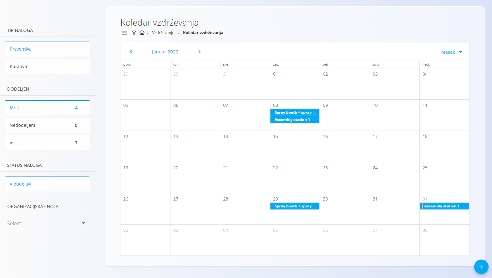
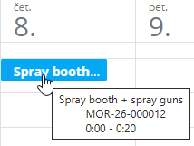

<!-- app_route: /maintenance-orders -->
<!-- app_label: Koledar vzdrževanja -->
<!-- canonical_source_url: https://github.com/Tom-PIT/Connected.Docs/blob/main/sl/Domene/Vzdrzevanje/Dokumenti/KoledarVzdrzevanja.md -->
<!-- canonical_source_title: Koledar vzdrževanja -->

# Koledar vzdrževanja

**Koledar vzdrževanja** omogoča časovni pregled vzdrževalnih aktivnosti.
Uporabnikom omogoča planiranje, pregled in navigacijo po vzdrževalnih nalogih
z uporabo koledarskega prikaza.

Za dostop do tega zaslona pojdite na **Vzdrževanje / Koledar vzdrževanja** v
[navigaciji](../../../Skupno/UI/Navigacija.md).

### Pregled

Privzeto koledar prikazuje **aktivne** [vzdrževalne naloge](VzdrzevalniNalogi.md),
razporejene na časovnici glede na njihov planirani datum in čas izvedbe.

Po potrebi lahko vključite tudi naloge v stanju **V obdelavi** z omogočitvijo
filtra **V obdelavi** (glej Filtri).  
Ko je ta filter izklopljen, so prikazani samo **aktivni** nalogi.

Koledar podpira različne časovne poglede za lažje planiranje in pregled.

Ob premiku miške nad posamezen vnos v koledarju se prikaže namig z dodatnimi
informacijami, kot so:
- oprema, ki se vzdržuje
- šifra vzdrževalnega naloga
- planirani čas izvedbe

## Navigacija in interakcija

- Klik na [**vzdrževalni nalog**](VzdrzevalniNalogi.md) v koledarju odpre
  ustrezen **dokument vzdrževalnega naloga**.
- Klik na [akcijski gumb](../../../Skupno/UI/AkcijskiGumb.md) ustvari
  nov vzdrževalni nalog.

## Pogledi

Koledar je mogoče prikazati v naslednjih pogledih, ki so dostopni v zgornjem
desnem kotu zaslona:

- **Dan** – podroben prikaz vzdrževalnih nalogov za posamezen dan
- **Teden** – pregled vzdrževalnih nalogov v okviru enega tedna
- **Mesec** – splošen pregled planiranih vzdrževalnih nalogov

## Filtri

Na levi strani zaslona so na voljo naslednji filtri:

### Tip naloga
- **Preventiva**
- **Kurativa**

### Dodeljen
- **Moji**
- **Nedodeljeni**
- **Vsi**

### Status naloga
- **V obdelavi** (preklop) — ko je omogočen, so vključeni tudi nalogi v obdelavi;
  sicer so prikazani samo aktivni nalogi

### Organizacijska enota
- Izberite eno ali več organizacijskih enot

Filtre je mogoče kombinirati za natančnejši prikaz vzdrževalnih nalogov
v koledarju.

## Povezano

- **[Vzdrževalni nalogi](VzdrzevalniNalogi.md)** – ustvarjanje in upravljanje vzdrževalnih del
- **[Vzdrževalni urniki](UrnikiVzdrzevanja.md)** – nastavitev ponavljajočih se časovnih ali
  uporabniških urnikov, ki generirajo vzdrževalne naloge
