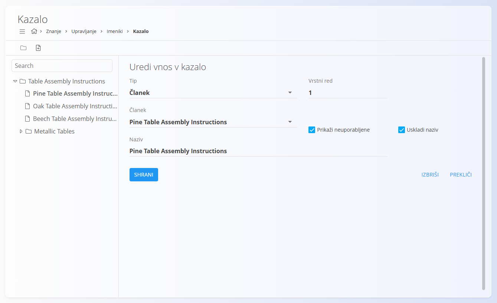
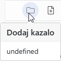
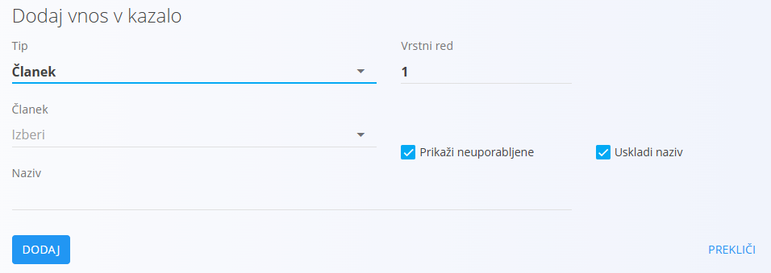

<!-- app_route: /management/knowledge/directories -->
<!-- app_label: Imeniki -->
<!-- canonical_source_url: https://github.com/Tom-PIT/Connected.Docs/blob/main/sl/Domene/Znanje/Upravljanje/Kazalo.md -->
<!-- canonical_source_title: Kazalo -->

# Kazalo

**Kazalo** določa **navigacijsko strukturo** znotraj imenika v [**bazi znanja**](../BazaZnanja/BazaZnanja.md).  
Omogoča hierarhično razporeditev člankov ter uporabnikom nudi jasen pregled nad vsebino.

Imenik lahko vsebuje **eno ali več kazal**.

Za upravljanje kazala pojdite na **Znanje / Upravljanje / Imeniki**, nato kliknite **Kazalo** pod izbranim imenikom.

## Pregled

Kazalo je prikazano kot **drevesna struktura** in lahko vsebuje:

- **Mape**
- **Članke**
- **URL povezave**

Vnosi so razvrščeni po **ordinalni vrednosti** in jih je mogoče omogočiti ali onemogočiti.

> [!TIP]
> Razvrščanje poteka prek polja **Ordinal**. Povleci-in-spusti ni podprt.

## Shema

| Polje | Opis |
|------|------|
| **Tip** | Vrsta vnosa: mapa, članek ali URL. |
| **Naslov** | Prikazni naslov vnosa kazala. |
| [**Članek**](Clanki.md) | Povezan članek (na voljo, če je tip *članek*). |
| **Hyperpovezava** | Prikazano besedilo URL povezave. |
| **Vrstni red** | Položaj vnosa znotraj iste ravni. |
| **Omogočno** | Določa vidnost vnosa v [**bazi znanja**](../BazaZnanja/BazaZnanja.md). |
| **Prikaži neuporabljene** | Prikaže članke, ki še niso uporabljeni v kazalu. |
| **Uskladi naziv** | Sinhronizira naslov z naslovom povezanega članka. |

## Ustvariti kazalo

Če imenik še nima nobenega kazala, je zaslon prazen.

Za ustvarjanje novega kazala kliknite **ikono mape**.

Imenik lahko vsebuje več kazal.
Za ustvarjanje **novega glavnega kazala** se prepričajte, da v stranskem meniju **ni izbrano nobeno obstoječe kazalo**, nato kliknite **ikono mape**.

## Ustvariti vnos v kazalo

Za dodajanje vnosov najprej izberite ciljno **kazalo** v stranskem meniju, nato kliknite **ikono dokumenta**, da dodate nov vnos.

Pri ustvarjanju vnosa izberite ustrezen **Tip** in izpolnite pripadajoča polja.

Kliknite **Dodaj**, da ustvarite vnos.

## Urediti vnosov

Kliknite obstoječo mapo ali vnos v drevesu, da odprete zaslon za urejanje.

Na zaslonu za urejanje lahko:

- spremenite **Naziv**
- uredite **Vrstni red**
- omogočite ali onemogočite vnos
- spremenite povezan **Članek** ali **URL**
- pri vnosih tipa **Članek** omogočite **Uskladi naziv**

Če je v drevesu izbrana **mapa**, bodo novi vnosi dodani **znotraj te mape**, kar omogoča gradnjo gnezdene strukture.

## Razvrščanje in hierarhija

- Vnosi so prikazani glede na **zaporedno številko**
- Mape lahko vsebujejo druge mape ali vnose
- Hierarhija določa način navigacije po [**Bazi znanja**](../BazaZnanja/BazaZnanja.md)

Spremembe kazala se **takoj** odrazijo v izbranem imeniku.

> [!NOTE]
> Kazalo vpliva **izključno na navigacijo**. Vsebina člankov se ureja ločeno v
> [Člankih](Clanki.md).

## Izbrisati kazalo ali vnos

Kliknite **Izbriši** na kazalu ali posameznem vnosu, da se odpre potrditveno okno:

**Ali ste prepričani, da želite izbrisati ta zapis?**

Po potrditvi je kazalo ali vnos trajno odstranjen.

## Uporaba kazala v Bazi znanja

Ko je kazalo nastavljeno, se uporablja pri brskanju po imeniku v [**Bazi znanja**](../BazaZnanja/BazaZnanja.md).

Znotraj imenika kliknite **ikono menija (hamburger)**, da odprete stranski panel s kazalom, ki omogoča navigacijo med mapami in članki.

