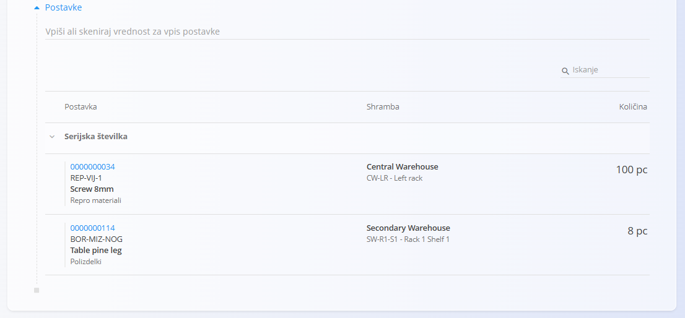
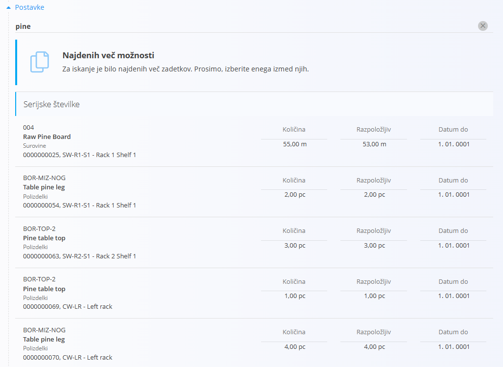
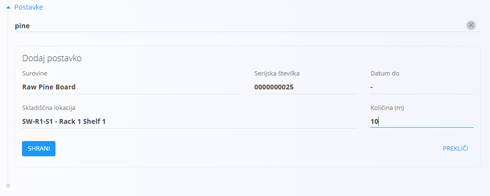
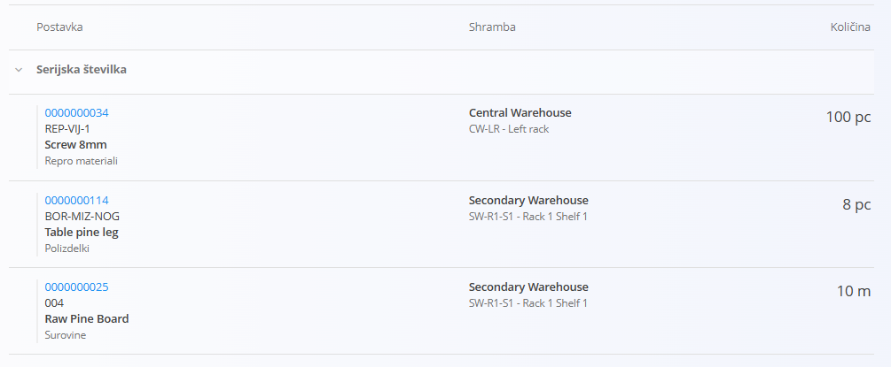

# Postavke dokumenta

Razdelek **Postavke dokumenta** vsebuje posamezne vrstice, ki sestavljajo dokument.

Glede na vrsto dokumenta lahko postavke predstavljajo:

* Blago
* Storitve

Večina logističnih, proizvodnih, vzdrževalnih in prodajnih dokumentov uporablja razdelek Postavke dokumenta za evidentiranje materialov in količin.

## Dodaj postavko

Nove postavke lahko dodate tako, da v vnosno polje nad seznamom postavk vpišete ali skenirate vrednost.

Podprte iskalne vrednosti običajno vključujejo:

* Šifro materiala
* Naziv materiala
* Črtno kodo (EAN)
* Serijsko številko

Razpoložljive možnosti iskanja so odvisne od vrste dokumenta in konfiguracije sistema.

### Izberi ustrezen zadetek

Če sistem najde več ustreznih zadetkov, prikaže seznam razpoložljivih rezultatov.

Na seznamu izberite ustrezen zapis.

### Potrdi postavko

Po izbiri zadetka sistem samodejno izpolni vse razpoložljive podatke, kot so:

* Material
* Serijska številka
* Skladiščna lokacija
* Rok uporabe
* Količina

Prikazana polja so odvisna od izbranega materiala in vrste dokumenta. Po potrebi lahko količino tudi spremenite.

Kliknite **Shrani**, da dodate postavko v dokument, ali **Prekliči**, da jo zavržete.

### Dodane postavke

Po shranjevanju se postavka prikaže na seznamu postavk.

## Podatki postavke

Glede na vrsto dokumenta lahko postavke vsebujejo podatke, kot so:

* Material
* Količina
* Merska enota
* Skladiščna lokacija
* Serijska številka
* Številka serije
* Rok uporabe
* Cena
* Znesek

Vsi dokumenti ne uporabljajo enakih polj.

## Uredi postavko

Obstoječe postavke je običajno mogoče urejati z izbiro vrstice postavke.

Razpoložljiva polja so odvisna od vrste dokumenta in trenutnega stanja dokumenta.

## Izbriši postavko

Postavke je običajno mogoče izbrisati, dokler je dokument v stanju **Osnutek**.

Za brisanje postavke izberite vrstico in kliknite gumb **Izbriši**.

Razpoložljivost je odvisna od vrste dokumenta in konfiguracije sistema.

## Dodatno vedenje

Glede na vrsto dokumenta lahko sistem samodejno:

* Preverja razpoložljivost zaloge
* Preverja serijske številke
* Izračunava cene
* Izračunava davke
* Predlaga skladiščne lokacije
* Omejuje podvojene vnose

Pravila, specifična za posamezne dokumente, so opisana v dokumentaciji posameznega dokumenta.
