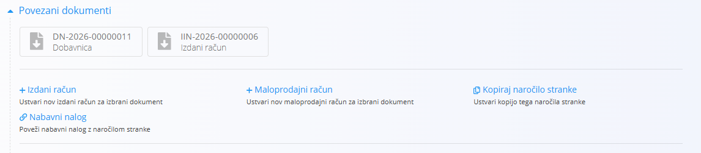

# Povezani dokumenti

Razdelek **Povezani dokumenti** prikazuje dokumente, povezane s trenutnim dokumentom, in omogoča ustvarjanje novih dokumentov kot del istega poslovnega procesa.

Povezani dokumenti zagotavljajo sledljivost med operativnimi, logističnimi, vzdrževalnimi, proizvodnimi in finančnimi dokumenti v celotnem sistemu.

## Namen povezanih dokumentov

Povezani dokumenti uporabnikom omogočajo:

* Spremljanje poteka poslovnega procesa
* Navigacijo med povezanimi dokumenti
* Ustvarjanje nadaljnjih dokumentov neposredno iz obstoječih dokumentov
* Zagotavljanje sledljivosti skozi celoten življenjski cikel dokumenta

Primeri:

* **Ponudba → Naročilo stranke → Dobavnica → Izdani račun**
* **Nabavni nalog → Prevzem → Prejeti račun**
* **Urnik vzdrževanja → Vzdrževalni nalog**
* **Proizvodni nalog → Prevzem → Izdaja**

Razpoložljivi povezani dokumenti so odvisni od vrste in stanja trenutnega dokumenta.

## Ustvarjanje in povezovanje dokumentov

Razdelek **Povezani dokumenti** omogoča ustvarjanje novih povezanih dokumentov ali povezovanje obstoječih dokumentov.

### Ustvari nov dokument

Številni tipi dokumentov omogočajo ustvarjanje nadaljnjih dokumentov neposredno iz trenutnega dokumenta.

Ko je ustvarjen nov dokument:

* Dokument se samodejno poveže z izvornim dokumentom
* Ustrezni podatki se prenesejo iz izvornega dokumenta
* Ohrani se sledljivost med dokumenti

Primeri:

* Naročilo stranke → Izdani račun
* Naročilo stranke → Dobavnica
* Nabavni nalog → Prevzem

### Poveži obstoječ dokument

Nekateri tipi dokumentov omogočajo tudi povezovanje dokumentov, ki že obstajajo v sistemu.

Pri povezovanju obstoječega dokumenta:

* Nov dokument se ne ustvari
* Zabeleži se povezava med dokumentoma
* Oba dokumenta sta prikazana v razdelku **Povezani dokumenti**

To je uporabno, kadar so bili povezani dokumenti ustvarjeni ločeno, vendar jih je zaradi sledljivosti ali poslovnega procesa smiselno povezati.

## Sledljivost dokumentov

Razdelek **Povezani dokumenti** omogoča vpogled v celoten življenjski cikel poslovnega procesa.

Uporabniki lahko prehajajo tako do izvornih dokumentov kot do dokumentov, ki so bili ustvarjeni iz trenutnega dokumenta.

S tem je zagotovljena popolna revizijska sled in možnost spremljanja zgodovine transakcij, materialov, vzdrževalnih aktivnosti, proizvodnih procesov ter finančnih dokumentov skozi celoten sistem.

## Dodatne informacije

Za primere povezanih dokumentov, ki so na voljo za posamezno vrsto dokumenta, si oglejte dokumentacijo tega dokumenta.
