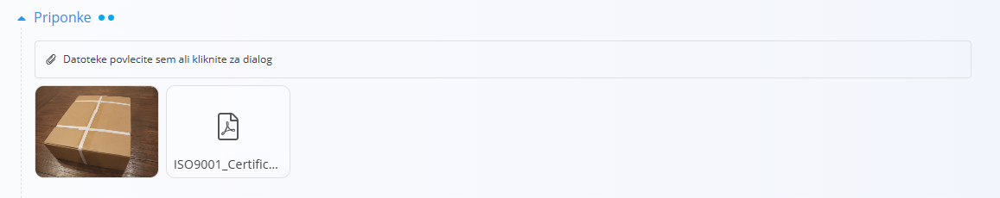

# Priponke

Razdelek **Priponke** je na voljo na vrhu večine dokumentov in zapisov v sistemu.

Ta razdelek uporabite za nalaganje in shranjevanje datotek, povezanih z dokumentom, kot so:

- Dobavnice
- Transportni dokumenti
- Pogodbe
- Fotografije
- Certifikati
- Skenirani dokumenti
- Druge podporne datoteke

Priponke ostanejo povezane z dokumentom in so kadar koli na voljo za pregled ali prenos.

Število pik, prikazanih ob naslovu **Priponke**, označuje število datotek, trenutno priloženih dokumentu.

### Nalaganje priponk

Datoteke lahko naložite na dva načina:

- Datoteke povlecite in spustite v območje za nalaganje
- Kliknite območje za nalaganje, da odprete pogovorno okno za izbiro datotek

Po nalaganju se priponke prikažejo na seznamu pod območjem za nalaganje.

### Dejanja priponk

Premaknite kazalec miške nad naloženo datoteko, da prikažete razpoložljiva dejanja.

Glede na vrsto datoteke so lahko na voljo naslednja dejanja:

- **Predogled** - odpre predogled datoteke. To dejanje je na voljo za slikovne datoteke.
- **Prenesi** - prenese datoteko na vašo napravo.
- **Izbriši** - po potrditvi odstrani datoteko iz dokumenta.