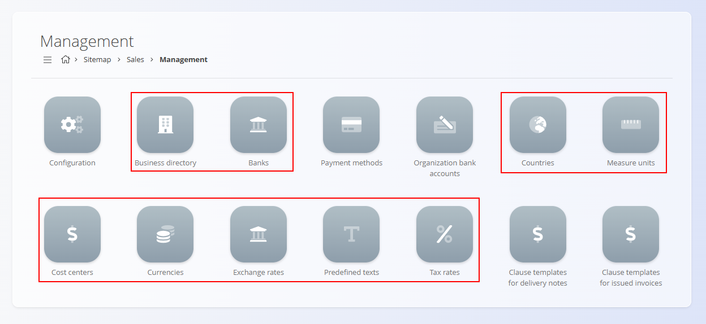

# Skupno

Modul **Skupno** ni domena, temveč nabor **skupnih šifrantov in osnov uporabniškega vmesnika**, ki se uporabljajo v celotni platformi. Ti elementi definirajo globalne strukture, kot so države, valute, davčne stopnje, merske enote in poslovni partnerji. Vsaka funkcionalna domena — [Prodaja](../Domene/Prodaja/Prodaja.md), [Nabava](../Domene/Nabava/Nabava.md), [Logistika](../Domene/Logistika/Logistika.md), [Proizvodnja](../Domene/Proizvodnja/Proizvodnja.md) — se za pravilno delovanje zanaša na modul Skupno.

Zaradi tega mora biti modul **Skupno** konfiguriran **pred** uporabo katerekoli druge domene v platformi.

Primer šifrantov modula Skupno v domeni **Prodaja**:

> [!IMPORTANT]  
> Šifranti modula Skupno morajo biti **prvi korak konfiguracije** pri vzpostavitvi platforme.  
>
> Brez teh vrednosti domene [**Prodaja**](../Domene/Prodaja/Prodaja.md), [**Nabava**](../Domene/Nabava/Nabava.md), [**Logistika**](../Domene/Logistika/Logistika.md) in [**Sistemske nastavitve**](../Domene/Sistem/Nastavitve/KonfiguracijaSistema.md) ne morejo pravilno delovati.

## Kaj vključuje modul Skupno?

Modul Skupno vsebuje več kategorij skupnih šifrantov, ki se uporabljajo v celotnem sistemu:

- **Geografija in organizacijska struktura**  
- **Finančne in davčne nastavitve**  
- **Meritve in merske enote**  
- **Partnerji in poslovni zapisi**  
- **Besedilne predloge in vedenje uporabniškega vmesnika**

Ti šifranti predstavljajo osnovne gradnike, na katerih temeljijo druge domene.

> [!NOTE]
> Oglejte si celoten seznam upravljanja: **[Kazalo upravljanja](../KazaloUpravljanja.md)**.

### Geografija in organizacija

Te nastavitve določajo geografski in organizacijski kontekst podjetja in njegovih dokumentov.

- **[Države](Upravljanje/Drzave.md)** – določajo dovoljene države za naslove, dokumente, pravno oblikovanje in lokalizacijo.  
- **[Poslovni imenik](Upravljanje/PoslovniImenik.md)** – osrednja baza podjetij, dobaviteljev in drugih pravnih subjektov.

> [!IMPORTANT]  
> Države morajo biti konfigurirane pred nastavitvijo države organizacije v **Sistem → Konfiguracija → Organizacija** ali v **Nastavitvah skupnih tipov**.

### Finančne in valutne nastavitve

Te nastavitve vplivajo na vse denarne in finančne procese v domenah.

- **[Valute](Upravljanje/Valute.md)** – definirajo valute, ki so na voljo organizaciji.  
- **[Davčne stopnje](Upravljanje/DavcneStopnje.md)** – definicije DDV ali drugih davkov, uporabljenih v prodaji in nabavi.  
- **[Načini plačila](../Domene/Prodaja/Upravljanje/NacinPlacila.md)** – plačilne metode, uporabljene v prodaji in financah.

> [!IMPORTANT]  
> Valute morajo biti ustvarjene tukaj **pred** izbiro v:  
> - Sistem → [Konfiguracija](../Domene/Sistem/Nastavitve/KonfiguracijaSistema.md) → Nastavitve skupnih tipov  
> - dokumentih v domenah [Prodaja](../Domene/Prodaja/Prodaja.md) in [Nabava](../Domene/Nabava/Nabava.md)

### Merjenje in merske enote

Uporabljajo se v sredstvih, materialih, prodajnih dokumentih, nabavnih naročilih, logistiki in proizvodnji.

- **[Merske enote](Upravljanje/MerskeEnote.md)** – osnovne merske enote (kos, kg, m, …).

Pravilna konfiguracija zagotavlja doslednost količin, cen in zalog.

## Partnerji in poslovni zapisi

Zapisi o partnerjih so skupni vsem komercialnim procesom.

- **[Poslovni imenik](Upravljanje/PoslovniImenik.md)** – skupni imenik kupcev, dobaviteljev in poslovnih subjektov.  
- **[Banke](Upravljanje/Banke.md)** – definicije bank, uporabljene pri plačilnih navodilih.  
- **[Bančni računi organizacije](../Domene/Prodaja/Upravljanje/BancniRacuniOrganizacije.md)** – interni bančni računi podjetja za izdajanje računov.

Ti zapisi zagotavljajo enotno identifikacijo poslovnih partnerjev v vseh domenah.

## Besedila in predloge

Te nastavitve omogočajo enotno oblikovanje in vedenje dokumentov.

- **[Vnaprej določena besedila](Upravljanje/VnaprejDolocenaBesedila.md)** – ponovno uporabljiva besedila za ponudbe, račune, dobavnice in nabavne dokumente.

## Zakaj morajo biti šifranti Skupno konfigurirani najprej

Skoraj vsi procesi v platformi so odvisni od nastavitev Skupno:

| Področje | Odvisnost |
|--------|----------|
| **Sistem → Konfiguracija** | Zahteva [Države](Upravljanje/Drzave.md) in [Valute](Upravljanje/Valute.md) pred nastavitvijo organizacije |
| **Prodaja** | Zahteva [Valute](Upravljanje/Valute.md), [Davčne stopnje](Upravljanje/DavcneStopnje.md), [Merske enote](Upravljanje/MerskeEnote.md), [Načini plačila](../Domene/Prodaja/Upravljanje/NacinPlacila.md) |
| **Nabava** | Zahteva [Poslovni imenik](Upravljanje/PoslovniImenik.md), [Države](Upravljanje/Drzave.md), [Valute](Upravljanje/Valute.md) |
| **Logistika** | Zahteva [Merske enote](Upravljanje/MerskeEnote.md), [Države](Upravljanje/Drzave.md), [Poslovni imenik](Upravljanje/PoslovniImenik.md) |
| **Proizvodnja** | Uporablja [Merske enote](Upravljanje/MerskeEnote.md) in [Poslovni imenik](Upravljanje/PoslovniImenik.md) |

Če modul Skupno ni pravilno konfiguriran, se lahko pojavijo:

- manjkajoče vrednosti v spustnih seznamih  
- nezmožnost ustvarjanja prodajnih ali nabavnih dokumentov  
- napačni davčni izračuni  
- nepravilno oblikovanje računov in dobavnic  
- napake v sistemski konfiguraciji  

> [!POZOR]  
> **Ne nadaljujte z uporabo domen [Prodaja](../Domene/Prodaja/Prodaja.md), [Nabava](../Domene/Nabava/Nabava.md), [Logistika](../Domene/Logistika/Logistika.md) ali [Sistemske nastavitve](../Domene/Sistem/Nastavitve/KonfiguracijaSistema.md), dokler niso ustvarjeni vsi zahtevani šifranti modula Skupno.**
