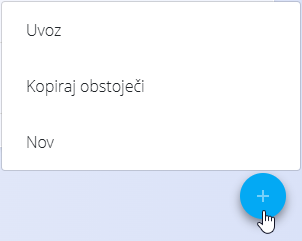

<!-- app_route: /sitemap -->
<!-- app_label: Zemljevid strani -->
<!-- canonical_source_url: https://tom-pit.github.io/Connected.Docs/sl/Skupno/UI/AkcijskiGumb/ -->
<!-- canonical_source_title: Akcijski gumb -->

# Akcijski gumb

akcijski gumb se prikaže kot okrogla modra ikona **+** v spodnjem desnem kotu seznamskih strani.  
Njegov glavni namen je ustvarjanje novih zapisov znotraj modula, ki ga trenutno uporabljate.

Ob kliku se odpre kontekstni meni z dejanji, ki so relevantna za trenutni zaslon.  
Najpogostejše dejanje je:

- **Nov** — ustvarjanje novega dokumenta, vnosa v šifrant ali konfiguracijskega zapisa.

Glede na modul lahko akcijski gumb vključuje tudi dodatne možnosti, kot so:

- **Uvoz** — nalaganje ali uvoz podatkov iz zunanjih datotek (npr. Excel predlog).  
- **Kopiraj obstoječe** — ustvarjanje novega zapisa na podlagi obstoječega.  
- **Druga modulno specifična dejanja** — prikazana samo, kadar so na voljo.

> [!NOTE]
> Razpoložljiva dejanja so odvisna od modula in uporabniških pravic.  
