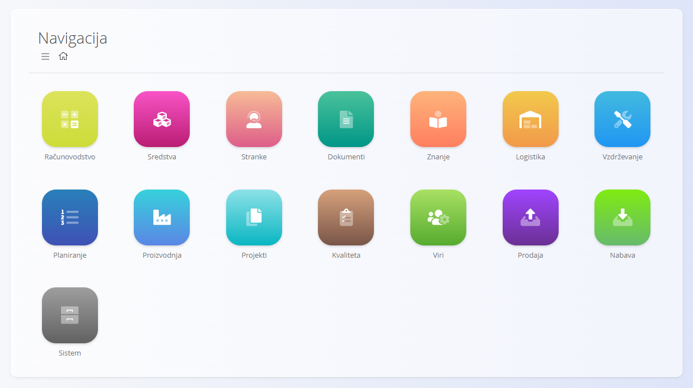
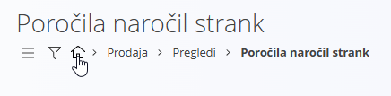
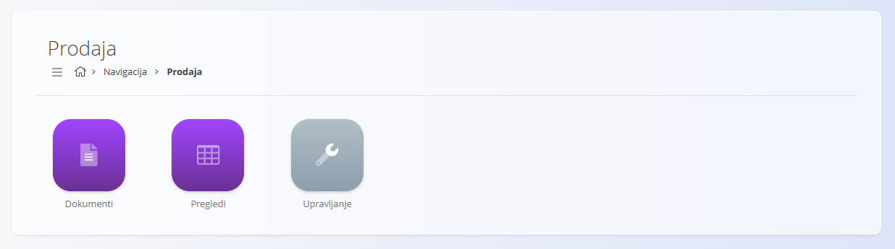
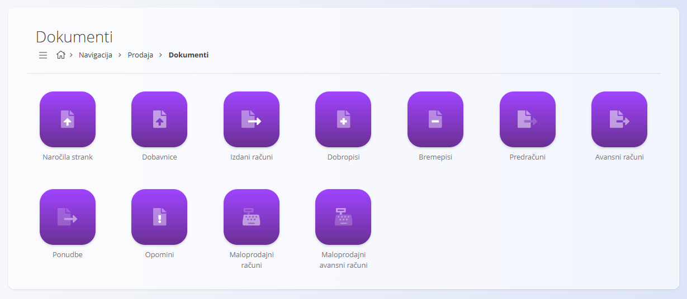
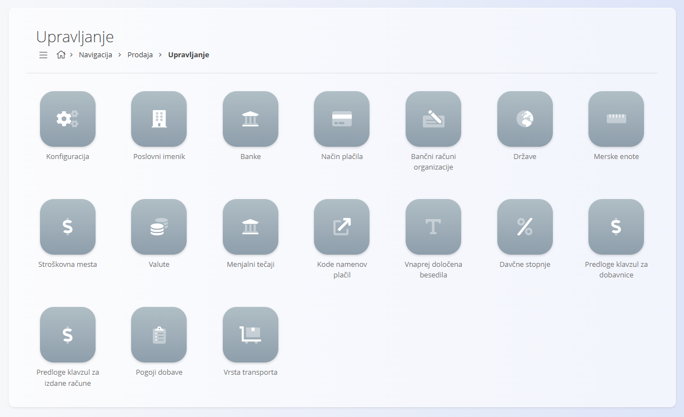

<!-- app_route: /sitemap -->
<!-- app_label: Zemljevid strani -->
<!-- canonical_source_url: https://github.com/Tom-PIT/Connected.Docs/blob/main/sl/Skupno/UI/Navigacija.md -->
<!-- canonical_source_title: Navigacija -->

# Navigacija

Platforma je organizirana tako, da omogoča enostavno iskanje dokumentov, pogledov in konfiguracijskih področij glede na vsakodnevno delo. Navigacija poteka predvsem prek **zemljevida strani**, drobtinic in gumbov za hitri dostop.

## Glavna navigacija

**Navigacija** je glavna vstopna točka platforme. Razdeljena je na **domene**, od katerih vsaka predstavlja funkcionalno področje sistema.

Na navigacijo se lahko vedno vrnete s klikom na **ikono hiše** v drobtinicah.

### Navigacija z drobtinicami

Drobtinice prikazujejo trenutno pot in omogočajo vračanje nazaj s klikom na katerikoli prejšnji element:

Na številnih zaslonih je v spodnjem desnem kotu na voljo tudi **gumb s puščico nazaj**, ki omogoča vrnitev na prejšnji zaslon:

### Domene

Vsaka domena vsebuje orodja, povezana z določenim poslovnim področjem. Primeri vključujejo:

- **[Prodaja](../../Domene/Prodaja/README.md)**  
- **[Logistika](../../Domene/Logistika/README.md)**  
- **[Nabava](../../Domene/Nabava/README.md)**  
- **[Proizvodnja](../../Domene/Proizvodnja/README.md)**  

> [!NOTE]
>
> Razpoložljive domene so odvisne od konfiguracije in poslovnega modela podjetja. Podjetje, ki na primer prodaja samo končne izdelke, morda ne bo imelo domene **Proizvodnja**.

Znotraj domen so različni razdelki glede na funkcionalno področje:
- Dokumenti
- Pogledi
- Upravljanje

Primer – razdelki v domeni **Prodaja**:

## Dokumenti

Dokumenti predstavljajo jedro vsakodnevnega operativnega dela. Uporabljajo se za ustvarjanje, obdelavo in sledenje poslovnim transakcijam, kot so:

- **[Naročila strank](../../Domene/Prodaja/Dokumenti/NarocilaStrank.md)**  
- **[Dobavnice](../../Domene/Prodaja/Dokumenti/Dobavnice.md)**  
- **[Prevzemi](../../Domene/Logistika/Dokumenti/Prevzemi.md)**  
- **[Izdajnice](../../Domene/Logistika/Dokumenti/Izdajnice.md)**  
- **[Med-skladiščni promet](../../Domene/Logistika/Dokumenti/MedSkladiscniPromet.md)**  
- **[Inventure](../../Domene/Logistika/Dokumenti/Inventure.md)**
- **[Nabavni nalogi](../../Domene/Nabava/Dokumenti/NabavniNalogi.md)**  
- **[Izvedba](../../Domene/Proizvodnja/Dokumenti/Izvedba.md)**
- **[Proizvodni nalogi](../../Domene/Proizvodnja/Dokumenti/ProizvodniNalogi.md)**
- **[Zahteve](../../Domene/Proizvodnja/Dokumenti/Zahteve.md)**
- in številni drugi

Primer – vstop v domeno **Prodaja** in razdelek **Dokumenti**:

Dokumenti običajno omogočajo:

- seznam osnutkov in potrjenih dokumentov  
- ustvarjanje novih zapisov  
- filtre za hitro iskanje informacij  
- možnosti tiskanja in izvoza  

## Pregledi

Pregledi omogočajo **analizo in spremljanje** poslovnih informacij. Ne ustvarjajo transakcij, temveč pomagajo razumeti širšo sliko.

Primeri pogledov vključujejo:

- **[Pregledi zalog](../../Domene/Logistika/Pregledi/Zaloga.md)**  
- **[Postavke naročil strank](../../Domene/Prodaja/Pregledi/PostavkeNarocilStrank.md)**  
- **[Poročila dobavnic](../../Domene/Prodaja/Pregledi/PorocilaDobavnic.md)**  
- **[Kartice podjetij](../../Domene/Prodaja/Pregledi/PoslovneKartice.md)**  
- **[Pregledi zalog po lokaciji](../../Domene/Logistika/Pregledi/PogledZalogePoLokacijah.md)**  
- **[KPI proizvodnje](../../Domene/Proizvodnja/Analiza/KazalnikiProizvodnje.md)**
- **[Povzetek slabih kosov](../../Domene/Proizvodnja/Analiza/PovzetekSlabihKosov.md)**
- **[Povzetek zastojev](../../Domene/Proizvodnja/Analiza/PovzetekZastojev.md)**

Primer – **Prodaja / Pogledi**:

Pogledi so namenjeni:

- hitri analizi  
- nadzoru in preverjanju  
- podpori odločanju  
- poročanju  

## Upravljanje

Razdelek **Upravljanje** vsebuje vse šifrante in osnovne nastavitve, ki podpirajo delovanje platforme. Te nastavitve zagotavljajo, da dokumenti in procesi uporabljajo dosledne in veljavne podatke.

> [!TIP]  
> Za hiter dostop do posameznih člankov za **matične podatke** in **šifrante** uporabite [**kazalo upravljanja**](../../KazaloUpravljanja.md).

Upravljanje vključuje na primer:

- konfiguracijo sistema  
- **[Poslovni imenik](../Upravljanje/PoslovniImenik.md)**  
- **[Banke in načini plačila](../../Domene/Prodaja/Upravljanje/NacinPlacila.md)**  
- **[Države](../Upravljanje/Drzave.md)**, **[valute](../Upravljanje/Valute.md)**, **[davčne stopnje](../Upravljanje/DavcneStopnje.md)**  
- **[Vnaprej določena besedila](../Upravljanje/VnaprejDolocenaBesedila.md)**  
- **[Merske enote](../Upravljanje/MerskeEnote.md)**  
- **[Bančni računi organizacije](../../Domene/Prodaja/Upravljanje/BancniRacuniOrganizacije.md)**  
- **[Procesi](../../Domene/Proizvodnja/Upravljanje/Procesi.md)**
- **[Vhodi](../../Domene/Proizvodnja/Upravljanje/Vhodi.md)**, **[Izhodi](../../Domene/Proizvodnja/Upravljanje/Izhodi.md)**
- **[Nazivi delovnih mest](../Upravljanje/NaziviDelovnihMest.md)**, **[Človeški viri](../../Domene/Proizvodnja/Upravljanje/CloveskiViri.md)**
- drugi ključni šifranti  

Primer – **Prodaja / Upravljanje**:

Strani za upravljanje običajno vzdržujejo skrbniki ali uporabniki, odgovorni za konfiguracijo sistema.
