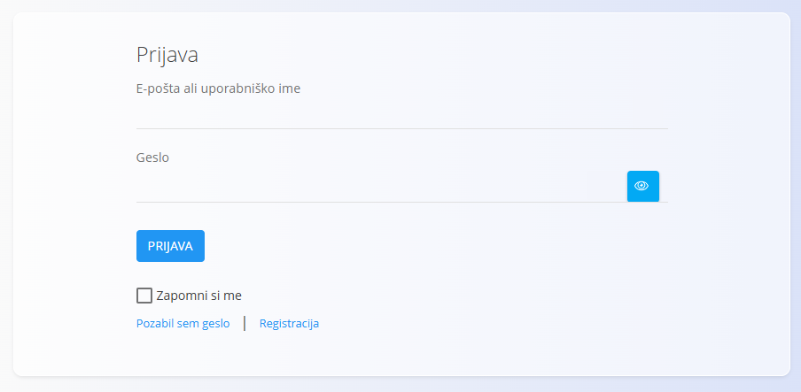
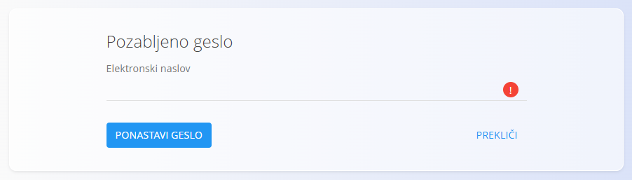
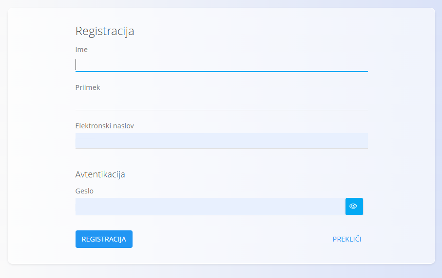

<!-- app_route: /login -->
<!-- app_label: Prijava -->
<!-- canonical_source_url: https://github.com/Tom-PIT/Connected.Docs/blob/main/sl/Skupno/UI/Prijava.md -->
<!-- canonical_source_title: Prijava -->

# Prijava

Zaslon **Prijava** se uporablja za dostop do aplikacije z uporabniškimi podatki.

## Prijavni podatki

Za prijavo vnesite:

- **E-pošta ali uporabniško ime**
- **Geslo**

Kliknite **Prijava** za dostop do aplikacije.

### Dodatne možnosti

- **Zapomni si me** – ohrani prijavo na trenutni napravi
- **Pozabil sem geslo** – odpre zaslon za ponastavitev gesla
- **Registracija** – odpre zaslon za registracijo (če je omogočeno)

## Ponastavitev gesla

Če ste pozabili geslo, kliknite **Pozabil sem geslo**.

Vnesite **elektronski naslov** in kliknite **Ponastavi geslo**.  
Prejeli boste navodila za nastavitev novega gesla.

## Registracija

Če je registracija omogočena, lahko uporabniki ustvarijo nov račun.

Za registracijo vnesite:

- **Ime**
- **Priimek**
- **Elektronski naslov**
- **Geslo**

Kliknite **Registracija** za ustvarjanje računa.

> [!NOTE]
> Razpoložljivost registracije je odvisna od nastavitev sistema.