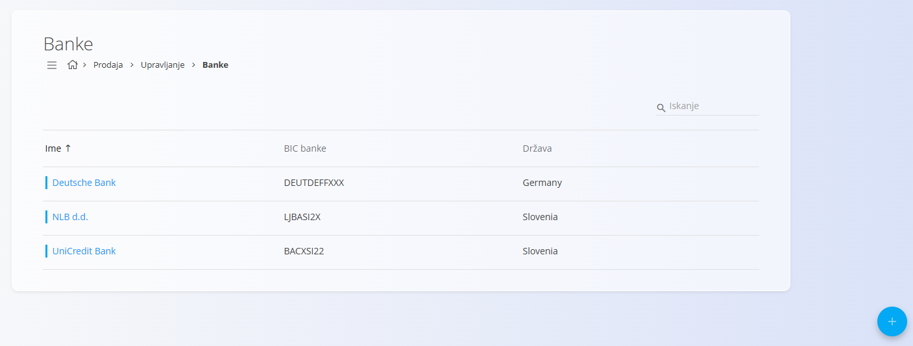
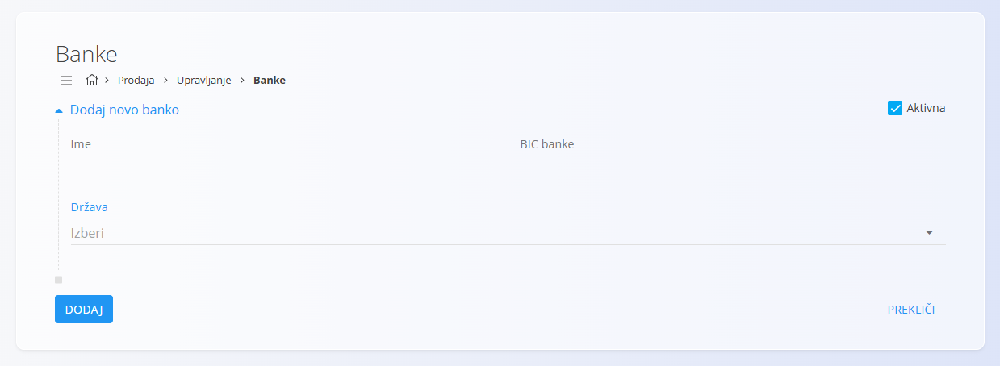

<!-- app_route: /management/common-types/banks -->
<!-- app_label: Banke -->
<!-- canonical_source_url: https://tom-pit.github.io/Connected.Docs/sl/Skupno/Upravljanje/Banke/ -->
<!-- canonical_source_title: Banke -->

# Banke
Šifrant **Banke** vsebuje finančne institucije, ki se lahko uporabljajo v dokumentih, kot so izdani računi, plačila in organizacijski bančni računi. Vsak zapis banke vsebuje ime, šifro BIC in državo, kar sistemu omogoča povezovanje z različnimi [poslovnimi partnerji](../../Skupno/Upravljanje/PoslovniImenik.md) in njihovimi transakcijami ter pravilno sklicevanje na bančne podatke kjerkoli so potrebni.

Za dostop do šifranta Banke se pomaknite na **Prodaja / Upravljanje / Banke** v [navigaciji](../../Skupno/UI/Navigacija.md).

> [!NOTE]  
> **Predpogoji**  
> Pred upravljanjem zapisov bank zagotovite, da je šifrant [**Države**](../../Skupno/Upravljanje/Drzave.md) pravilno konfiguriran.

## Shema
| Polje | Opis |
|------|------|
| **Ime** | Polno ime banke (obvezno). |
| **BIC banke** | Koda BIC (Bank Identifier Code), ki se uporablja za mednarodne transakcije (obvezno). |
| [**Država**](../../Skupno/Upravljanje/Drzave.md) | Država, v kateri je banka registrirana (obvezno). |
| **Aktivna** | Označuje, ali je banka na voljo za uporabo v dokumentih (privzeto izbrano). |

## Upravljanje
Na tem zaslonu lahko pregledujete, dodajate in urejate banke, ki se uporabljajo v celotnem sistemu.

### Seznam bank
Seznam prikazuje vse evidentirane banke, vključno z njihovim **imenom**, **šifro BIC** in [**državo**](../../Skupno/Upravljanje/Drzave.md).

Vsak zapis vključuje indikator stanja levo od imena:
- **Modra** označuje, da je banka aktivna
- **Siva** označuje, da je banka neaktivna

Za hitro filtriranje bank po kodi ali imenu lahko uporabite **iskalno vrstico**.

## Dejanja

### Dodati novo banko

Za vstvarjanje nove banke:

1. Kliknite [akcijski gumb](../../Skupno/UI/AkcijskiGumb.md) za dodajanje nove banke.
2. Izpolnite vsa obvezna polja. Neobvezna polja izpolnite, če so relevantna. 
3. Kliknite **Dodaj** za shranjevanje ali **Prekliči** za vrnitev na seznam.

> [!NOTE]
> Za več podrobnosti o poljih si oglejte zgoraj omenjeno razdelitev [**Shema**](#shema).

### Urediti banko

Za urejanje obstoječe banke: 

1. Kliknite na njeno **ime** v seznamu. Vmesnik se preklopi v način urejanja, kjer so prikazane obstoječe vrednosti za spremembe. 
2. Kliknite **Shrani**, da potrdite spremembe, ali **Prekliči**, da jih zavrnete.

### Izbrisati banko

Za brisanje banke:

1. Kliknite na njeno **ime** v seznamu. Vmesnik se preklopi v način urejanja.
2. Kliknite **Izbriši** na zaslonu za urejanje, da odprete potrditveno pogovorno okno. Če potrdite, se zapis trajno odstrani; sicer sistem ohrani obstoječe stanje.

> [!NOTE]
> Zapis banke je mogoče izbrisati le, če ni uporabljen v drugih sistemskih entitetah.
