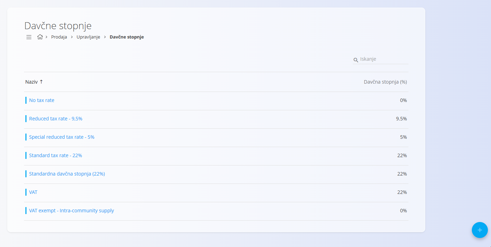
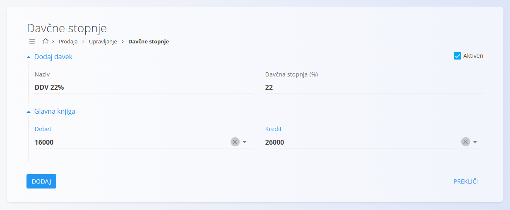

<!-- app_route: /management/common-types/tax-rates -->
<!-- app_label: Davčne stopnje -->
<!-- canonical_source_url: https://github.com/Tom-PIT/Connected.Docs/blob/main/sl/Skupno/Upravljanje/DavcneStopnje.md -->
<!-- canonical_source_title: Davčne stopnje -->

# Davčne stopnje
Šifrant **Davčne stopnje** določa vse davčne stopnje, uporabljene v sistemu. Davčne stopnje določajo odstotek davka, ki se uporablja za izdelke, materiale in storitve v poslovnih dokumentih. Vsak zapis vsebuje opisno ime in številčno vrednost, kar zagotavlja dosledno obračunavanje davkov v vseh digitalnih vsebinah.

Do šifranta **Davčne stopnje** lahko dostopate iz različnih domen v [navigaciji](../UI/Navigacija.md). V vseh primerih delate z istimi skupnimi podatki.

Za odpiranje seznama pojdite v razdelek **Upravljanje / Davčne stopnje** v naslednjih domenah:

- **Sredstva**
- **Prodaja**
- **Nabava**

## Shema
| Polje | Opis |
|------|------|
| **Naziv** | Opisno ime davčne stopnje (npr. *Standardna davčna stopnja 22* ali *Znižana davčna stopnja 9,5*). |
| **Davčna stopnja (%)** | Številčni odstotek davka (npr. **22** ali **9,5**). |
| **Aktivna** | Označuje, ali je davčna stopnja trenutno v uporabi. Neaktivnih stopenj ni mogoče izbrati v novih vnosih, ostanejo pa vidne v zgodovini. |
| **Glavna knjiga – Debet/Kredit** | Konto glavne knjige, izbran iz **[Konti](../../Domene/Racunovodstvo/Upravljanje/GlavnaKnjiga/Konti.md)**, ki se bremeni oziroma odobri, ko se davčni znesek knjiži z uporabo te davčne stopnje. |

## Upravljanje

### Seznam davčnih stopenj
Uporabniški vmesnik vsebuje seznam davčnih stopenj. Če zapisi še ne obstajajo, je seznam prazen.

Vsak zapis vključuje indikator stanja levo od imena:
- **Modra** označuje, da je davčna stopnja aktivna
- **Siva** označuje, da je davčna stopnja neaktivna

Seznam prikazuje ime davčne stopnje in pripadajoči odstotek. V zgornjem desnem kotu je na voljo iskalno polje.

## Dejanja

### Dodati novo davčno stopnjo

1. Kliknite [akcijski gumb](../UI/AkcijskiGumb.md), da dodate novo davčno stopnjo.
2. Izpolnite vsa obvezna polja. Neobvezna polja izpolnite, če so relevantna. 
3. Kliknite **Dodaj** za shranjevanje ali **Prekliči** za vrnitev na seznam.

> [!NOTE]
> Za več podrobnosti o poljih si oglejte zgoraj omenjeno razdelitev [**Shema**](#shema).

#### Glavna knjiga
Razdelek **Glavna knjiga** določa, kateri konti glavne knjige se uporabijo za knjiženje davčnih zneskov, ko je ta davčna stopnja uporabljena v poslovnih dokumentih.

Polji **Debet** in **Kredit** omogočata izbor kontov iz šifranta **[Konti](../../Domene/Racunovodstvo/Upravljanje/GlavnaKnjiga/Konti.md)**. Ti konti določajo, kam se davčni zneski knjižijo med računovodskimi transakcijami.

> [!NOTE]
> Nastavitev glavne knjige je potrebna za natančno davčno računovodstvo, poročanje in skladnost s predpisi.

### Urediti davčno stopnjo

Za urejanje obstoječe davčne stopnje: 

1. Kliknite njeno **Ime** na seznamu.  
2. Vmesnik se preklopi v način urejanja, kjer so prikazane obstoječe vrednosti za spremembe.  
3. Kliknite **Shrani** za potrditev sprememb ali **Prekliči** za zavrnitev.

### Izbrisati davčno stopnjo

Za brisanje davčne stopnje:

1. Kliknite njeno **Ime** na seznamu.  
2. Kliknite **Izbriši** na zaslonu za urejanje, da odprete potrditveno pogovorno okno. Če potrdite, se zapis trajno odstrani; sicer sistem ohrani obstoječe stanje.

> [!NOTE]
> Davčno stopnjo je mogoče izbrisati le, če ni uporabljena v nobenem od odvisnih zapisov.
