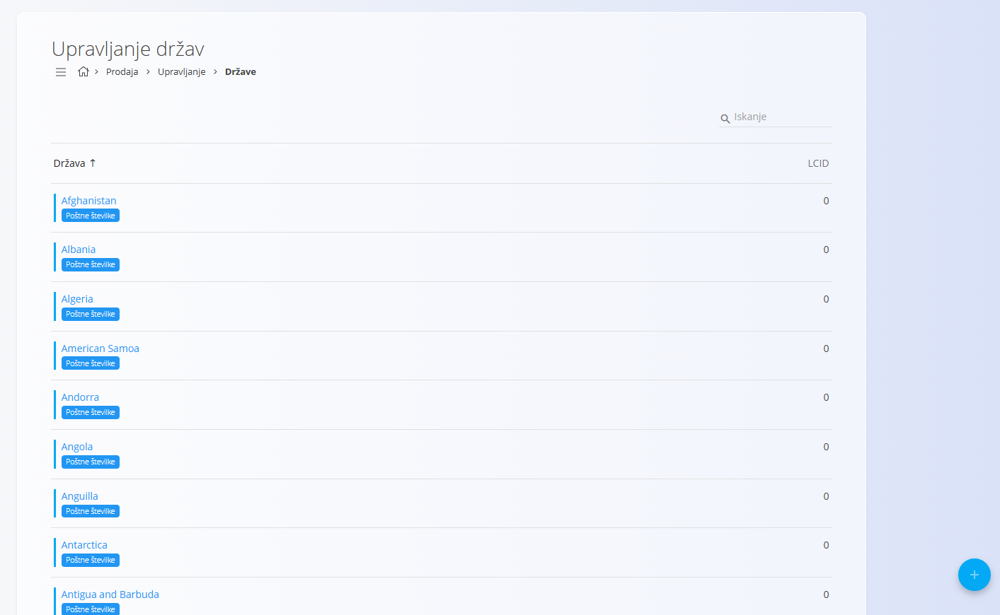
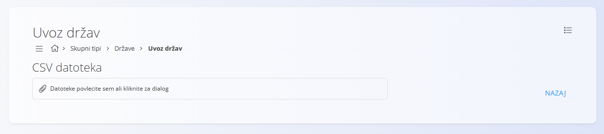
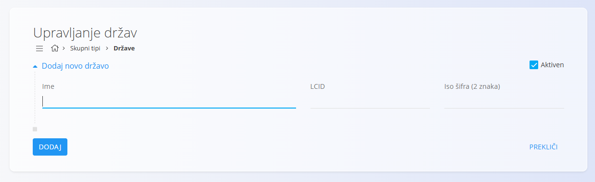

<!-- app_route: /management/common-types/countries -->
<!-- app_label: Države -->
<!-- canonical_source_url: https://tom-pit.github.io/Connected.Docs/sl/Skupno/Upravljanje/Drzave/ -->
<!-- canonical_source_title: Države -->

# Države
Ta šifrant predstavlja države, ki se uporabljajo v digitalnih vsebinah sistema. Vsaka država določa lokalizacijske parametre, kot sta LCID in koda ISO, ki zagotavljajo pravilne jezikovne in regionalne nastavitve ter skladnost z mednarodnimi standardi.

Do šifranta **Države** lahko dostopate iz različnih domen v [navigaciji](../UI/Navigacija.md). V vseh primerih delate z istimi skupnimi podatki.

Za odpiranje seznama pojdite v razdelek **Upravljanje / Države** v naslednjih domenah:

- **Logistika**
- **Prodaja**
- **Nabava**
- 
## Shema
| Polje | Opis |
|------|------|
| **Ime** | Ime države, na primer Slovenija ali **Avstrija** (obvezno). |
| **LCID** | Lokalizacijski identifikator, ki se uporablja za nastavitev jezika in regionalnih posebnosti države. |
| **ISO šifra (2 znaka)** | Mednarodna standardna koda države (npr. **SI** za Slovenijo ali **AT** za Avstrijo). |
| **Aktiven** | Označuje, ali je država aktivna. Neaktivnih držav ni mogoče uporabiti za nove vnose, vendar ostanejo vidne v zgodovini. |

## Upravljanje

### Seznam držav
Uporabniški vmesnik vsebuje seznam držav. Če zapisi še ne obstajajo, je seznam prazen.

Vsak zapis vključuje indikator stanja levo od imena:
- **Modra** označuje, da je država aktivna
- **Siva** označuje, da je država neaktivna



Vsak zapis prikazuje oznako s **povezanimi podatki** — [Poštne številke](PostneStevilke.md).

Klik na to oznako odpre vmesnik za upravljanje povezanih podatkov za izbrano državo.

## Dejanja
Kliknite [akcijski gumb](../UI/AkcijskiGumb.md) za prikaz naslednjih dejanj:

- **Uvoz** 
- **Nov**

### Uvoziti države

Dejanje **Uvoz** omogoča množično ustvarjanje ali posodabljanje zapisov držav. Funkcija je namenjena skrbnikom, ki morajo hkrati dodati ali spremeniti več držav.

Kliknite na [akcijski gumb](../UI/AkcijskiGumb.md) in izberite **Uvoz** sistem odpre vmesnik za nalaganje:



Uvoz sprejme **CSV datoteko**. Datoteko lahko povlečete in spustite v območje za nalaganje ali kliknete za odprtje pogovornega okna za izbiro datoteke. Datoteka mora vsebovati zahtevana polja v veljavni strukturi. Po končanem nalaganju sistem obdela datoteko in ustvari ali posodobi zapise držav na podlagi vsebine CSV.

Kliknite **Prekliči** za vrnitev na seznam držav brez uvoza.

> [!TIP]
> Primer datoteke lahko prenesete prek menija v zgornjem desnem kotu zaslona za uvoz.

#### Primer strukture CSV
```csv
Name,LCID,ISOAlpha2Code,Active
Slovenia,1060,SI,true
Austria,3079,AT,true
Italy,1040,IT,false
```

### Dodati novo državo

Za ustvarjanje nove države sledite tem korakom:

1. Kliknite na [akcijski gumb](../UI/AkcijskiGumb.md) in izberite **Novo**, da odprete vnosni obrazec za dodajanje nove države.
2. Izpolnite vsa obvezna polja. Neobvezna polja izpolnite, če so relevantna.
3. Kliknite **Dodaj** za ustvarjanje zapisa ali **Prekliči** za vrnitev na seznam brez shranjevanja.

> [!NOTE]
> Za več podrobnosti o poljih si oglejte zgoraj omenjeno razdelitev [**Shema**](#shema).



### Urediti državo

Za urejanje obstoječega zapisa:

1. Kliknite **Ime** države na seznamu. 
2. Vmesnik se preklopi v način urejanja in prikaže obstoječe vrednosti za spremembe. 
3. Kliknite **Shrani** za potrditev sprememb ali **Prekliči** za zavrnitev.

### Izbrisati državo

Za brisanje države sledite tem korakom:

1. Kliknite njeno **Ime** na seznamu.
2. Kliknite **Izbriši** na zaslonu za urejanje, da odprete potrditveno pogovorno okno.
3. Če brisanje potrdite, se zapis trajno odstrani. Če ga prekličete, sistem ohrani obstoječe stanje.

> [!NOTE]
> Državo je mogoče izbrisati le, če ni uporabljena v odvisnih zapisih (npr. naslovih ali dokumentih).
