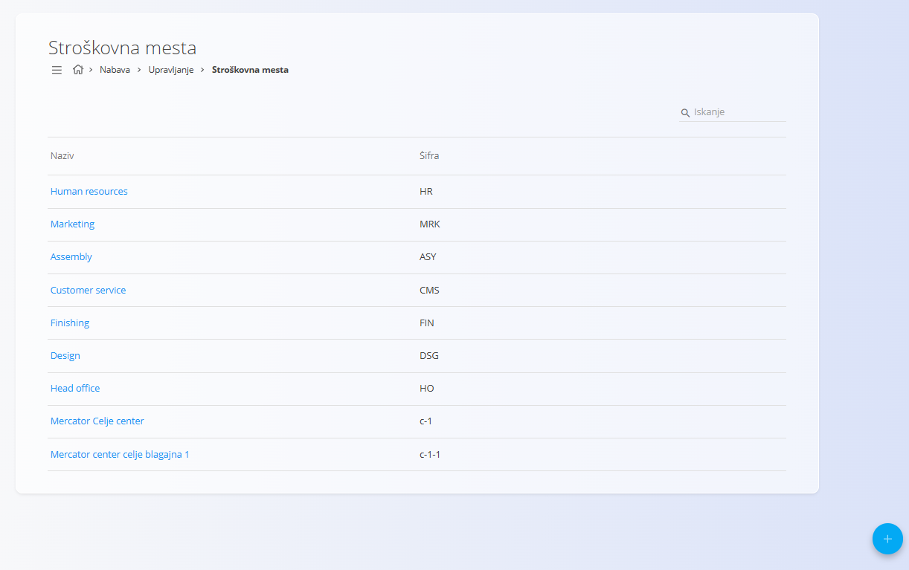
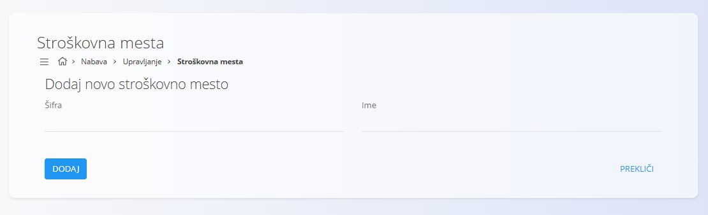

<!-- app_route: /management/common-types/cost-centers -->
<!-- app_label: Stroškovna mesta -->
<!-- canonical_source_url: https://tom-pit.github.io/Connected.Docs/sl/Skupno/Upravljanje/StroskovnaMesta/ -->
<!-- canonical_source_title: Stroškovna mesta -->

# Stroškovna mesta
Šifrant **Stroškovna mesta** opredeljuje oddelke ali funkcije, ki ustvarjajo stroške, vendar ne prihodkov, kot so kadrovska služba ali podporne ekipe. Čeprav te enote ne ustvarjajo dobička, imajo ključno vlogo pri nemotenem delovanju podjetja. Z definiranjem stroškovnih mest in dodeljevanjem stroškov sistem zagotavlja preglednost porazdelitve stroškov po podjetju.

Ta stran je na voljo v domenah **Prodaja** in **Nabava**. Za dostop pojdite na **Upravljanje / Stroškovna mesta** v [navigaciji](../../Skupno/UI/Navigacija.md).

## Shema
| Polje | Opis |
|------|------|
| **Šifra** | Kratek interni identifikator stroškovnega mesta (obvezno). Na primer **HR** za kadrovsko službo. |
| **Ime** | Polno opisno ime stroškovnega mesta (obvezno). |

## Upravljanje

### Seznamski pogled
Seznamski pogled prikazuje vsa evidentirana stroškovna mesta skupaj z njihovim **imenom** in **šifro**.

Za filtriranje stroškovnih mest po imenu ali kodi lahko uporabite **iskalno vrstico**.

## Dejanja

### Dodati novo stroškovno mesto

Za ustvarjanje novega stroškovnega mesta:

1. Kliknite [akcijski gumb](../UI/AkcijskiGumb.md), da odprete obrazec za ustvarjanje
2. Izpolnite vsa obvezna polja.
3. Kliknite **Dodaj**, da shranite novo stroškovno mesto.

### Urediti stroškovno mesto

Za urejanje obstoječega stroškovnega mesta:

1. Kliknite vnos na seznamu, da odprete zaslon za urejanje.
2. Prilagodite **Šifro** ali **Ime**.
3. Kliknite **Shrani**, da potrdite spremembe ali **Prekliči**, da zavrnete spremembe in ohranite obstoječe stanje. 

### Izbrisati stroškovno mesto

Za brisanje stroškovnega mesta:

1. Kliknite vnos na seznamu, da odprete zaslon za urejanje.
2. Kliknite **Izbriši** na zaslonu za urejanje, da odprete potrditveno pogovorno okno. 
3. Če brisanje potrdite, se zapis trajno odstrani. Če ga prekličete, sistem ohrani obstoječe stanje.

> [!NOTE]  
> Stroškovno mesto je mogoče izbrisati le, če ni uporabljeno v dokumentih ali drugih sistemskih entitetah.
