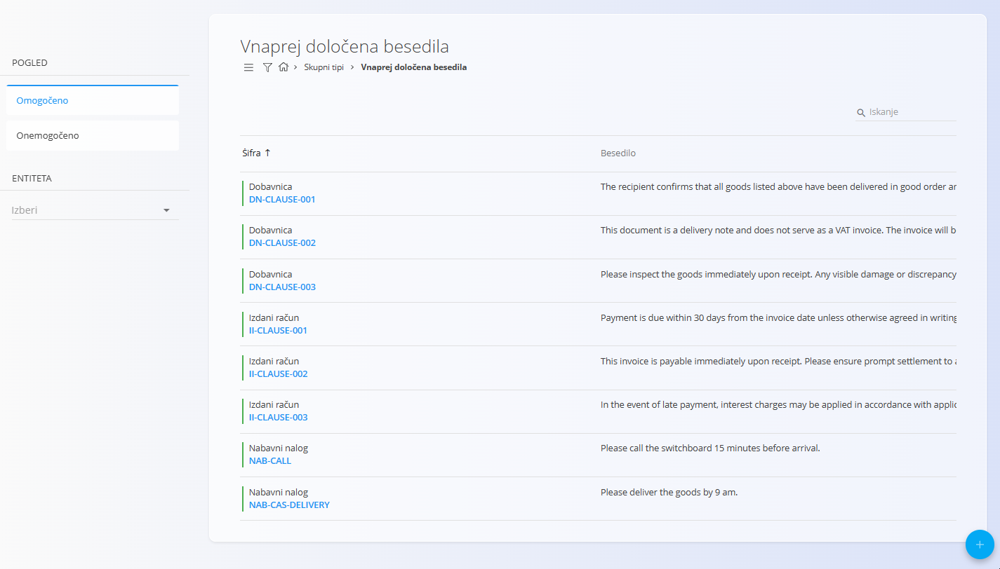
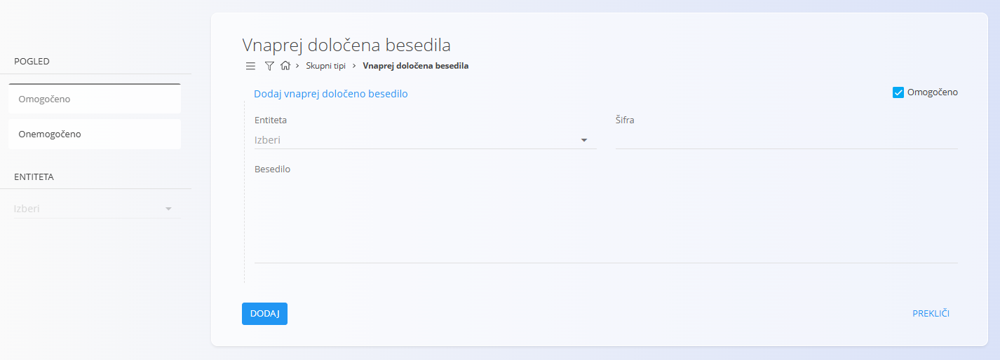
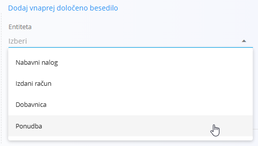

<!-- app_route: /management/common-types/predefined-texts -->
<!-- app_label: Vnaprej določena besedila -->
<!-- canonical_source_url: https://github.com/Tom-PIT/Connected.Docs/blob/main/sl/Skupno/Upravljanje/VnaprejDolocenaBesedila.md -->
<!-- canonical_source_title: Vnaprej določena besedila -->

# Vnaprej določena besedila
Šifrant **Vnaprej določena besedila** vsebuje vnaprej pripravljene besedilne predloge, ki jih je mogoče vstavljati v različne komercialne dokumente — kot so dobavnice, izdani računi, ponudbe ali dobavni nalogi. Ta besedila omogočajo hitro in dosledno dodajanje pogosto uporabljenih navodil, opomb ali besedil, specifičnih za kupca.

Ta stran je na voljo v domenah **Prodaja** in **Nabava**. Za dostop pojdite na **Upravljanje / Prednastavljena besedila** v [navigaciji](../../Skupno/UI/Navigacija.md).

## Shema
| Polje | Opis |
|------|------|
| **Entiteta** | Vrsta dokumenta, na katero se prednastavljeno besedilo nanaša (obvezno):  • [**Dobavnica**](../../Domene/Prodaja/Dokumenti/Dobavnice.md)  • [**Izdani račun**](../../Domene/Prodaja/Dokumenti/IzdaniRacuni.md)  • [**Ponudba**](../../Domene/Prodaja/Dokumenti/Ponudbe.md)  • [**Nabavni nalog**](../../Domene/Nabava/Dokumenti/NabavniNalogi.md) |
| **Koda** | Kratek identifikator za sklicevanje na prednastavljeno besedilo (obvezno). |
| **Besedilo** | Celotna vsebina besedila, ki se vstavi v izbrano vrsto dokumenta (obvezno). |
| **Omogočeno** | Označuje, ali je prednastavljeno besedilo aktivno in na voljo za uporabo. |

## Upravljanje

### Seznamski pogled
Seznam prikazuje vsa prednastavljena besedila skupaj z **entiteto**, **šifro** in **besedilom**. Seznam lahko filtrirate po stanju **Omogočeno / Onemogočeno** ali po **entiteti**.

Vsak zapis vključuje indikator stanja levo od imena:
- **Modra** označuje, da je besedilo aktivno
- **Siva** označuje, da je besedilo neaktivno

Na voljo je **iskalno polje** za hitro iskanje po kodi ali vsebini besedila.

## Dejanja

### Dodati novo prednastavljeno besedilo

Za ustvarjanje novega prednastavljenega besedila:

1. Kliknite [akcijski gumb](../UI/AkcijskiGumb.md), da ustvarite novo prednastavljeno besedilo.
2. Izpolnite vsa obvezna polja.
3. Kliknite **Dodaj**, da shranite novo prednastavljeno besedilo.

Izberite **entiteto**, vnesite **šifro** in napišite celotno **besedilo**. Po potrebi lahko zapis omogočite ali onemogočite.

Možnosti entitet:

### Urediti prednastavljeno besedilo

Za urejanje obstoječega prednastavljenega besedila:

1. Kliknite zapis na seznamu, da odprete zaslon za urejanje.
2. Spremenite **Entiteto**, **Šifro** ali **Besedilo**.
3. Kliknite **Shrani**, da potrdite spremembe ali **Prekliči**, da zavrnete spremembe in ohranite obstoječe stanje.

### Izbrisati prednastavljeno besedilo

Za izbris prednastavljenega besedila:

1. Kliknite zapis na seznamu, da odprete zaslon za urejanje.
2. Kliknite **Izbriši**, da odprete potrditveno pogovorno okno.
3. Če brisanje potrdite, se zapis trajno odstrani. Če ga prekličete, sistem ohrani obstoječe stanje.

> [!NOTE]  
> Prednastavljeno besedilo je mogoče izbrisati le, če ni uporabljeno v odvisnih dokumentih.