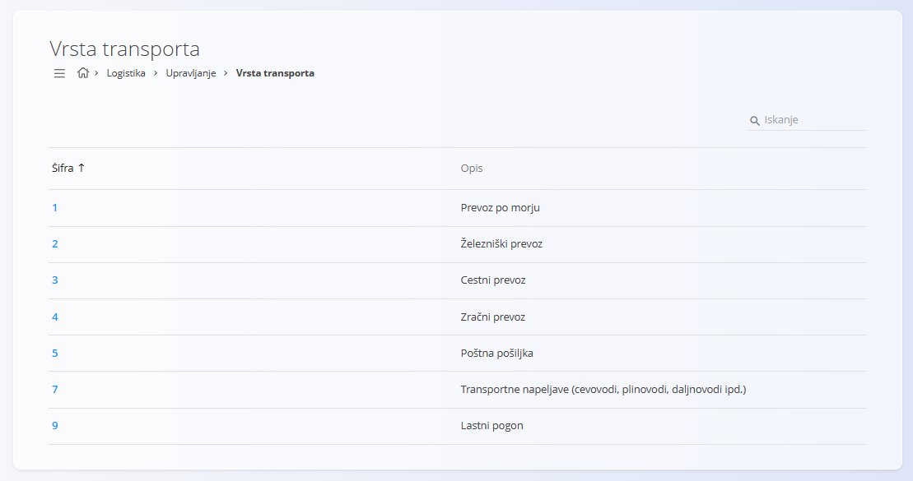

<!-- app_route: /management/common/mode-of-transport -->
<!-- app_label: Vrsta transporta -->
<!-- canonical_source_url: https://tom-pit.github.io/Connected.Docs/sl/Skupno/Upravljanje/VrstaTransporta/ -->
<!-- canonical_source_title: Vrsta transporta -->

# Vrsta transporta
Ta šifrant določa **vrste transporta**, ki se uporabljajo v celotnem sistemu.  
Vrste transporta se uporabljajo v dokumentih logistike, prodaje, nabave in drugih domen za opis načina dostave ali prenosa blaga.

Do šifranta **Vrsta transporta** lahko dostopate iz različnih domen prek [navigacije](../UI/Navigacija.md).  
V vseh primerih gre za **iste deljene podatke**.

Za dostop do seznama pojdite v razdelek **Upravljanje / Vrsta transporta** v naslednjih domenah:

- **Logistika**
- **Prodaja**

## Shema
| Polje | Opis |
|------|------|
| **Šifra** | Številčna identifikacija vrste transporta. |
| **Opis** | Opis vrste transporta, prikazan uporabnikom. |

## Seznam vrst transporta
Zaslon prikazuje seznam vseh definiranih vrst transporta.

Vsaka vrstica vsebuje:
- **Šifro**
- **Opis**

Če v sistemu ni nobenega zapisa, je seznam prazen.

Klik na vrstico odpre zapis v načinu urejanja.

## Dejanja

### Dodati novo vrsto transporta

Za ustvarjanje nove vrste transporta:

1. Kliknite [akcijski gumb](../UI/AkcijskiGumb.md), da odprete zaslon za dodajanje nove vrste transporta.
2. Izpolnite vsa obvezna polja. Neobvezna polja izpolnite, če so relevantna. 
3. Kliknite **Dodaj**, da ustvarite zapis, ali **Prekliči**, da se vrnete na seznam brez shranjevanja.

### Urediti vrsto transporta
Za urejanje obstoče vrste transporta: 

1. Kliknite njeno **Šifro** v seznamu.
2. Zaslon se preklopi v način urejanja, kjer lahko posodobite vrednosti polj.
3. Kliknite **Dodaj** za shranjevanje sprememb ali **Prekliči** za zavrnitev sprememb.

### Izbrisati vrsto transporta

Za brisanje vrste transporta: 

1. Kliknite njeno **Šifro** v seznamu.
2. V načinu urejanja kliknite **Izbriši**, nato potrdite brisanje v pogovornem oknu.

> [!NOTE]
> Vrsto transporta je mogoče izbrisati samo, če ni uporabljena v nobenem obstoječem dokumentu.
