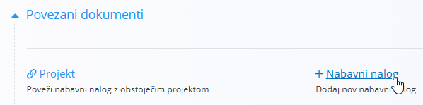
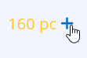

<!-- canonical_source_url: https://github.com/Tom-PIT/Connected.Docs/blob/main/sl/Uvod/05.ObnovaAliProizvodnja.md -->
<!-- canonical_source_title: Obnova zaloge ali proizvodnja -->

# Obnova zaloge ali proizvodnja

Ta vodič v preprostih korakih pojasnjuje, kaj storiti, ko prejmete naročilo stranke in pred dobavo nimate dovolj zaloge.

- **Lahko dokupite (obnova zaloge)** — naročite manjkajoče blago pri dobavitelju.  
  Primer: prodajate borove mize in imate na zalogi 2 kosa, potrebujete pa jih 10. Ustvarite **nabavni nalog** za 8 končnih miz (ali za les, noge, vijake, če jih sestavljate interno).
- **Ali proizvedete (izdelava)** — manjkajoče izdelke izdelate z lastnim procesom.  
  Primer: izdelujete borove mize iz lesa in okovja. Ustvarite **proizvodni nalog** za 8 miz in porabite potrebne materiale.

> [!NOTE]
> Katera možnost velja, je odvisno od vašega poslovnega modela:
> - Trgovsko podjetje (nakup/prodaja končnih izdelkov) → običajno **dokup**
> - Proizvodno podjetje (izdelujete izdelke) → običajno **proizvodnja** (in dokup surovin, če manjkajo)
> - Storitve/programska oprema → običajno nobeno (ni zaloge)

> [!TIP]
> Preden začnete, preverite, da so definirani **[Procesi](../Domene/Proizvodnja/Upravljanje/Procesi.md)**, **[Vhodi](../Domene/Proizvodnja/Upravljanje/Vhodi.md)** in **[Izhodi](../Domene/Proizvodnja/Upravljanje/Izhodi.md)**.

## Podrobni koraki

<!-- app_route: /warehouse/stock/index -->
<!-- app_label: Zaloga -->

### 1. Zaznajte primanjkljaj

- Odprite objavljeno **Naročilo stranke** in preglejte naročene postavke, nato odprite **[Zalogo](../Domene/Logistika/Pregledi/Zaloga.md)** za preverjanje trenutnih stanj po skladiščih/lokacijah.
- Pri ustvarjanju dokumenta **[Izdajnica](../Domene/Logistika/Dokumenti/Izdajnice.md)**, na primer preko **Povezani dokumenti → + Polna izdaja**, sistem ob nezadostni zalogi prikaže opozorilo in vam ne dovoli nadaljevanja ali objave, dokler količine niso na voljo.
- V proizvodnji odprite **[Zahteve](../Domene/Proizvodnja/Dokumenti/Zahteve.md)**, kjer vidite, kateri materiali ali polizdelki manjkajo za planirane operacije.

### 2. Odločitev: obnova zaloge ali proizvodnja

- Če kupujete/prodajate končne izdelke → nadaljujte z **obnovo zaloge**.
- Če izdelke proizvajate → nadaljujte s **proizvodnjo** (in po potrebi obnovo zaloge surovin/polizdelkov).

### 3. Obnova zaloge (dokup)

<!-- app_route: /supply/documents/inquiries -->
<!-- app_label: Povpraševanja -->

#### 3.1 (Neobvezno) Pošljite povpraševanje

1. Pojdite na **Nabava / Dokumenti / Povpraševanja**.
2. Uporabite [akcijski gumb](../Skupno/UI/AkcijskiGumb.md) za ustvarjanje osnutka [povpraševanja](../Domene/Nabava/Dokumenti/Povprasevanja.md).
3. Dodajte postavke, zahtevajte ceno in dobavni rok; kliknite **Objavi** za pošiljanje.

<!-- app_route: /supply/documents/supply-orders -->
<!-- app_label: Nabavni nalogi -->

#### 3.2 Ustvarite nabavno naročilo

- Iz povpraševanja (ali neposredno) izberite **Povezani dokumenti → [+ Nabavni nalog](../Domene/Nabava/Dokumenti/NabavniNalogiUstvarjanje.md)**

  

- Potrdite dobavitelja, postavke in datum dobave; kliknite **Objavi**

<!-- app_route: /warehouse/documents/receives -->
<!-- app_label: Prevzemi -->

#### 3.3 Prevzem v zalogo

1. V nabavnem naročilu odprite **Povezani dokumenti → [+ Prevzem](../Domene/Logistika/Dokumenti/Prevzemi.md)**.
2. Izberite skladišče in lokacije, potrdite prejete količine; kliknite **Objavi**.
3. (Neobvezno) Preverite stanje v **[Zalogi](../Domene/Logistika/Pregledi/Zaloga.md)** ali **[Pogledu zaloge po lokacijah](../Domene/Logistika/Pregledi/PogledZalogePoLokacijah.md)**.

> [!NOTE]
> V običajnem procesu dobavne verige je po prejemu blaga treba evidentirati dobaviteljev [**Prejeti račun**](../Domene/Racunovodstvo/Dokumenti/PrejetiRacuni.md) in ga poravnati preko [**Plačilnega naloga**](../Domene/Racunovodstvo/Dokumenti/PlacilniNalogi.md) v domeni [**Računovodstvo**](../Domene/Racunovodstvo/README.md). Ti finančni koraki so dokumentirani ločeno.

### 4. Proizvodnja (izdelava)

> [!IMPORTANT]
> Preverite, da so vaši procesi/operacije definirani v **[Procesih](../Domene/Proizvodnja/Upravljanje/Procesi.md)** z določenimi **[Vhodi](../Domene/Proizvodnja/Upravljanje/Vhodi.md)**/**[Izhodi](../Domene/Proizvodnja/Upravljanje/Izhodi.md)**.

<!-- app_route: /production-orders -->
<!-- app_label: Proizvodni nalogi -->

#### 4.1 Ustvarite proizvodni nalog

1. Pojdite na **Proizvodnja / Proizvodni nalogi**.
2. Uporabite **[akcijski gumb](../Skupno/UI/AkcijskiGumb.md)** za ustvarjanje osnutka [proizvodnega naloga](../Domene/Proizvodnja/Dokumenti/ProizvodniNalogiUstvarjanje.md).
3. Izberite **Izdelek**, **Proces**, **Količino**, **Rok** ter **Organizacijsko enoto**; kliknite **Objavi** za potrditev.
4. Nastavite status na **Aktivno**, da je nalog na voljo v **[Izvedbi](../Domene/Proizvodnja/Dokumenti/Izvedba.md)**.

> [!TIP]
> Za več informacij o ustvarjanju proizvodnih nalogov si oglejte **[Kako ustvariti nov proizvodni nalog](../Domene/Proizvodnja/Dokumenti/ProizvodniNalogiUstvarjanje.md)**.

<!-- app_route: /production-orders/requirements -->
<!-- app_label: Zahteve -->

#### 4.2 Odpravite manjkajoče vhode

1. Odprite **[Zahteve](../Domene/Proizvodnja/Dokumenti/Zahteve.md)**.
2. Uporabite filter **Prikaži planirane operacije**, da vidite manjkajoče materiale/polizdelke za proizvodni nalog.
3. Za manjkajoče vhode uporabite znak **+** za ustvarjanje novega **[nabavnega naloga](../Domene/Nabava/Dokumenti/NabavniNalogiUstvarjanje.md)** in izvedite **[Prevzem](../Domene/Logistika/Dokumenti/Prevzemi.md)** (glejte [korak 3.3](#33-prevzem-v-zalogo)).

<!-- app_route: /production-orders/execution -->
<!-- app_label: Izvedba -->

#### 4.3 Beleženje izvedbe

Uporabite modul **[Izvedba](../Domene/Proizvodnja/Dokumenti/Izvedba.md)** za spremljanje napredka proizvodnje:

1. Vnesite proizvedene količine z gumbom **Proizvedi**.
2. Preko menija za izbiro aktivnosti z uporabo **[akcijskega gumba](../Skupno/UI/AkcijskiGumb.md)** beležite:
   - **[Porabo](../Domene/Proizvodnja/Dokumenti/Poraba.md)** — porabljene materiale
   - **[Delo](../Domene/Proizvodnja/Dokumenti/Delo.md)** — porabljen delovni čas
   - **[Slabe kose](../Domene/Proizvodnja/Dokumenti/SlabiKosi.md)** — izmet in razlog (če obstaja)
   - **[Zastoj](../Domene/Proizvodnja/Dokumenti/Zastoj.md)** — zastoje opreme in trajanje (če obstaja)
3. Ko je nalog zaključen, kliknite gumb **Ustavi** za dokončanje.

### 5. Nadaljujte prodajni proces

- Vrnite se na **Naročilo stranke** in sledite vodičem za dobavo/obračun:
  - **[Prodajni proces (s predplačilom)](02.ProdajniProcesSAvansnimRacunom.md)**
  - **[Prodajni proces (brez predplačila)](03.ProdajniProcesBrezAvansnegaRacuna.md)**

> [!TIP]
> Po zaključku lahko vse podrobnosti pregledate v seznamu zaključenih **[Proizvodnih nalogov](../Domene/Proizvodnja/Dokumenti/ProizvodniNalogi.md)**.
