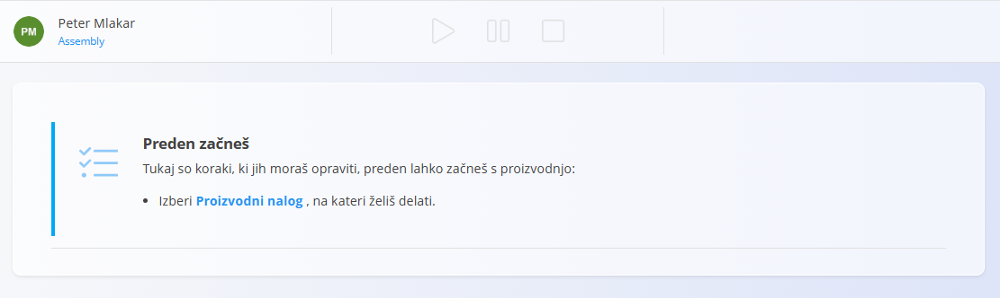
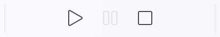
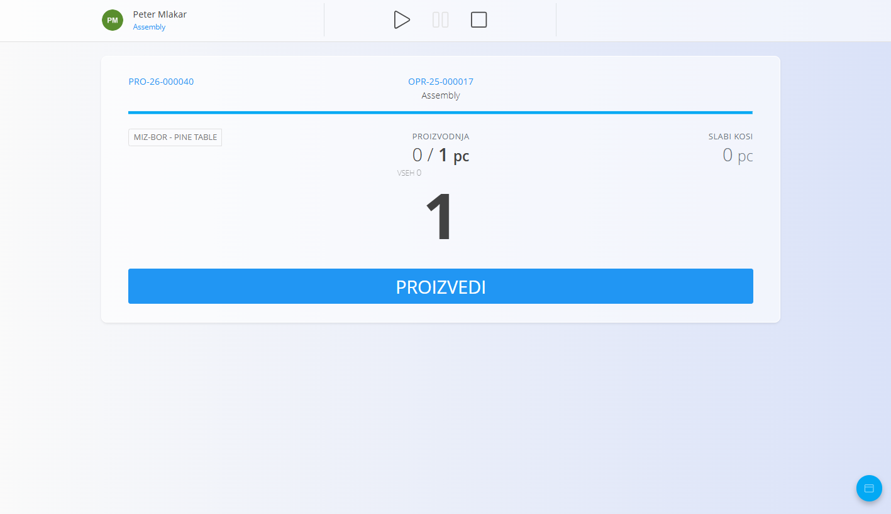
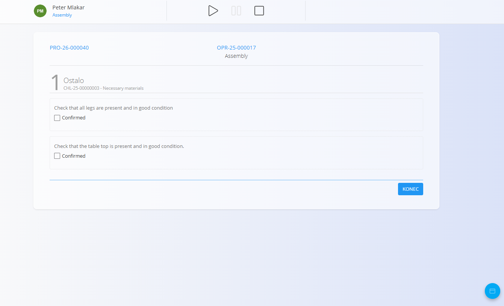
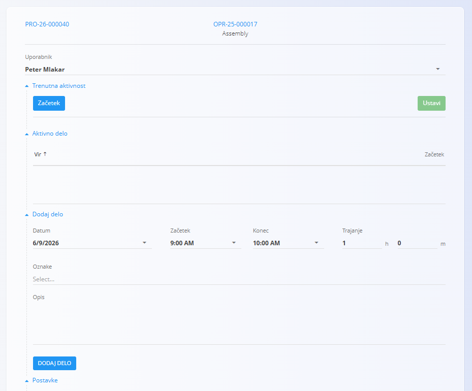
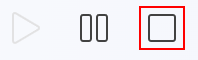

<!-- app_route: /production-orders/execution -->
<!-- app_label: Izvedba -->
<!-- canonical_source_url: https://github.com/Tom-PIT/Connected.Docs/blob/main/sl/Domene/Proizvodnja/Dokumenti/Izvedba.md -->
<!-- canonical_source_title: Izvedba -->

# Izvedba – Hitri uporabniški vodnik

Ta vodnik prikazuje **osnovne korake** za izvajanje proizvodnje na zaslonu **Izvedba**.

> [!NOTE]
>
> Za več informacij in podrobnosti si oglejte celotno dokumentacijo **[Izvedba](../Domene/Proizvodnja/Dokumenti/Izvedba.md)**.

## 1. Izberite proizvodni nalog

Ko odprete **Izvedbo**, prepričajte se, da je izbrana prava organizacijska enota in izberite proizvodni nalog in operacijo, na kateri boste delali.  

Če ni izbrano nič ali če ni na voljo nobenih proizvodnih nalogov, vas bo zaslon pozval, da izberete **Proizvodni nalog**.

## 2. Zaženite operacijo

Delo lahko začnete na dva načina:

### Možnost A — pritisnite Začni
Pritisnite **Začni**, da se začne merjenje časa in delo na operaciji.

### Možnost B — pritisnite Proizvedi
S pritiskom na **Proizvedi** se operacija **samodejno zažene**, tudi če ne spremenite količine.

## 3. Proizvajajte kose

1. Vnesite število proizvedenih kosov (npr. **1**).  
2. Pritisnite **Proizvedi**.  
3. Sistem posodobi:  
   - proizvedeno količino  
   - preostalo količino  

Postopek ponovite vsakič, ko dokončate nove kose.

> [!NOTE]  
> Po potrebi preverite **Navodila**:  
> - tapnite **Navodila**, da si ogledate korake sestave, slike ali opombe, specifične za operacijo.

## 4. Izpolnite kontrolne sezname kakovosti (če je potrebno)

[Kontrolne liste in nadzor kakovosti](../Domene/Proizvodnja/Dokumenti/Izvedba.md#kontrolni-seznami-in-kakovost) so enostavni zaporedni pregledi, ki pomagajo zagotavljati varno delo in pravilno kakovost izdelkov. Kontrolna lista se lahko prikaže ob začetku, med delom ali pred zaključkom – odvisno od nastavitve operacije.

1. Sledite korakom, prikazanim na zaslonu.  

   

2. Dokončajte vse korake in pritisnite **Konec**.  
3. Če morate kontrolno listo ponoviti:
   1. Odprite akcijski meni z [akcijskim gumbom](../Skupno/UI/AkcijskiGumb.md).
   2. Vstopite v razdelek **[Kakovost](../Domene/Proizvodnja/Dokumenti/Kvaliteta.md)**.
   3. Pri želeni kontrolni listi pritisnite **Ponovi**.

> [!NOTE]
> Operacije ni mogoče ustaviti, če obvezna kontrolna lista ni dokončana.

## 5. Zabeležite slabe kose (če je potrebno)

1. Odprite akcijski meni z [akcijskim gumbom](../Skupno/UI/AkcijskiGumb.md).
2. Vstopite v razdelek **[Slabi kosi](../Domene/Proizvodnja/Dokumenti/Izvedba.md#slabi-kosi)**.  
3. Vnesite količino slabih kosov.  
4. Izberite razlog za izmet.  
5. Potrdite z rumenim gumbom **Izmet**.

## 6. Zabeležite porabo materiala

To uporabite, kadar se med operacijo porablja material:

1. Odprite akcijski meni z [akcijskim gumbom](../Skupno/UI/AkcijskiGumb.md).
2. Vstopite v razdelek **[Poraba](../Domene/Proizvodnja/Dokumenti/Izvedba.md#poraba)**.  
3. Skenirajte, vnesite ali izberite material.  
4. Vnesite porabljeno količino.  
5. Potrdite.

## 7. Zabeležite zastoje (če je potrebno)

1. Odprite akcijski meni z [akcijskim gumbom](../Skupno/UI/AkcijskiGumb.md).
2. Vstopite v razdelek **[Zastoj](../Domene/Proizvodnja/Dokumenti/Izvedba.md#zastoj)**.
3. Zaženite in ustavite merjenje zastoja.  
4. Izberite razlog zastoja.  
5. Po potrebi prilagodite čase.  
6. Shranite.

To uporabite za vsako prekinitev, npr. čakanje na material ali okvaro stroja.

## 8. Zabeležite delo (delovni čas)

1. Odprite akcijski meni z [akcijskim gumbom](../Skupno/UI/AkcijskiGumb.md).
2. Po potrebi vstopite v razdelek **[Delo](../Domene/Proizvodnja/Dokumenti/Izvedba.md#delo)**.

### Samodejno:
Pritisnite **Začni** → delajte → pritisnite **Ustavi**.

### Ročno:
Odprite **Delo** in vnesite:  
- datum  
- začetek/konec ali trajanje  
- opis (neobvezno)  

Shranite vnos. Seznam zabeleženega dela je prikazan spodaj.

## 9. Zaključite operacijo

Ko je proizvodnja zaključena:

1. Preverite proizvedeno količino.  
2. Zabeležite morebitne slabe kose, zastoje, porabo materiala ali kontrolne liste.  
3. Pritisnite **Ustavi**, da zaključite operacijo.

## Povezani vodniki

- [**Vzdrževalni nalog – hitri uporabniški vodnik**](VzdrzevalniNalogiHitriVodnik.md)
