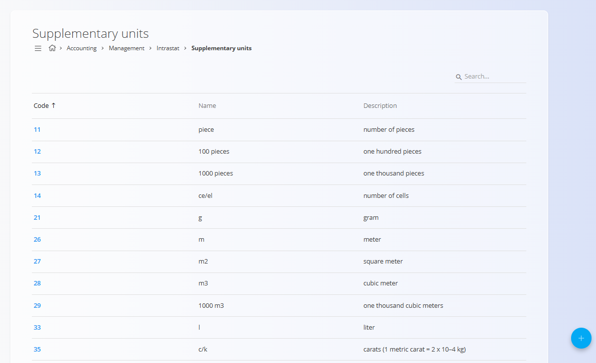
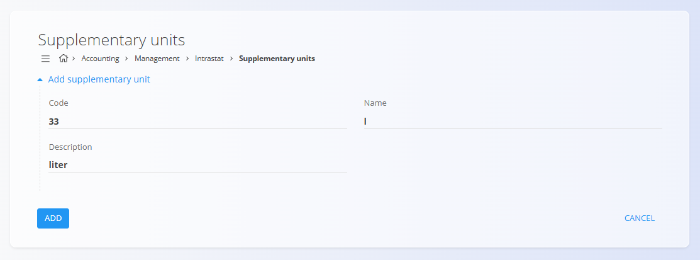

# Supplementary units

Supplementary units are standardized measurement units used for Intrastat reporting and logistics-related documents. They are referenced by documents such as [sales orders](../../../Sales/Documents/SalesOrders.md), [delivery notes](../../../Sales/Documents/DeliveryNotes.md), and other transactions where an additional statistical unit is required alongside the primary quantity.

To access this screen, go to **Accounting / Management / Intrastat / Supplementary units** in the [navigation](../../../Common/UI/Navigation.md).

## Schema

| Field        | Description |
|--------------|-------------|
| Code         | Numeric code identifying the supplementary unit (Intrastat standard). |
| Name         | Short unit name or abbreviation (e.g. `piece`, `m2`, `l`). |
| Description  | Human-readable explanation of the unit. |

## List view

The list view displays all available supplementary units with their codes, names, and descriptions.

You can:
- Search for units using the search field
- Sort the list by **Code**
- Click a unit to open it in edit mode

## Add supplementary unit

Click **Add supplementary unit** to create a new entry.

Provide:
- **Code**
- **Name**
- **Description**

Click **Add** to save the unit or **Cancel** to discard the entry.

## Edit supplementary unit

Click a code in the list to open it in edit mode.  
Update the **Code**, **Name**, or **Description** as needed.

Click **Save** to apply changes or **Cancel** to discard them.

## Deletion

Open an entry from the list and click **Delete**. Confirm the deletion in the dialog.

> [!NOTE]
> A supplementary unit can be deleted only if it is not referenced by dependent documents such as sales orders, delivery notes, or Intrastat reports.
