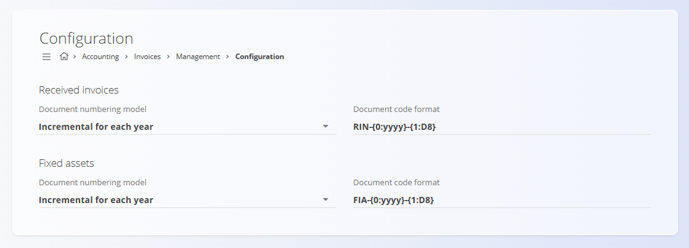

# Configuration

Configure **Invoices** settings affecting document numbering. Any changes are saved automatically.

To access this page, go to **Accounting / Invoices / Management / Configuration** in the [navigation](../../../Common/UI/Navigation.md).

## Document numbering settings

Choose the numbering model and format for invoice-related documents.

| Field | Description |
|------|-------------|
| **Document numbering model** | • **Incremental for each year:** numbering restarts at the beginning of each year.   • **Incremental:** a single continuous sequence without yearly reset. |
| **Document code format** | Pattern defining the document code structure. |

> [!NOTE]
> The numbering model and format apply immediately after changes are made. Existing documents are not renumbered.
