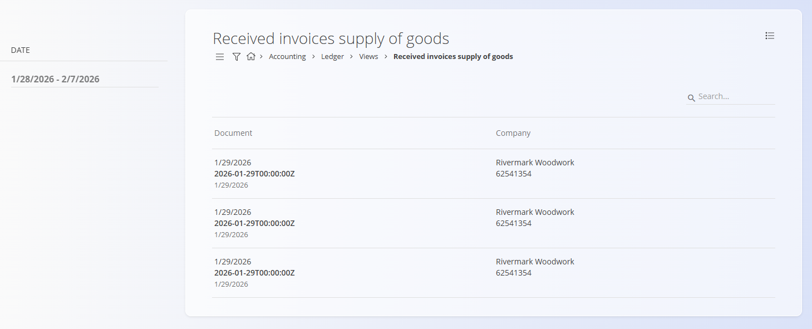

# Received invoices supply of goods

The **Received invoices supply of goods** view provides an overview of **posted incoming invoices related to the supply of goods**. It is a **read-only analytical view** based on committed accounting postings and does not allow creation, editing, or modification of documents.

This view is typically used for **accounting review**, **VAT control**, **supplier invoice verification**, and **ledger reconciliation**.

> [!NOTE]
>
> * All data shown is based on **posted (published) incoming invoices**.
> * Documents listed in this view **cannot be opened or drilled into**.
> * The view is intended strictly for **review and reporting purposes**.

To access this view, go to **Accounting / Ledger / Views / Received invoices supply of goods** in the [**navigation**](../../Common/UI/Navigation.md).

## Overview

Each row in the list represents **one posted incoming invoice for goods**.

The view displays a consolidated list of:

* Incoming invoices that have been successfully posted to the ledger
* Suppliers from whom goods were purchased
* Posting dates within the selected period

Multiple rows with the same supplier and date indicate **multiple separate incoming invoices**, which is expected behavior.

## Columns

The table contains the following columns:

* **Document** – The document (posting) date of the incoming invoice, including the internal system timestamp.
* **Company** – The supplier name and the supplier’s internal identification number.

## Filters

The filters on the left side allow you to narrow down the displayed results by **Date**, which defines the date range for which posted incoming invoices are shown. Only invoices whose document date falls within this range will be included.

## Menu

The menu in the top-right corner provides the option **Export to PDF** – Exports the currently displayed list of received invoices for goods into a PDF document for reporting, review, or audit purposes.
