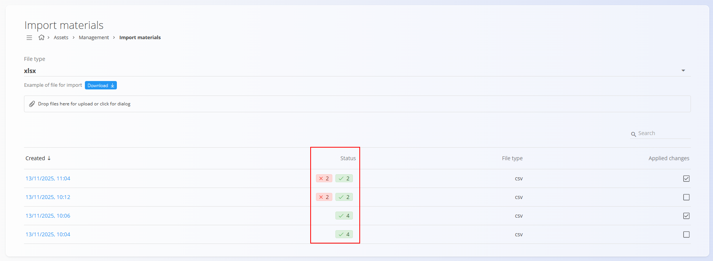
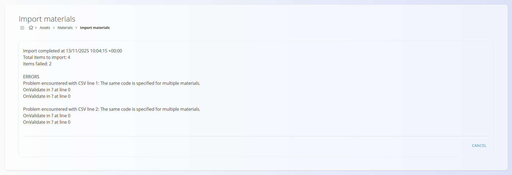

# Import materials

This document describes how to import multiple materials into the system at once using a spreadsheet file. This allows fast bulk creation or updating of material records. 

The import supports the following material types:

- [Products](../CodeLists/Products.md)  
- [Semi products](../CodeLists/SemiProducts.md)  
- [Repro materials](../CodeLists/ReproMaterials.md)  
- [Raw materials](../CodeLists/RawMaterials.md)


The screen also provides a downloadable example file, which shows the required structure of the spreadsheet. Before importing, you can run a **Test import**, which validates the data and reports errors without applying changes.

To access the **Import materials** code list, go to **Assets / Materials /
Import materials** in the [navigation](../../Common/UI/Navigation.md).

---

## Schema

| Field | Description |
|--------|-------------|
| **Created** | The date and time when the spreadsheet file was uploaded. |
| **Status** | Indicates the result of the validation or import, showing the number of valid rows and rows with errors. |
| **File type** | The format of the uploaded file, either CSV or XLSX. |
| **Applied changes** | Indicates whether the changes were actually imported (checked) or if this was only a test import (not checked). |

---

## File type

The system accepts imports in the **CSV** or **XLSX** format. The dropdown menu is used to select the format of the **example file** that you can download. Click the **Download** button to obtain the example import file in the selected format. This sample file contains all required columns in the correct order.


---

## Spreadsheet structure

The import file must include the columns listed below. Each row represents a single material that will be imported.

| Column | Description |
|--------|-------------|
| **Type** | Type of material: Product, Semi product, Repro material, or Raw material. |
| **Code** | Unique identifier of the material. If a material with the same code already exists, the import updates it. |
| **Name** | Full name of the material. |
| **Measure unit** | Measure unit used for quantities. Must match an existing [measure unit](../../Common/CodeLists/MeasureUnits.md). |
| **Tags** | Optional tags used for categorization. Multiple tags can be separated with commas. |
| **Description** | Optional text describing the material. |
| **EAN** | Barcode value of the material. |
| **Expiration (days)** | Number of days until the material expires. |
| **Image link URL** | URL pointing to an image for the material. |
| **Info link URL** | URL pointing to an external information page about the material. |
| **Precision** | Number of decimal places used when displaying values. |
| **Tax rate name** | Name of the tax rate. Must match an existing [tax rate](../../Common/CodeLists/TaxRates.md). |
| **Tax rate** | Percentage of tax applied to the material. |
| **External key** | External system identifier. |

---

## Example row

```
Product,C0000001,Acme product 1,Kg,ACME,Acme product 1,C000EAN1,0,https://google.com;https://google.com,0,DDV,22,EXT01
```

---

## Editing the file

You can prepare or modify the spreadsheet in a spreadsheet editor:


---

## Uploading the file

1. To begin the import, drag a **CSV** or **XLSX** file into the upload area or click it to open the file dialog.

2. Once the file is uploaded, the **Data preview** appears, showing all parsed records. The following actions are available:

    - **Test import** – carries out a test import without actually saving the data, so any errors can be detected before importing  
    - **Import** – imports and saves the data, applying all valid changes to the system  


    
   
   It is recommended to perform a **Test import** first to ensure that the data structure is correct and to prevent issues before applying the import. Below the upload area, you can see the list with all previously uploaded files. Rows containing errors are marked in **red**, while valid rows are marked in **green** in the **Status** column.

   

3. To complete the full import after valitating the data with a **Test import**, load the spreadsheet file again, and select the **Import** option.

During import:

- New materials are created.  
- Existing materials (matched by **Code**) are updated.  
- Dependencies (tags, measure units, tax rates) are linked automatically.  
- Material type is assigned based on the **Type** column.

After the import completes, the status updates in the table, indicating which rows were processed successfully.

> [!NOTE]  
> Materials are linked to two code lists, [Measure units](../../Common/CodeLists/MeasureUnits.md) and [Tax rates](../../Common/CodeLists/TaxRates.md). If the required records do not exist in these code lists, the system automatically creates the missing dependent code list entries during import.

---

## Results list

Click any import on the **Created** column on the import list to review the results and any possible errors.



---

## Notes

- Materials must have unique **Code** values to avoid conflicts.  
- Measure units and tax rates must already exist in the system.  
- The column order in the spreadsheet must not be changed.  
- Empty optional fields will be imported as blank values.  
- URLs must be valid or left empty.
