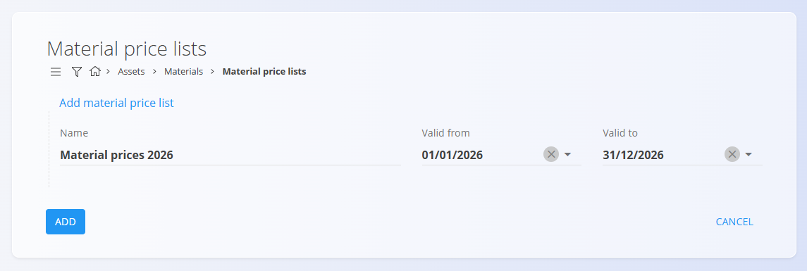

# Material price lists

**Material price lists** are the central source of truth for net prices of [materials](Materials.md) within a defined validity period. They enable:
- Consistent pricing across processes (procurement, production, and inventory)
- Time-based price changes using **Valid from** / **Valid to**
- Optional **quantity-based ranges** to apply percentage adjustments to the base price

Use this screen to create and maintain price lists per material type, set the base net price (100 %), and configure ranges that automatically calculate the effective net price for specific order quantities.

To access this screen, navigate to **Assets / Materials / Material price lists** in the [navigation](../../Common/UI/Navigation.md).

## Schema

### Price list header

| Field | Description |
|------|-------------|
| **Name** | Display name of the material price list (mandatory). |
| **Valid from** | Start date when the price list becomes active. |
| **Valid to** | End date of the price list validity period. |

### Price list details

| Field | Description |
|------|-------------|
| **Type** | Material classification (e.g. *Raw material*, *Semi products*, *Repro*). |
| [**Material**](Materials.md) | Specific material to which the price applies. |
| **Item price net 100 %** | Base net price of the material without discounts. |
| **Ranges** | Optional quantity-based pricing rules defining discounts or adjustments. |
| **Range from / Range to** | Quantity interval where the rule applies. |
| **Percentage (%)** | Percentage of the base price applied for the range. |
| **Item price net** | Calculated net price for the specified range. |

## Management

To access the list of material price lists, go to:

**Assets / Materials / Material price lists**

The list displays:
- All existing material price lists
- Their **valid periods**
- A **Details** button to manage material prices

The list can be filtered by:
- **Type**
- **Value**

Clicking the **price list name** opens the *Edit* screen.

Clicking the **Details** button opens the pricing details page.

## Actions

Depending on the current screen, the [**action button**](../../Common/UI/ActionButton.md) provides different options.

### On the Material price lists page
- **New**
- **Copy**

### On the Details page
- **New**
- **Import**

## Creating a new material price list

1. Click **New** on the *Material price lists* screen.
2. Enter:
   - **Name**
   - **Valid from**
   - **Valid to**
3. Click **Add** to save the price list header.

   

4. Click the **Details** button to manage material prices.

   

5. Add one or more **materials** using the action button.

   

6. Enter:
   - **Type**
   - **Material**
   - **Item price net 100 %**

7. (Optional) Add **Ranges** to define quantity-based pricing rules.  
   For example, when ordering between *10 and 50 units*, the price can be reduced to *95 %* of the base price.

8. Save the details.  
   The material price list is now active for the selected period.

## Menu

The menu in the **Details** view allows you to:
- Export the material price details (including ranges) to **CSV**

## Deletion

A material price list can be deleted **only if it contains no material details**.

If materials exist in the **Details** section:

1. Open **Details**
2. Click a material row
3. Delete the material price detail
4. Repeat until no details remain

Once empty, the price list itself can be deleted from the edit screen.

---