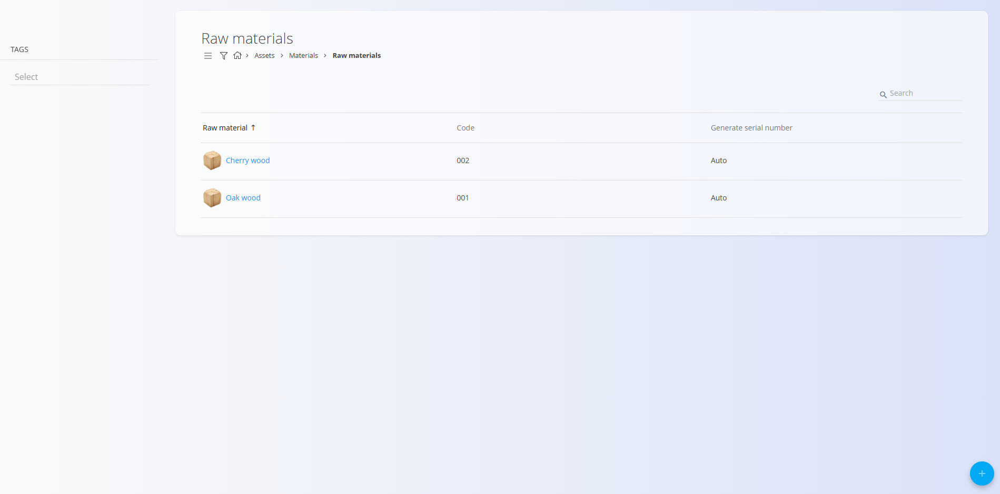

# Raw materials

**Raw materials** are the basic items used in production processes or purchased for internal use. They can include wood, metal sheets, fabrics, chemicals, or any other input material needed to create finished products. Each raw material stores key information—such as[measure units](../../Common/CodeLists/MeasureUnits.md), [tax rate](../../Common/CodeLists/TaxRates.md), expiration period, or [packaging](Packaging.md)—to ensure that it can be managed consistently across the system.

This code list serves as the register of all raw materials within the materials structure.

> [!TIP]
> For a full demonstration, see the **[Raw materials](https://www.youtube.com/watch?v=kb6I-eJ0tBU)** video tutorial.

> [!NOTE]  
> **Prerequisites**  
> Before managing semi products, ensure that the following code lists are properly configured:  
> - [**Measure units**](../../Common/CodeLists/MeasureUnits.md)  
> - [**Tax rates**](../../Common/CodeLists/TaxRates.md)

To access the **Raw materials** code list, go to **Assets / Materials / Raw materials** in the [navigation](../../Common/UI/Navigation.md).

## Schema

| Field                | Description |
|----------------------|-------------|
| **Code**             | Unique identifier of the raw material within the list of materials. The code must be unique across all materials. |
| **Name**             | Name of the raw material displayed in lists and documents. |
| **Generate serial number** | Determines how serial numbers and material records are handled: • **Auto** – each item receives a unique ascending serial number. • **Same** – all items share the same serial number but remain separate records. • **Identical** – all items share the same serial number and are treated as one identical record. |
| **Expiration (days)** | Number of days before the material expires (useful for perishable goods). |
| **EAN**              | Barcode value used for scanning. |
| **Base measure unit**     | Measure unit used to express quantities (e.g., piece, kg, meter). |
| **Tax rate**         | Default tax rate used in business documents. |
| **Precision**        | Default number of decimal places for values and quantities. |
| **Description**      | Short internal description of the raw material. |
| **Tags**             | Tags used for categorization and filtering. |
| **Info link URL**    | URL linking to external information or documentation. |
| **Image URL**        | Public URL pointing to the material image. |
| **External key**     | Identifier used to connect the raw material with external systems. |
| **Active**           | Indicates whether the raw material is available for use in new documents. |

## Management

### List of raw materials

The user interface contains a list of raw materials.

A filter for **Tags** is available on the left side. A search field is
available in the upper-right corner.

## Actions

Click on the action button to display the following actions:

-   **Import**
-   **Copy existing**
-   **New**

### Import

Use the import functionality to upload multiple raw materials in bulk.\

See the [**Import materials**](ImportMaterials.md) documentation for full details.

### Copy existing

Allows creating a new raw material based on an existing one.

### New

Click **New** to open the input form for adding a new semi product.  
The form includes fields such as **Code**, **Name**, **Generate serial number**, **Base measure unit**, **Tax rate**, and others depending on the configuration.

Additional collapsible sections are available:

#### Packaging
This section allows you to review or add one or more [packaging](Packaging.md) definitions specific to the material. Each entry represents a packaging unit with its own quantity and identification.  

These packaging records can later be used in warehouse operations such as [Receives](../../Logistics/Documents/Receives.md), [Issues](../../Logistics/Documents/Issues.md), and [Inter warehouse](../../Logistics/Documents/InterWarehouse.md) transfers.

#### Additional
This section contains optional descriptive fields, such as a material description, tags, images, links, or external identifiers. These fields help provide extra context or references but do not affect stock calculations.

After entering the required information, click Add to save the semi product or Cancel to return to the list view.

## Editing

Click the raw material name to edit the entry.

## Deletion

 Click **Delete** on the edit screen to open a confirmation dialog: 
 
 **Are you sure you want to delete this record?**  

If confirmed, the raw material is permanently removed; otherwise, the system keeps the record unchanged.

> [!NOTE]
>A raw material can be deleted only if it is not referenced by other records.

---
