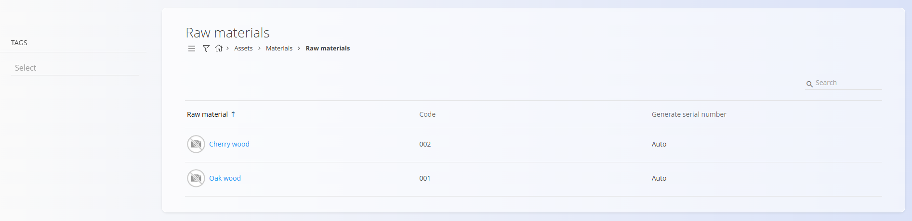
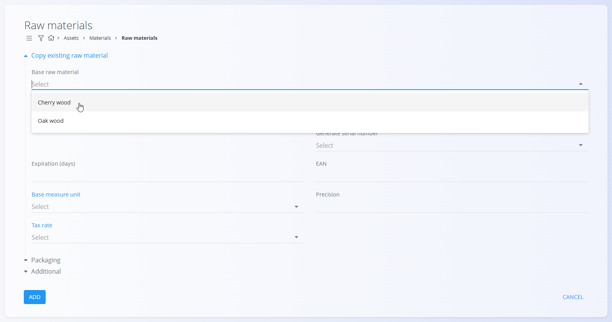
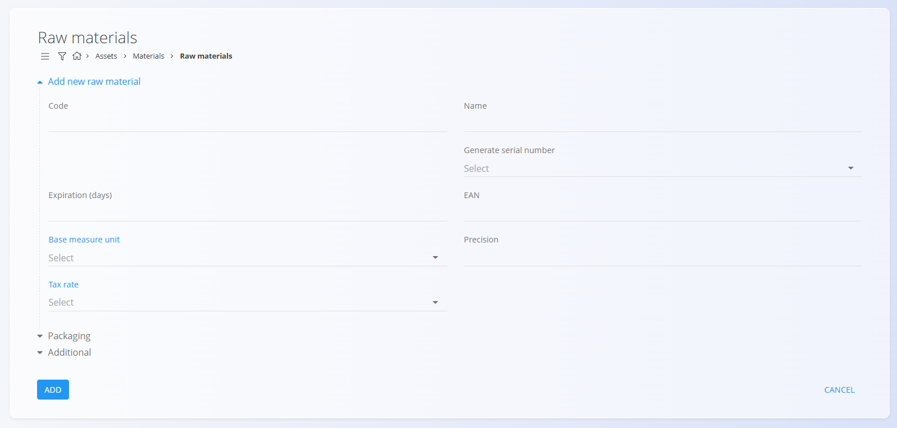
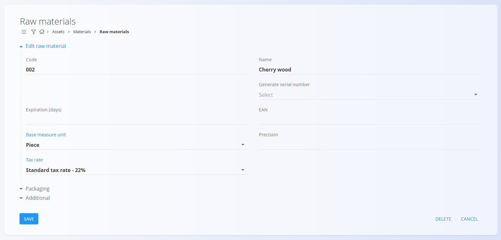

# Raw materials

Raw materials represent the base materials used in production processes.
They may be purchased, stored, consumed in manufacturing, or used within
internal operations. Each raw material includes essential
properties---such as expiration period, tax rate, and measure
unit---which ensure accurate and standardized management within the
system.

This code list serves as the register of all raw materials within the
materials structure.

For a detailed explanation of how raw material management works, watch
the <a href="https://www.youtube.com/watch?v=kb6I-eJ0tBU" target="_blank">Raw materials</a> video.

> [!NOTE]  
> **Prerequisites**  
> Before managing semi products, ensure that the following code lists are properly configured:  
> - [**Measure units**](../../Common/CodeLists/MeasureUnits.md)  
> - [**Tax rates**](../../Common/CodeLists/TaxRates.md)

------------------------------------------------------------------------

## Schema

The code list has the following schema:

  -----------------------------------------------------------------------
  Field                    Description
  ------------------------ ----------------------------------------------
  **Code**                 Unique identifier of the raw material within
                           the list of materials.

  **Name**                 Name of the raw material shown in lists and
                           documents.

  **Generate serial        Defines how the system assigns serial numbers.
  number**                 

  **Expiration (days)**    Number of days before expiration, used for
                           perishable goods.

  **EAN**                  Barcode value used for scanning.

  **Base measure unit**    Measure unit used to express quantities.

  **Tax rate**             Default tax rate used in business documents.

  **Precision**            Default number of decimal places for
                           displaying quantities.

  **Description**          Short internal description.

  **Tags**                 Tags used for categorization and filtering.

  **Info link URL**        URL linking to external material information.

  **Image URL**            URL of raw material image.

  **External key**         Identifier in external system.

  **Active**               Indicates whether the raw material is
                           available for new documents.
  -----------------------------------------------------------------------

------------------------------------------------------------------------

## Management

To access the **raw materials** code list, go to **Assets / Materials /
Raw materials**.

### List of Raw materials

The user interface contains a list of raw materials.

A filter for **Tags** is available on the left side. A search field is
available in the upper-right corner.

------------------------------------------------------------------------

## Actions

Click on the action button to display the following actions:

-   **Import**
-   **Copy existing**
-   **New**

### Import

Use the import functionality to upload multiple raw materials in bulk.\
See **Import materials** for details.

### Copy existing

Allows creating a new raw material based on an existing one.

### New

Opens the form for adding a new raw material.

------------------------------------------------------------------------

## Editing

Click the raw material name to edit the entry.

------------------------------------------------------------------------

## Deletion

A raw material can be deleted only if it is not referenced by other
records.
