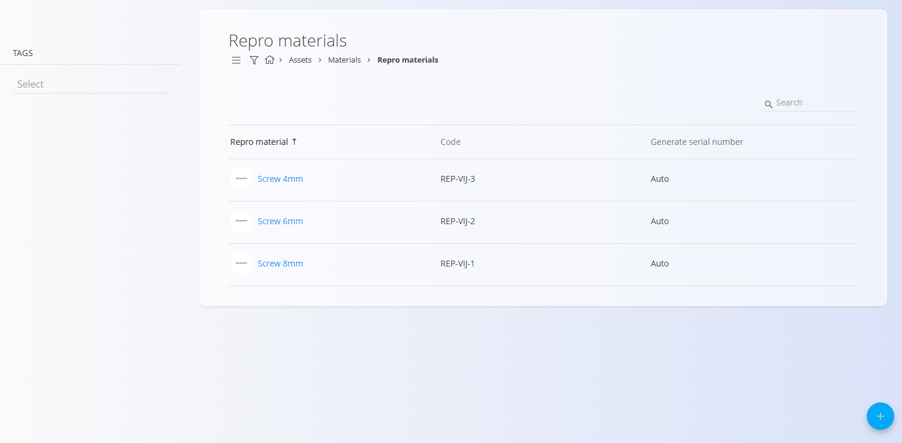
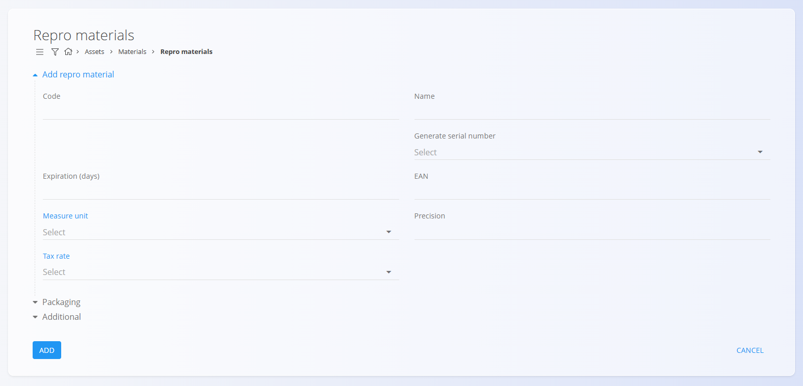

# Repro materials

Repro materials represent reusable or auxiliary components used within production processes or internal workflows. These materials support the creation or maintenance of other items but are not themselves final products. Each repro material includes key properties such as expiration period, tax rate, and measure unit, ensuring accurate and standardized material management across the system.

This code list serves as the register of repro materials within the materials structure.

For a detailed explanation of how repro materials work, watch the  
**[Repro materials](https://www.youtube.com/watch?v=ZRUwbQrAolU)** video.

> [!NOTE]  
> **Prerequisites**  
> Before managing repro materials, ensure that the following code lists are properly configured:  
> - [**Measure units**](../../Common/CodeLists/MeasureUnits.md)  
> - [**Tax rates**](../../Common/CodeLists/TaxRates.md)

---

## Schema

| Field | Description |
|-------|-------------|
| **Code** | Unique identifier of the repro material within the list of materials. For example **REP-VIJ-2**. The code must be unique across all materials. |
| **Name** | Name shown in lists and documents. For example **Screw 6mm**. |
| **Generate serial number** | Determines how serial numbers and material records are handled: • **Auto** – each item receives a unique ascending serial number. • **Same** – all items share the same serial number but remain separate records. • **Identical** – all items share the same serial number and are treated as one identical record. |
| **Expiration (days)** | Number of days before expiration, used for perishable items. For example **30** or **365**. |
| **EAN** | Barcode value used for scanning. For example **57884441241**. |
| **Measure unit** | Measure unit used to express quantities, such as **piece** or **meter**. |
| **Tax rate** | Default tax rate used in business documents. For example **22** or **9.5**. |
| **Precision** | Default number of decimal places for displaying values or quantities. For example **2** or **3**. |
| **Description** | Short internal description specifying the material’s purpose or characteristics. |
| **Tags** | Tags used for categorization and filtering. |
| **Info link URL** | URL linking to external material information or documentation. |
| **Image URL** | Public URL pointing to the material image. |
| **External key** | Identifier in an external system used for cross-system connections. |
| **Active** | Indicates whether the material is available for use in new documents. Inactive materials cannot be added to new entries but remain visible in the history. |

---

## Management

To access the **Repro materials** code list, go to:  
**Assets / Materials / Repro materials** in the [navigation](../../Common/UI/Navigation.md).

### List of repro materials

The user interface contains a list of repro materials.

The list displays each repro material’s name, code, and serial number generation method.

A filter for **Tags** is available on the left side. A search field is available on the right for quickly finding specific materials.

---

## Actions

Click on the [action button](../../Common/UI/ActionButton.md) to display the following actions:

- **Import**
- **Copy existing**
- **New**

### Import

The **Import** action allows you to import multiple repro materials at once by uploading a correctly structured spreadsheet.

See the [**Import materials**](../../Common/CodeLists/ImportMaterials.md) documentation for full details.

### Copy existing

Click **Copy existing repro material** to create a new record based on an existing one.

After selecting a base material, all fields are pre-filled and may be edited before saving.

### New

Click **New** to open the input form for creating a new repro material.

The form includes fields such as **Code**, **Name**, **Generate serial number**, **Measure unit**, **Tax rate**, and others depending on configuration.

Additional collapsible sections are available:

- **Packaging**
- **Additional**

After entering the required information, click **Add** to save the material or **Cancel** to return to the list.

---

## Editing

To edit an existing repro material, click its **Name** in the list. The interface switches to edit mode.

Make the necessary changes and click **Save**.  
Click **Cancel** to discard changes.

---

## Deletion

Click **Delete** on the edit screen to open a confirmation dialog: 

**Are you sure you want to delete this record?**  

If confirmed, the repro material is permanently removed; otherwise, the system keeps the record unchanged.

> [!NOTE]
>A repro material can be deleted only if no dependent records reference it (e.g., stock movements, production processes, documents).

