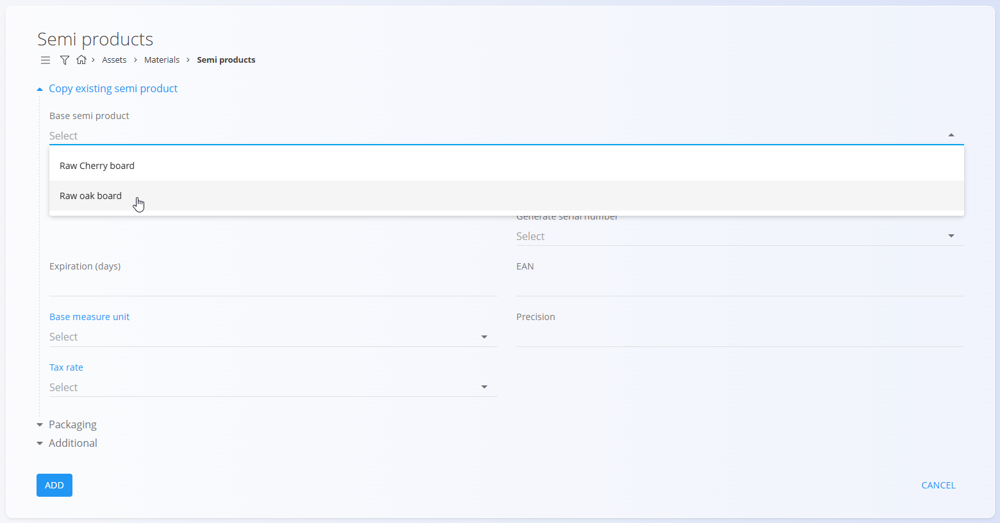

# Semi products

Semi products represent intermediate materials used in production processes. They may be included in the manufacturing of finished products, serve as subcomponents in multi-level material structures, or be used internally within operational workflows. Each semi product includes essential properties—such as expiration period, tax rate, and measure unit—which ensure accurate and standardized management within the system.

This code list serves as the register of semi-finished materials within the materials structure.

For a detailed explanation of how semi product materials work, watch the [Semi product materials](https://www.youtube.com/watch?v=Ox2OF8_IwOQ) video.

> [!NOTE]  
> **Prerequisites**  
> Before managing semi products, ensure that the following code lists are properly configured:  
> - [**Measure units**](../../Common/CodeLists/MeasureUnits.md)  
> - [**Tax rates**](../../Common/CodeLists/TaxRates.md)

---

## Schema

| Field | Description |
|-------|-------------|
| **Code** | Unique identifier of the semi product within the list of materials. The code must be unique across all materials. |
| **Name** | Name of the semi product shown in lists and documents. |
| **Generate serial number** | Determines how serial numbers and material records are handled: • **Auto** – each item receives a unique ascending serial number. • **Same** – all items share the same serial number but remain separate records. • **Identical** – all items share the same serial number and are treated as one identical record. |
| **Expiration (days)** | Number of days before expiration, used for perishable or time-sensitive materials. |
| **EAN** | Barcode value used for scanning. |
| **Base measure unit** | Measure unit used to express quantities, such as **piece** or **meter**. |
| **Tax rate** | Default tax rate used in business documents. |
| **Precision** | Default number of decimal places for displaying values or quantities. |
| **Description** | Short internal description explaining the use or specifications of the semi product. |
| **Tags** | Tags used for categorization and filtering. |
| **Info link URL** | URL linking to external material information or documentation. |
| **Image URL** | Public URL pointing to the material image. |
| **External key** | Identifier in an external system used for cross-system record linking. |
| **Active** | Indicates whether the semi product is available for use in new documents. Inactive items cannot be used in new entries but remain visible in the history. |

---

## Management

To access the **Semi products** code list, go to **Assets / Materials / Semi products** in the [navigation](../../Common/UI/Navigation.md).

### List of semi products

The user interface contains a list of semi products. If no record exists yet, the list is empty.

The list displays each semi product’s name, code, and serial number generation method.

A filter for **Tags** is available on the left side of the screen. A search field in the upper-right corner helps filter the list.

---

## Actions

Click on the [action button](../../Common/UI/ActionButton.md) to display the following actions:

- **Import**
- **Copy existing**
- **New**

### Import

The **Import** action allows you to import multiple semi products at once by preparing and uploading a correctly structured spreadsheet.  

See the [**Import materials**](ImportMaterials.md) documentation for full details.

### Copy existing

Click **Copy existing semi product** to create a new semi product based on an existing one. A selection list appears with the available base semi products.

After selecting the base semi product, all fields are pre-filled and can be edited before saving.

### New

Click **New** to open the input form for adding a new semi product.  
The form includes fields such as **Code**, **Name**, **Generate serial number**, **Base measure unit**, **Tax rate**, and others depending on the configuration.

Additional collapsible sections are available:

#### Packaging
This section allows you to review or add one or more packaging definitions specific to the material. Each entry represents a packaging unit with its own quantity and identification.  

These packaging records can later be used in warehouse operations such as Receives, Issues, and Inter-warehouse transfers.

#### Additional
This section contains optional descriptive fields, such as a material description, tags, images, links, or external identifiers. These fields help provide extra context or references but do not affect stock calculations.

After entering the required information, click **Add** to save the semi product or **Cancel** to return to the list view.

---

## Editing

To edit an existing semi product, click the semi product’s **Name** in the list.  
The interface switches to edit mode, displaying all fields for modification.

Click **Save** to apply changes or **Cancel** to discard them.

---

## Deletion

Click **Delete** on the edit screen to open a confirmation dialog: 

**Are you sure you want to delete this record?**  

If confirmed, the semiproduct is permanently removed; otherwise, the system keeps the record unchanged.

> [!NOTE]
>A semi product can be deleted only if it is not referenced by dependent entries, such as stock movements, documents, production structures, or other material relationships.  
