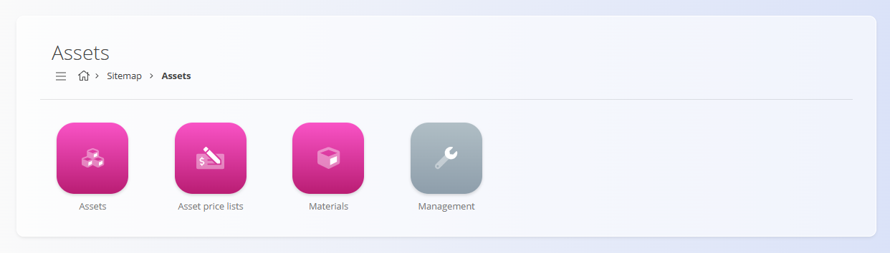

# Assets

The **Assets** domain contains all records related to the goods and services your company offers and prices—whether for sales, internal use, or catalog presentation. Assets differ from *materials* in that assets are **commercial items**: they represent what is sold to customers, while materials represent what is used internally in production or stock processes.

This domain groups together all elements needed to define, price, and organize your asset catalog.  

To access the Assets domain, navigate to **Assets** in the [navigation](../../Common/UI/Navigation.md).

> [!NOTE]
>
>Available domains depend on each company’s configuration and business model.

## What is included in the Assets domain?

The domain is structured into several functional areas:

- **[Assets](Assets/Assets.md)** - Defines the goods and services offered to customers. Each asset includes prices, tax settings, descriptive fields, and optional component details.  

- **[Asset price lists](Assets/AssetPriceLists.md)** - Used to prepare customer-specific selling prices for selected assets. Price lists support validity periods, company-specific pricing, and quantity-based discount ranges.  
See: 

- **[Materials](Materials/Materials.md)** - Materials are used to *build* assets or represent items handled in logistics workflows (stock, receives, issues, etc.).  Unlike assets, materials are internal operational units.  

- **Management** - Contains additional configurable elements used across the Assets domain, such as [Tax rates](../CodeLists/TaxRates.md) and [Measure units](../CodeLists/MeasureUnits.md) . These define the structure and behavior of assets and pricing.  
See relevant code lists inside **Assets / Management**.

## Assets vs. Materials

Understanding the distinction between these two concepts is essential for navigating the system correctly. Although both represent items managed within your organization, they serve very different purposes: 
- [**Assets**](../CodeLists/Assets.md) define what you *sell* to customers.
- [**Materials**](Materials.md) define what you *use* internally in production and logistics.  

The table below summarizes the key differences to help you determine where each type of item belongs.

| Aspect | [**Assets**](../CodeLists/Assets.md) | [**Materials**](Materials.md) |
|--------|------------|---------------|
| **Purpose** | Commercial items offered or sold to customers. | Operational items used internally in production or logistics. |
| **Role in the system** | Define what appears in price lists, catalogs, offers, invoices, etc. | Define what appears in stock, receives, issues, production, and warehouse operations. |
| **Examples** | Finished goods, service items, catalog items. | Raw materials, components, semi-finished goods, packaging, repro materials. |
| **Used in** | Sales processes (offers, invoices, contracts). | Logistics processes (stock handling, production, BOMs). |
| **Pricing** | Uses *asset price lists* for customer-specific pricing. | Uses *material price lists* for procurement and costing. |
| **Composition** | May contain material components via asset details. | May be included as parts of BOMs or asset structures. |
| **External visibility** | Visible to customers. | Internal only; customers never see material records. |
| **Lifecycle** | Market-oriented (changes are driven by commercial strategy). | Production-oriented (changes follow operational needs). |

---