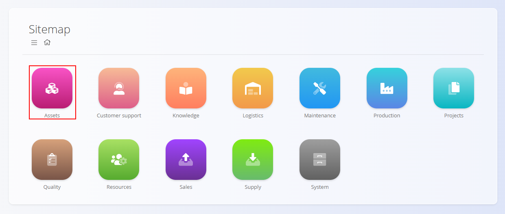
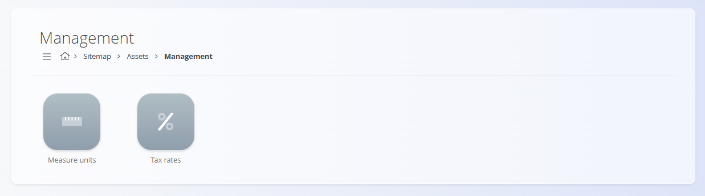

# Assets

The **Assets** domain contains all records related to the goods and services your company offers and prices, as well as the operational items used to build, deliver, or support them. It includes both **Assets** (commercial items you sell) and **Materials** (operational items used internally in production and logistics).

- **Assets** are commercial items visible to customers (e.g., finished goods, service items, catalog entries). They define how offerings are priced, taxed, and presented in sales documents.
- **Materials** are operational items used internally (e.g., raw materials, components, semi‑finished goods, packaging, repro materials). They define what exists in stock and how goods move through logistics and production.

For example, an **asset** might be a *Complete Laptop Set* sold as a packaged offering that includes a laptop, a carrying bag, and a mouse. The individual parts of that set—such as the **mouse**, the **laptop**, or even the internal **chips** inside the laptop—would be considered **materials**, because they are components used to build, assemble, or support the final commercial product. See the comparison [Assets vs. Materials](#assets-vs-materials) for more information.

This domain groups together all elements needed to define, price, organize, and operate your catalog across sales and logistics.

To access the Assets domain, navigate to **Assets** in the [navigation](../../Common/UI/Navigation.md).

> [!NOTE]  
> The available domains depend on each company’s configuration and business model.

## What is included in the Assets domain?

The domain is structured into several functional areas:

- **[Assets](../Assets/Assets.md)** – Defines the goods and services offered to customers. Each asset includes prices, tax settings, descriptive fields, and optional component details.

- **[Asset price lists](../Assets/AssetPriceLists.md)** – Used to prepare customer-specific selling prices for selected assets. Price lists support validity periods, company-specific pricing, and quantity-based discount ranges.

- **[Materials](Materials.md)** – Materials are used to *build* assets or represent items handled in logistics workflows (stock, receives, issues, etc.). Unlike assets, materials are operational internal units.

    - **[Products](../Materials/Products.md)**
    - **[Raw materials](../Materials/RawMaterials.md)**
    - **[Repro materials](../Materials/ReproMaterials.md)**
    - **[Semi products](../Materials/SemiProducts.md)**

- **Management** – Contains additional configurable elements such as [**Tax rates**](../../Common/Management/TaxRates.md) and [**Measure units**](../../Common/Management/MeasureUnits.md). These define the structure and behavior of assets and pricing.

## Assets vs. Materials

Understanding the distinction between these two concepts is essential. Although both represent items managed within your organization, they serve very different purposes.

- **[Assets](../Assets/Assets.md)** define what you *sell* to customers.
- **[Materials](Materials.md)** define what you *use* internally in production and logistics.

The table below summarizes the key differences and helps determine where each type of item belongs.

| Aspect | [**Assets**](../Assets/Assets.md) | [**Materials**](Materials.md) |
|--------|--------------------------------------|-------------------------------------------|
| **Purpose** | Commercial items offered or sold to customers. | Operational items used internally in production or logistics. |
| **Role in the system** | Appear in price lists, catalogs, offers, invoices, etc. | Appear in stock, receives, issues, production, and warehouse operations. |
| **Examples** | Finished goods, service items, catalog items. | Raw materials, components, semi-finished goods, packaging, repro materials. |
| **Used in** | Sales processes (offers, invoices, contracts). | Logistics processes (stock handling, production, BOMs). |
| **Pricing** | Uses *asset price lists* for customer-specific pricing. | Uses *material price lists* for procurement and costing. |
| **Composition** | May contain material components via asset details. | May be included as parts of BOMs or asset structures. |
| **External visibility** | Visible to customers. | Internal only; customers never see material records. |
| **Lifecycle** | Market-oriented (driven by commercial strategy). | Production-oriented (driven by operational needs). |
