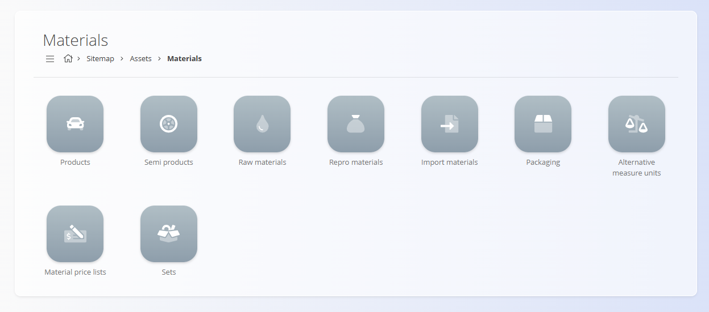

# Materials

The **Materials** section contains all records related to items used internally in logistics, production, and stock management.  
Unlike *assets*, which represent **commercial items** offered or sold to customers, materials represent **operational items**—the components, packaging, and intermediate products needed to manufacture or handle assets.

This section groups the different material categories your organization works with, making it easier to classify, price, and manage all components used throughout operational workflows.

To access the Materials section, navigate to **Assets / Materials** in the [navigation](../../Common/UI/Navigation.md).

## What is included in the Materials section?

The section is organized into multiple material categories:

- **[Products](CodeLists/Products.md)** — Finished materials that represent the end result of internal production processes. Products may be used inside assets or logistics workflows.

- **[Semi products](CodeLists/SemiProducts.md)** — Items that are partially completed during production. Semi products serve as intermediate building blocks for finished products or assets.

- **[Raw materials](CodeLists/RawMaterials.md)** — Basic input materials used at the early stages of production (e.g., wood planks, metal sheets, grains).

- **[Repro materials](CodeLists/ReproMaterials.md)** — Returnable or reusable items such as crates, bottles, or pallets that circulate across production or logistics processes.

- **[Import materials](CodeLists/ImportMaterials.md)** — Materials procured through import procedures, typically tied to customs or international sourcing.

- **[Packaging](CodeLists/Packaging.md)** — Packaging units (boxes, pallets, containers, bags) used for storing, shipping, or bundling goods.

- **[Alternative measure units](CodeLists/AlternativeMeasureUnits.md)** — Additional measurement units (e.g., pcs, kg, m²) assigned to a material that may require conversion from its base measure unit.

- **[Material price lists](CodeLists/MaterialPriceLists.md)** — Price definitions for materials, used primarily in procurement and valuation processes.

- **[Sets](CodeLists/Sets.md)** — Predefined bundles of materials grouped logically for faster selection and operational efficiency.

---
