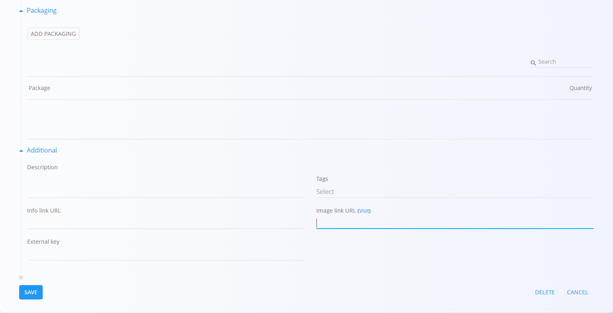
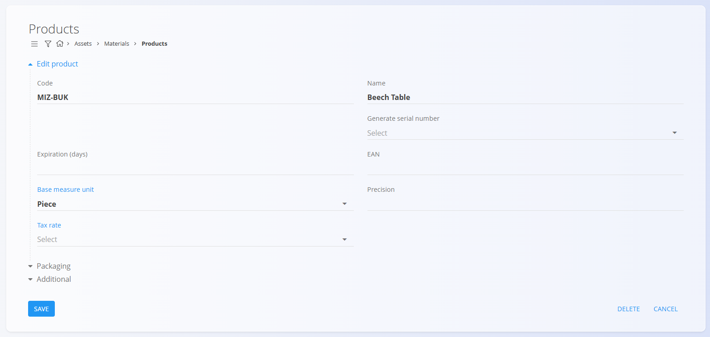

# Products

**Products** are the final goods that your company manufactures or purchases. These items can be sold to customers, stored in the warehouse, or used in internal processes. Examples of products include Oak table, Office chair, LED lamp, or Garden bench.

Each product contains important information—such as [measure units](../../Common/Management/MeasureUnits.md), [tax rate](../../Common/Management/TaxRates.md), expiration period, or [packaging](Packaging.md)—that ensures it is managed consistently across stock, sales, and production documents. This code list represents all finished products available in your catalog.

> [!TIP]
> For a full demonstration, see the **[Product materials](https://www.youtube.com/watch?v=FcrJ_IHQYeA)** video tutorial.

> [!NOTE]  
> **Prerequisites**  
> Before managing products, ensure that the following code lists are properly configured:  
> - [**Measure units**](../../Common/Management/MeasureUnits.md)  
> - [**Tax rates**](../../Common/Management/TaxRates.md)

To access the **Products** code list, go to **Assets / Materials / Products** in the [navigation](../../Common/UI/Navigation.md).

## Schema

| Field | Description |
|-------|-------------|
| **Code** | Unique identifier of the product within the list of materials. For example **2625001** or **MIZ-ČLS**. The code must be unique across all materials. |
| **Name** | Name of the product shown in lists and documents. For example **Table – Oak**. |
| **Generate serial number** | Determines how serial numbers and material records are handled: • **Auto** – each item receives a unique ascending serial number. • **Same** – all items share the same serial number but remain separate records. • **Identical** – all items share the same serial number and are treated as one identical record. |
| **Expiration (days)** | Number of days before expiration, used for perishable goods. For example **30** or **365**. |
| **EAN** | Barcode value used for scanning. For example **3831234567890**. |
| **Base measure unit** | Measure unit used to express quantities, such as **piece** or **meter**. |
| **Tax rate** | Default tax rate used in business documents. For example **22** or **9.5**. |
| **Precision** | Default number of decimal places used for values in this measure unit. For example **3** for **1.255**, or **1** for **2.5**. |
| **Description** | Short internal description explaining the use or specifications of the product. For example **Solid oak, oiled**. |
| **Tags** | Tags used for categorization and filtering. For example **furniture**, **premium**. |
| **Info link URL** | URL linking to external product information or documentation. For example *https://example.domain/info*. |
| **Image URL** | Public URL pointing to the product image. For example *https://example.domain/images/product.jpg*. |
| **External key** | Identifier in an external system used for cross-system record linking, for example **SAP-4711**. |
| **Active** | Indicates whether the product is available for use in new documents. Inactive products cannot be added to new entries but remain visible in the history. |

## Management

### List of products

The user interface contains a list of products. If no record exists yet, the list is empty.

The list displays each product’s name, code, and serial number generation method.

A filter for **Tags** is available on the left side of the screen. A search field is available in the upper-right corner to quickly locate specific products.

## Actions

Click on the [action button](../../Common/UI/ActionButton.md) to display the following actions:

- **Import**
- **Copy existing**
- **New**

### Import

The **Import** action allows you to import multiple product materials at once by preparing and uploading a correctly structured spreadsheet.  

See the [**Import materials**](ImportMaterials.md) documentation for full details.

### Copy existing

Click **Copy existing product** to create a new product based on an existing one. A selection list appears with the available base products.

After selecting the base product, all fields are pre-filled and can be edited before saving.

### New

Click **New** to open the input form for adding a new product. The form includes fields such as **Code**, **Name**, **Generate serial number**, **Base measure unit**, **Tax rate**, and others depending on the configuration.

Additional collapsible sections are available:

#### Packaging
This section allows you to review or add one or more [packaging](Packaging.md) definitions specific to the material. Each entry represents a packaging unit with its own quantity and identification.  

These packaging records can later be used in warehouse operations such as [Receives](../../Logistics/Documents/Receives.md), [Issues](../../Logistics/Documents/Issues.md), and [Inter warehouse](../../Logistics/Documents/InterWarehouse.md) transfers.

#### Additional
This section contains optional descriptive fields, such as a material description, tags, images, links, or external identifiers. These fields help provide extra context or references but do not affect stock calculations.

After entering the required information, click **Add** to save the product or **Cancel** to return to the list view.

## Editing

To edit an existing product, click the product’s **Name** in the list. The interface switches to edit mode, displaying all fields for modification. Click **Save** to apply changes or **Cancel** to discard them.

## Deletion

Click **Delete** on the edit screen to open a confirmation dialog: 

**Are you sure you want to delete this record?**  

If confirmed, the product is permanently removed; otherwise, the system keeps the record unchanged.

> [!NOTE]
> A product can be deleted only if it is not referenced by dependent entries, such as stock movements, documents, or material structures.  
