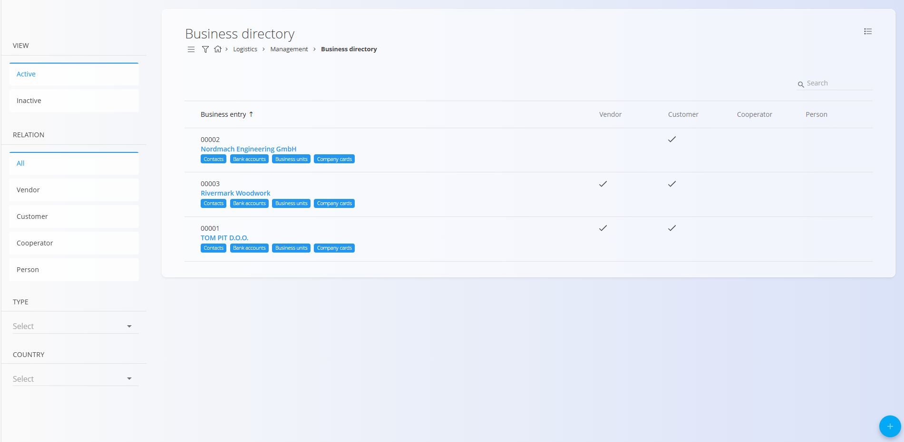
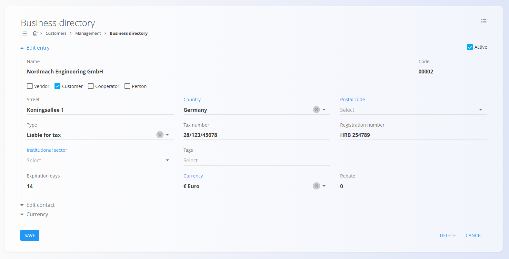

# Business directory

This code list represents the collection of entries in the business directory used across the system. Each entry may represent a vendor, customer, cooperator, or individual person, and contains all relevant identification and contact information. It serves as the central registry for managing entities within the organization, ensuring consistent referencing across all documents and modules.

---

## Schema

| Field | Description |
|-------|--------------|
| **Name** | Full name of the entity, for example **ACME d.o.o.** or **John Smith**. |
| **Code** | Internal code that ensures unique identification. |
| **Active** | Indicates whether the entry is active. Inactive entries cannot be used in new documents. |
| **Vendor** | Checkbox indicating whether the entity acts as a vendor. |
| **Customer** | Checkbox indicating whether the entity acts as a customer. |
| **Cooperator** | Checkbox indicating whether the entity acts as a cooperator. |
| **Person** | Checkbox indicating whether the entity is a natural person. |
| **Street** | Entity’s street address, for example **Dunajska cesta 10**. |
| **Country** | Country where the entity’s headquarters are located. |
| **Postal code** | Postal code of the entity’s headquarters. |
| **Type** | Defines the tax status of the entity (see the [list section below](#list-of-business-directory-entries)). |
| **VAT ID** | VAT identification number, for example **SI12345678**. |
| **Company ID** | Company registration number. |
| **Institutional sector** | Institutional sector to which the entity belongs. |
| **Tags** | Tags that allow categorization of entities. |
| **Payment currency** | Default payment currency used in documents. |
| **Currency** | Currency associated with the entity. |
| **Discount** | Default discount percentage applied to the entity. |
| **Primary contact** | Name and surname of the primary contact person. |
| **Phone** | Phone number of the primary contact. |
| **Email** | Email address of the primary contact. |
| **Use partner currency on documents** | Checkbox defining whether the entity’s currency is used in documents. |

---

## Management

You can access the **Business directory** code list from different domains in the [navigation](../UI/Navigation.md). In all cases you are working with the same shared data.

To open the list, go to the **Management** section of the following domains:

- **Customers**
- **Logistics**
- **Sales**
- **Supply**

### List of business directory entries

The user interface contains a list of entries in the business directory. If no record exists yet, the list is empty.

Each record displays multiple tags representing **associated data**:
- [Contacts](#contacts)
- [Bank accounts](#bank-accounts)
- [Business units](#business-units)
- [Company cards](#company-cards)

Clicking any of these tags opens the respective interface for managing the related data linked to the selected record.

Filters on the left side allow you to narrow results by **View** (Active / Inactive), **Relation** (Vendor, Customer, Cooperator, Person), **Type**, and **Country**.

The **Type** field determines the tax status of the entity. The available values are:
- **Liable for tax** — the entity is identified as a VAT payer and has a valid VAT ID number.  
- **Not liable for tax** — the entity is not registered as a VAT payer.  
- **Final customer** — a natural or legal person acting as the final buyer of goods or services.

---

## Actions

Click on the [action button](../../Common/UI/ActionButton.md) to display the following actions:

- Import by VIES  
- Import  
- New  

### Import by VIES

The **Import by VIES** action allows automatic retrieval of data from the VIES database, based on the provided VAT ID. This feature simplifies the process of adding entities registered within the European Union.

### Import

The **Import** action enables bulk creation or updating of company records. When selecting **Import**, the system opens the upload interface:

The import accepts a **CSV file**. Drag and drop the file into the upload area or click to open the file dialog.
The file must contain the required fields in a valid structure.

Click **Cancel** to return to the list without importing.

### New

The **New** action opens the input form for creating a new entry. Fill in the required fields such as **Name**, **Code**, and **VAT ID**. Click **Add** to save the new record or **Cancel** to return to the list view without saving.

---

## Menu

The **Menu** in the top-right corner provides the **Exporting** option, which exports all visible records into a CSV file, allowing further analysis or backup.

---

## Editing

To edit an existing record, click the entry’s **Name** in the list. The interface switches to edit mode, displaying the existing data for modification. Click **Save** to confirm changes or **Cancel** to discard them.

### Contacts

The **Contacts** tag opens the interface for managing contact persons related to the selected record. You can add, edit, or delete contact details such as name, role, phone number, and email address.  

See the dedicated [Contacts](Contacts.md) document for details.

### Bank accounts

The **Bank accounts** tag opens the interface for managing the record’s financial accounts. Each account includes fields such as bank name, IBAN, and currency. Multiple accounts per record are supported.  

See the dedicated [Bank accounts](BankAccounts.md) document for details.

### Business Units

The **Business units** tag provides access to managing the record’s internal organizational units. Each unit can have its own contact details and addresses, allowing a more granular structure for larger organizations.  

See the dedicated [Business units](BusinessUnits.md) document for details.

### Company cards

The **Company cards** tag opens the view for managing company identification cards associated with the record. These cards may store general company data and links to documents or certifications.  

See the dedicated [Company cards](CompanyCards.md) document for details.

---

## Deletion

Click **Delete** on the edit screen to open a confirmation dialog: 

**Are you sure you want to delete this record?**  

If confirmed, the entry is permanently removed; otherwise, the system keeps the record unchanged.

> [!NOTE]
>An entry can be deleted only if it is not referenced in any dependent records (for example, invoices or orders).

